Diffusion modeling
================
2024-07-23

# Summary statistics of variables of interest

| name | category | mean | median | sd | max | min | NAs |
|:---|:---|---:|---:|---:|---:|---:|---:|
| Median household income (thousands) | County | 58.072 | 54.700 | 15.152 | 115.518 | 26.814 | 0 |
| Proportion of households spending more than 30% of income on rent | County | 0.469 | 0.469 | 0.056 | 0.673 | 0.221 | 0 |
| Proportion in county voting Republican in 2016 presidential election | County | 0.436 | 0.432 | 0.169 | 0.821 | 0.041 | 0 |
| White proportion in county of university | County | 0.743 | 0.784 | 0.172 | 0.975 | 0.126 | 0 |
| Public/Private status (1 = Public) | University | 0.542 | 1.000 | 0.498 | 1.000 | 0.000 | 0 |
| Proportion of Pell grant recipients | University | 0.365 | 0.350 | 0.168 | 0.940 | 0.000 | 9 |
| Tuition (thousands of dollars) | University | 19.824 | 11.220 | 16.522 | 52.320 | 0.000 | 7 |
| Nonwhite proportion of enrolled students | University | 0.425 | 0.376 | 0.209 | 1.000 | 0.060 | 5 |
| Total enrollment at university (thousands) | University | 10.643 | 6.085 | 11.995 | 107.195 | 0.174 | 5 |

# Colinearity

We noticed in previous modeling that certain combinations of variables
showed very strange results, with very high coefficient values (\>10 for
a proportional hazards regression).

One explanation for this was that we’re dealing with multicolinearity in
these variables and produce incorrect coefficients by measuring
essentially a single variable twice.

## Pairs

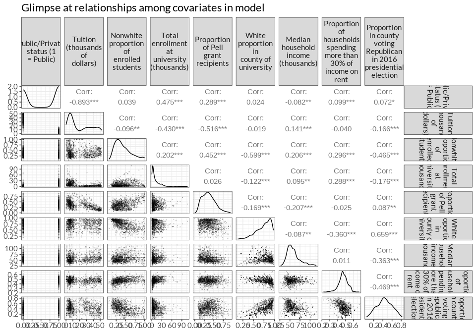<!-- -->

## PCA

| Variable | PC1 | PC2 | PC3 | PC4 | PC5 | PC6 | PC7 | PC8 | PC9 |
|:---|---:|---:|---:|---:|---:|---:|---:|---:|---:|
| Public/Private status (1 = Public) | 0.2988069 | -0.4810075 | -0.2346373 | -0.0427953 | 0.3729531 | 0.0985360 | 0.2123288 | 0.2416432 | -0.6084257 |
| Tuition (thousands of dollars) | -0.3016471 | 0.5278004 | 0.0483142 | 0.0878704 | -0.2316823 | -0.1212927 | -0.0386479 | 0.0664680 | -0.7389723 |
| Nonwhite proportion of enrolled students | 0.4450747 | 0.1740466 | 0.3422832 | -0.2188768 | -0.3701150 | -0.0632707 | 0.4684846 | 0.4887564 | 0.0848676 |
| Total enrollment at university (thousands) | 0.3436263 | -0.1747245 | -0.4764688 | 0.0373313 | -0.5099878 | -0.5419627 | -0.2185235 | -0.1395421 | -0.0440500 |
| Proportion of Pell grant recipients | 0.2644672 | -0.2768305 | 0.6023600 | -0.1542508 | -0.2181845 | 0.2087158 | -0.5054538 | -0.2441655 | -0.2460163 |
| White proportion in county of university | -0.4126046 | -0.2950637 | -0.2242980 | -0.1146334 | -0.4141764 | 0.3673515 | -0.2529774 | 0.5522078 | 0.0618400 |
| Median household income (thousands) | 0.1018717 | 0.2625292 | -0.3501637 | -0.7678169 | -0.0351082 | 0.3313372 | 0.0465706 | -0.3059843 | -0.0416056 |
| Proportion of households spending more than 30% of income on rent | 0.3407070 | 0.1742469 | -0.2170324 | 0.5608212 | -0.2463050 | 0.6241298 | 0.1056232 | -0.1746404 | -0.0085792 |
| Proportion in county voting Republican in 2016 presidential election | -0.3700114 | -0.4077455 | 0.1247634 | -0.0122186 | -0.3593207 | 0.0044993 | 0.5944629 | -0.4360732 | -0.0918821 |

We see that nonwhite proportion of enrolled students and the white
proportion of the county as a whole are the strongest elements in the
first principal component. This … makes sense.

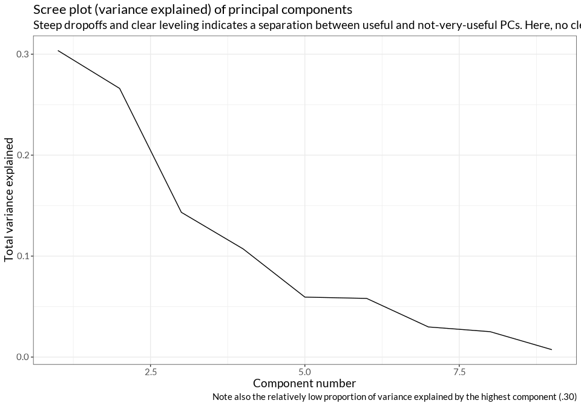<!-- -->

- No clear dropoff/leveling -\> No single principal component captures
  all of the problem
- Also, first few principal components don’t capture a crazy amount of
  total variance

# Kaplan-Meier estimators across each variable

    ## [[1]]

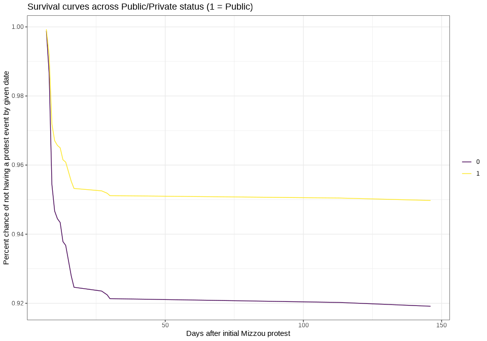<!-- -->

    ## 
    ## [[2]]

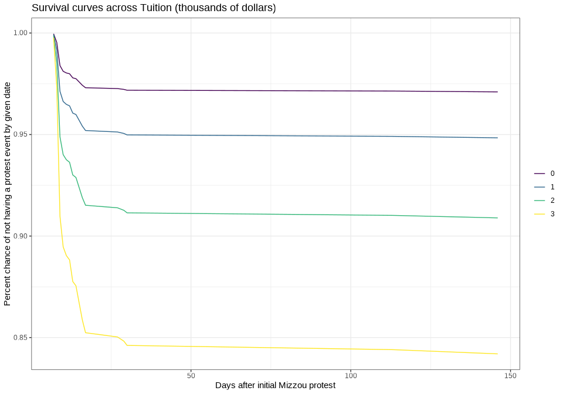<!-- -->

    ## 
    ## [[3]]

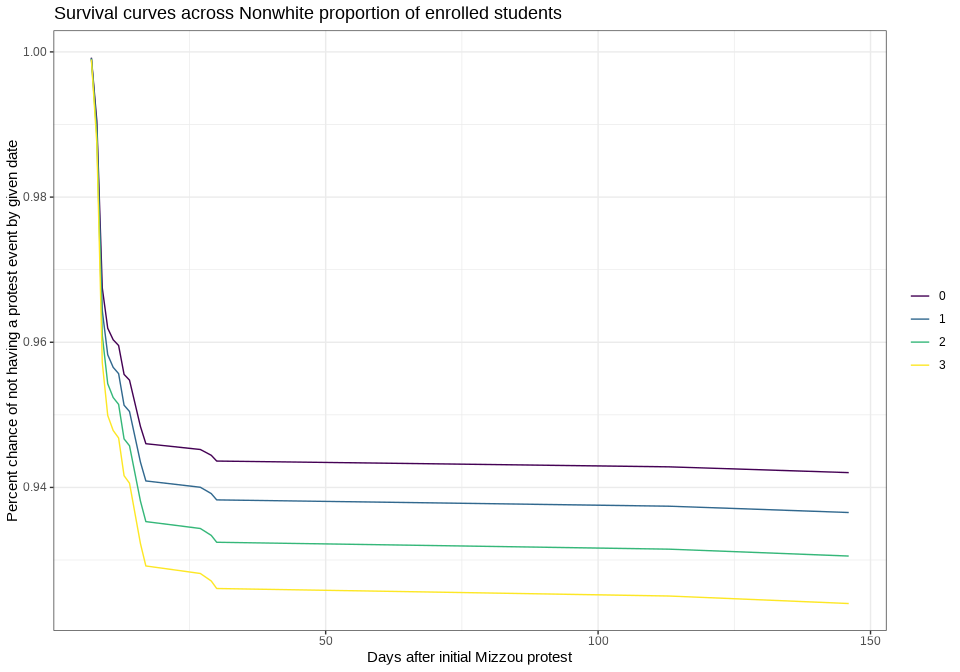<!-- -->

    ## 
    ## [[4]]

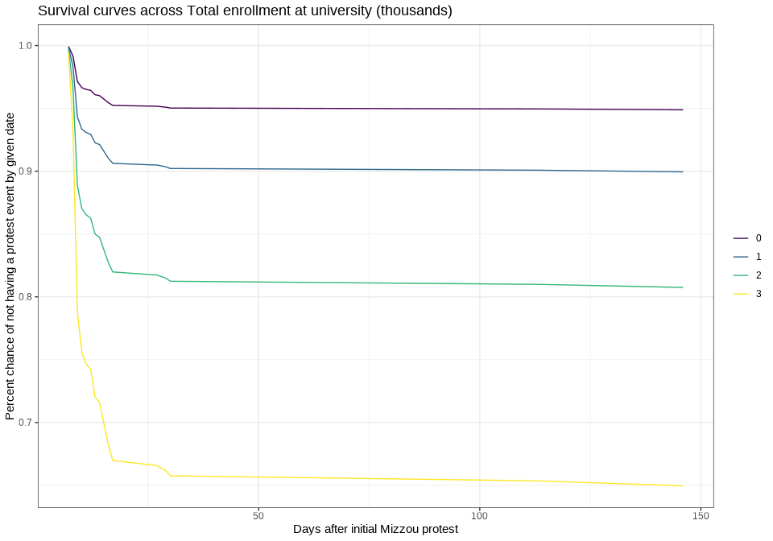<!-- -->

    ## 
    ## [[5]]

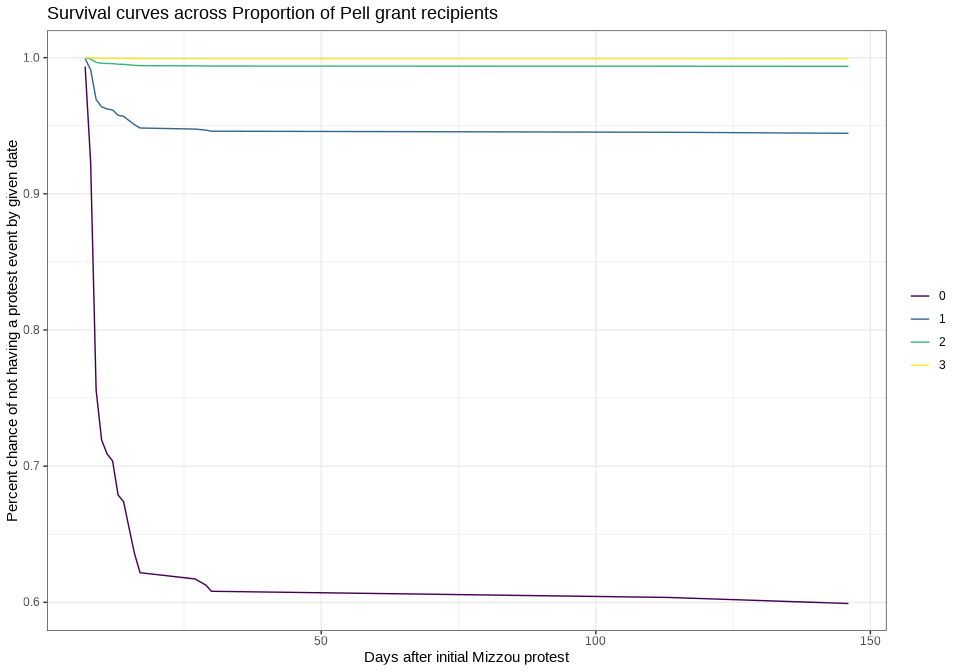<!-- -->

    ## 
    ## [[6]]

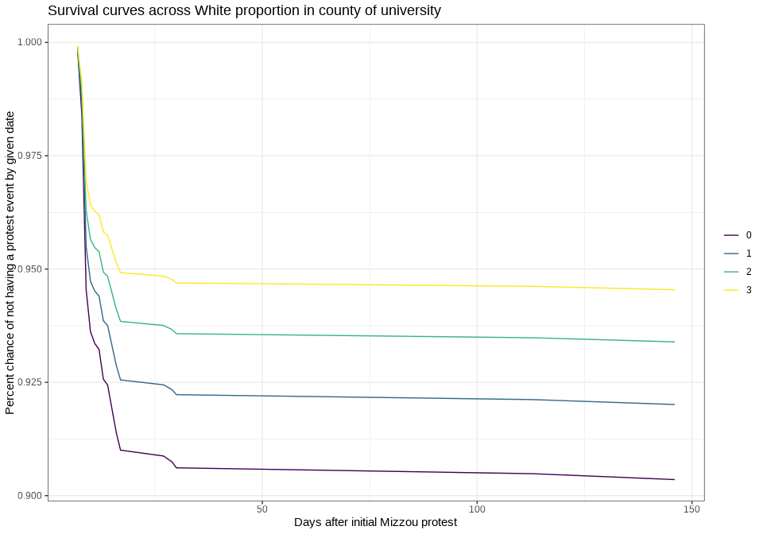<!-- -->

    ## 
    ## [[7]]

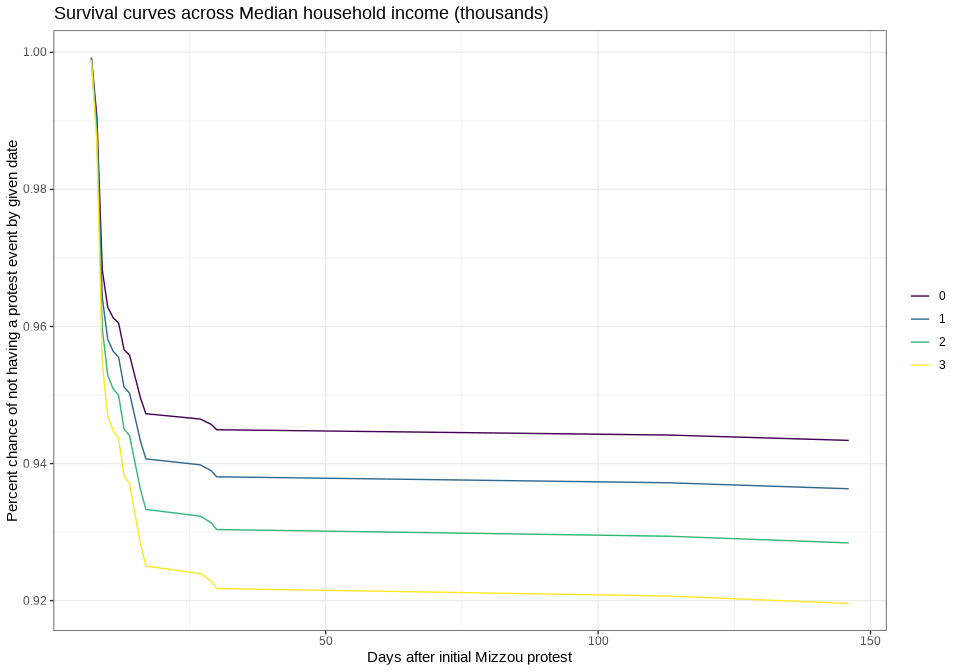<!-- -->

    ## 
    ## [[8]]

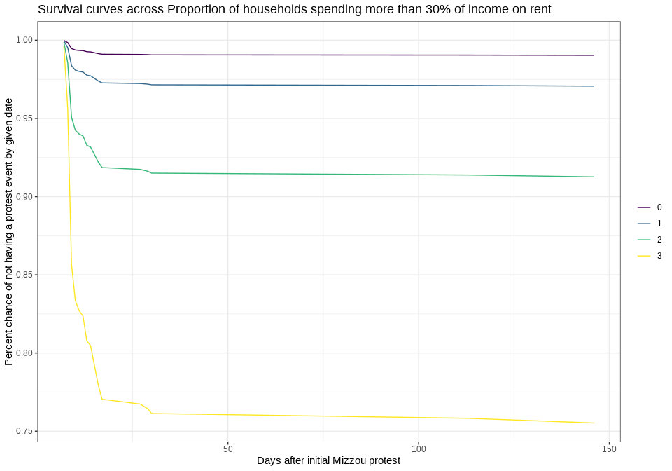<!-- -->

    ## 
    ## [[9]]

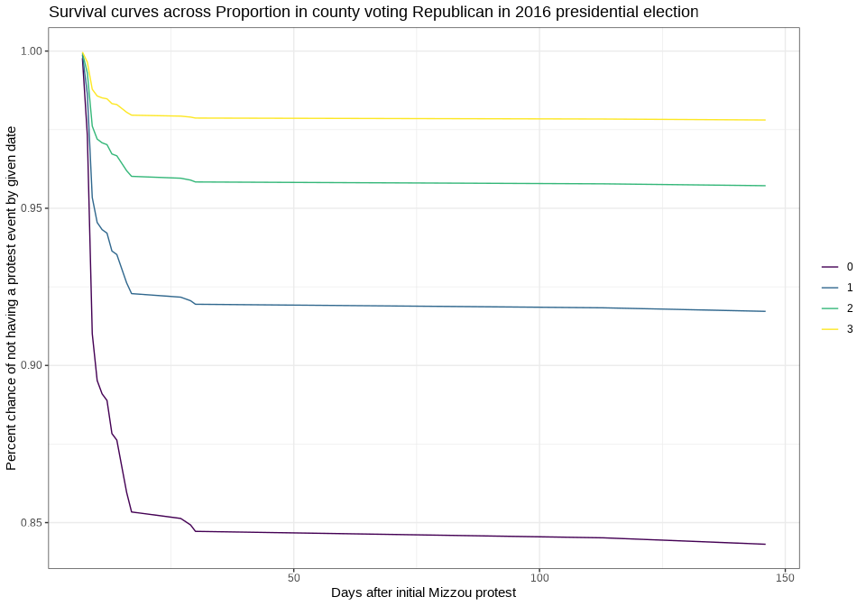<!-- -->

# Review of main models
