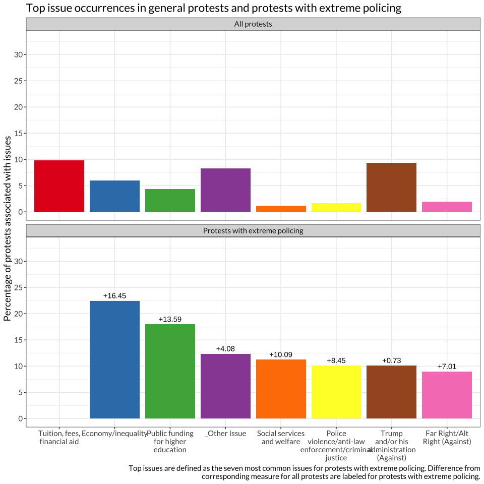
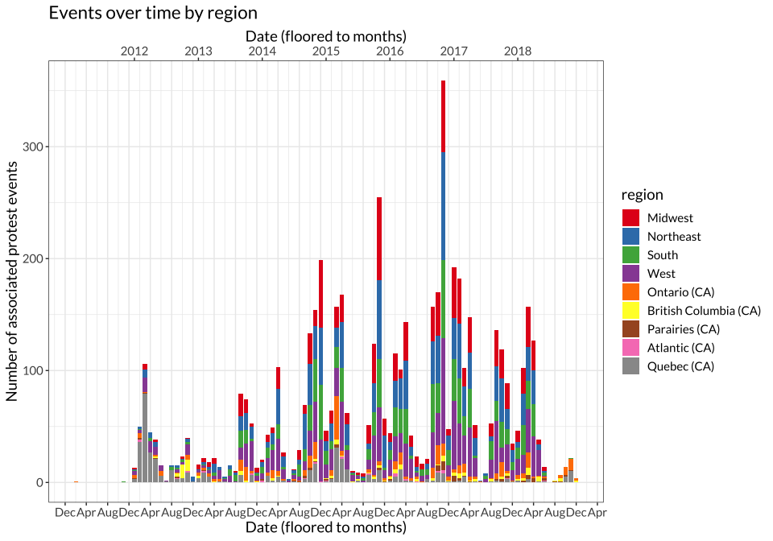
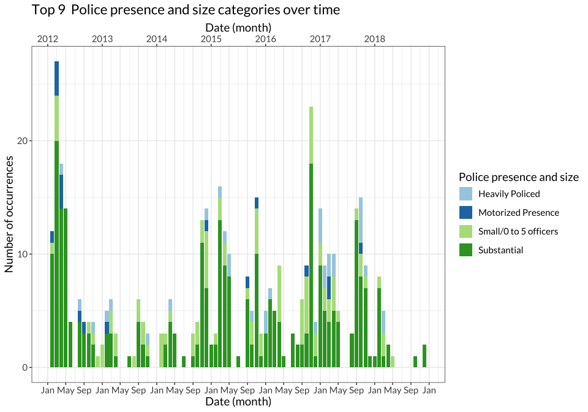
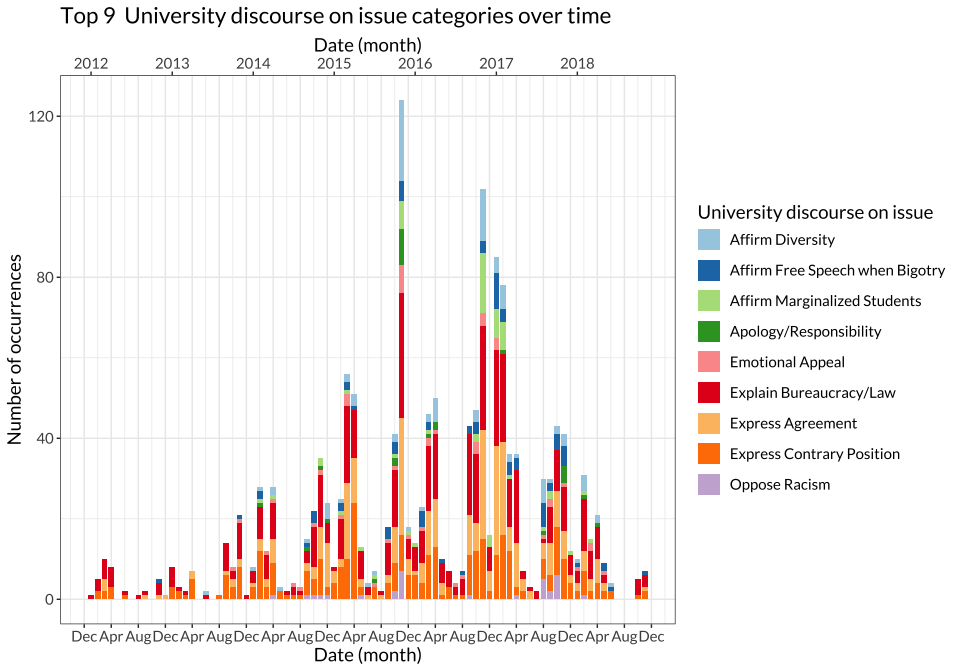
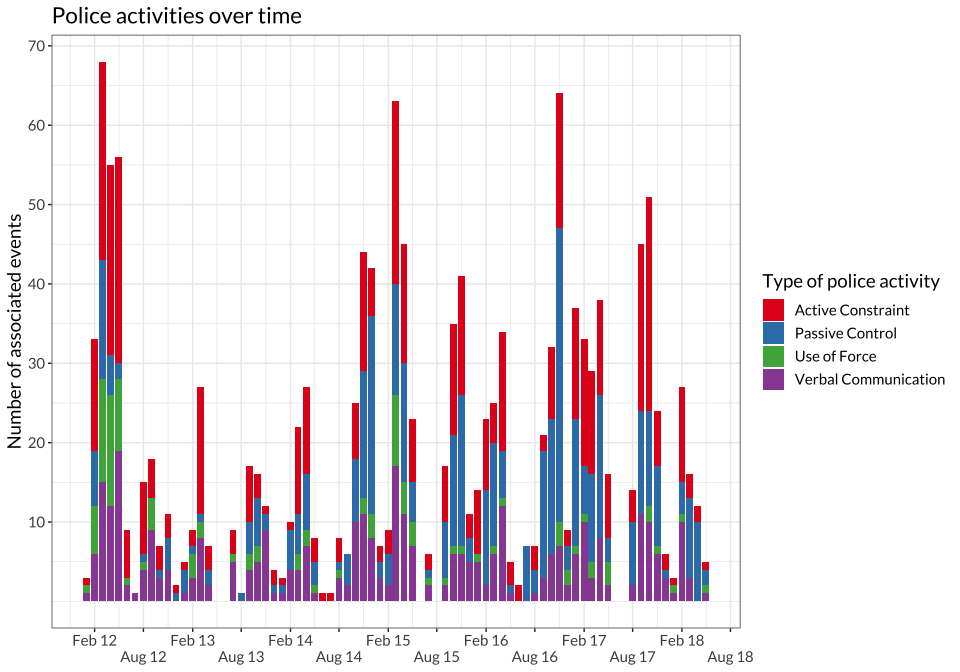
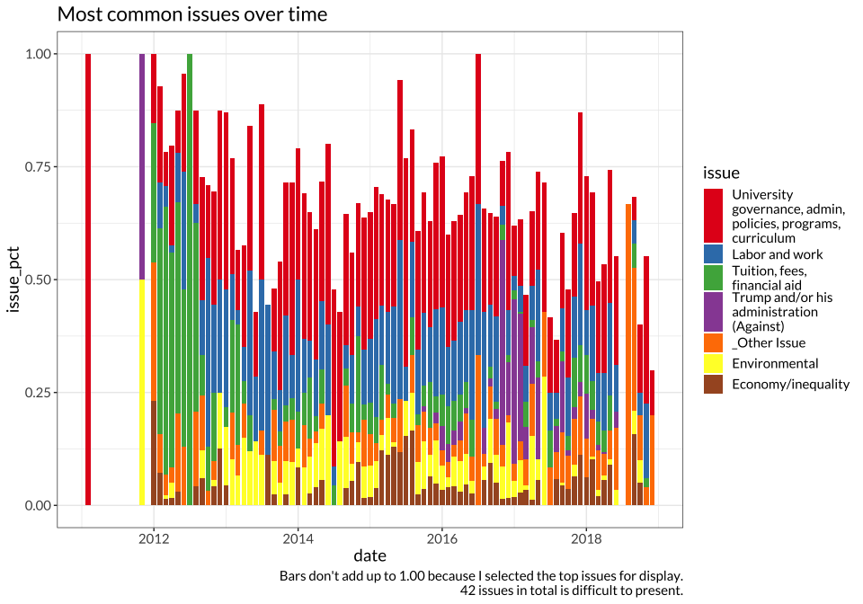
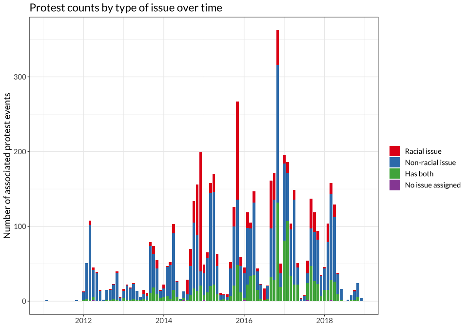
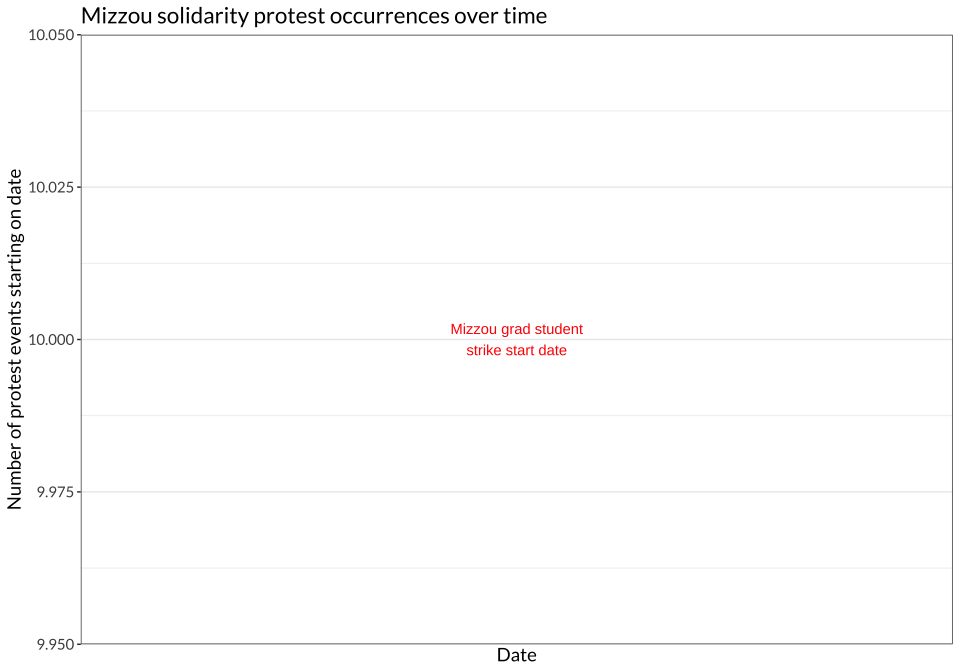

Exploratory Plots
================

- [Basic counts](#basic-counts)
  - [For US events, public/private division of police
    analyses](#for-us-events-publicprivate-division-of-police-analyses)
- [Counts of university responses](#counts-of-university-responses)
  - [For US, university responses disaggregated by public/private
    status](#for-us-university-responses-disaggregated-by-publicprivate-status)
  - [Counts by (combined) issue](#counts-by-combined-issue)
  - [Counts by combined issue, separated by
    country](#counts-by-combined-issue-separated-by-country)
  - [Counts by (split) issue and racial
    issue](#counts-by-split-issue-and-racial-issue)
  - [Counts of forms](#counts-of-forms)
  - [Counts of targets](#counts-of-targets)
- [Police involvement by issue](#police-involvement-by-issue)
- [Police involvement by issue separated by
  country](#police-involvement-by-issue-separated-by-country)
- [Police involvement for US disaggregated by public vs private
  universities](#police-involvement-for-us-disaggregated-by-public-vs-private-universities)
- [Percentages of all protest with given
  preset](#percentages-of-all-protest-with-given-preset)
- [Counts over time](#counts-over-time)
  - [Police activities over time](#police-activities-over-time)
  - [Racial and “nonracial” issues over time
    (collapsed)](#racial-and-nonracial-issues-over-time-collapsed)
- [Issue co-occurrence](#issue-co-occurrence)
- [Basic summary plots by variable](#basic-summary-plots-by-variable)
- [Trying out joins with protest
  data](#trying-out-joins-with-protest-data)
- [Maps and related things](#maps-and-related-things)
- [Investigating specific movements](#investigating-specific-movements)
  - [2015 Mizzou protests](#2015-mizzou-protests)
    - [Mizzou issues](#mizzou-issues)
    - [2015 Antiracism protest profiles and
      comparison](#2015-antiracism-protest-profiles-and-comparison)
    - [Newspaper coverage for Mizzou
      umbrella](#newspaper-coverage-for-mizzou-umbrella)
  - [2012 Quebec protest wave](#2012-quebec-protest-wave)
    - [Quebec events frequency stratified by police
      fields](#quebec-events-frequency-stratified-by-police-fields)
  - [Trump-related protests](#trump-related-protests)
    - [Issue composition November 9th and 17th
      protests](#issue-composition-november-9th-and-17th-protests)
- [Investigating reporting measures](#investigating-reporting-measures)

# Basic counts

| Events with many issues                 | Number of issues |
|:----------------------------------------|-----------------:|
| 20160305_Toronto_March_Feminism         |               14 |
| 20151112_Athens_Rally_Tuition           |               10 |
| 20160928_Hempstead_Rally_Trump(Against) |               10 |
| 20180201_Toronto_March_Anti-War         |               10 |
| 20140208_Raleigh_March_PublicFunding    |                9 |

| Statistic                                             |  Value |
|:------------------------------------------------------|-------:|
| Total imported events                                 | 6016.0 |
| Total non-umbrella events                             | 5561.0 |
| Unique locations                                      |  533.0 |
| US counties                                           |  314.0 |
| Canadian CMAs                                         |   31.0 |
| Universities                                          |  584.0 |
| CEs with missing universities                         |    2.0 |
| Universities with missing locations                   |    6.0 |
| \# of events with police activity recorded            |  880.0 |
| \# of events with any police field recorded           |  933.0 |
| \# of events with university police only              |  457.0 |
| \# of events with government police only              |  287.0 |
| \# of events with both types of police                |  147.0 |
| \# of events with at least one issue or racial issue  | 5526.0 |
| \# of events with at least one issue and racial issue | 1051.0 |
| mode of issue counts                                  |    1.0 |
| mean of issue counts                                  |    2.1 |
| \# of events with just one issue                      | 2035.0 |

The initial import of the MPEDS db found 6016 unique canonical events,
and after all cleaning steps we still have 6015 canonical events.

However, there’s still an issue regarding duplicate matches in IPEDS we
can detect (there are likely also incorrect matches that we can’t detect
programmatically right now); there are lots of schools called “Columbia
College” (or another common name) inside IPEDS, so any schools with that
name in MPEDS will be assigned multiple schools. The MPEDS-IPEDS join is
crucial because we also use IPEDS to join county FIPS identifiers, and
thus no further joins will be accurate unless the MPEDS-IPEDS join is
accurate. As of Jan 30, 2023, we are in the middle of repairing this
join.

Of those events, there were 533 unique locations, 314 unique counties,
31 unique Canadian CMAs, and 584 unique universities. Surprisingly, all
of the locations that were not universities found geocoding matches, and
hand-checking the most common ones indicates that there isn’t a strong
pattern of missing value substitution, e.g. Google isn’t sending the
majority of results to the centroid of America or to `(-1, -1)` or
anything weird like that. Universities had a harder time, with 2
canonical events missing lon/lat coords for universities.

That comes out to ~5% of universities not having coordinates, and ~2.5%
of canonical events not having universities with coordinates.

The top universities by appearances:

| university_name                      |   n |
|:-------------------------------------|----:|
| University of California Berkeley    | 286 |
| McGill University                    | 265 |
| Concordia University                 | 244 |
| Harvard University                   | 148 |
| University of Toronto                | 123 |
| University of Michigan Ann Arbor     | 122 |
| University of California Los Angeles | 114 |
| Ryerson University                   |  90 |
| Columbia University                  |  84 |
| York University                      |  84 |
| University of Missouri Columbia      |  74 |
| University of Chicago                |  73 |
| Tufts University                     |  71 |
| University of Texas Austin           |  59 |
| University of Wisconsin Madison      |  58 |

And the top locations:

| location               |   n |
|:-----------------------|----:|
| Montreal, QC, Canada   | 414 |
| Berkeley, CA, USA      | 227 |
| Toronto, ON, Canada    | 219 |
| New York City, NY, USA | 166 |
| Los Angeles, CA, USA   | 133 |
| Cambridge, MA, USA     | 129 |
| Chicago, IL, USA       | 115 |
| Ann Arbor, MI, USA     | 109 |
| San Diego, CA, USA     |  92 |
| San Francisco, CA, USA |  86 |
| Washington, D.C., USA  |  73 |
| Columbia, MO, USA      |  66 |
| Boston, MA, USA        |  56 |
| Austin, TX, USA        |  54 |
| Vancouver, BC, Canada  |  53 |

Top states:

| area_name            |   n |
|:---------------------|----:|
| California           | 904 |
| Quebec               | 458 |
| Massachusetts        | 345 |
| New York             | 327 |
| Ontario              | 324 |
| Illinois             | 258 |
| Pennsylvania         | 188 |
| Michigan             | 167 |
| Texas                | 162 |
| Ohio                 | 139 |
| Missouri             | 130 |
| District of Columbia | 128 |
| Virginia             | 119 |
| British Col          | 115 |
| Connecticut          | 110 |

And finally the top counties:

| locality_name        |   n |
|:---------------------|----:|
| Montréal             | 428 |
| Middlesex            | 281 |
| Alameda              | 251 |
| Toronto              | 236 |
| Los Angeles          | 202 |
| New York             | 174 |
| Cook                 | 139 |
| District of Columbia | 128 |
| Washtenaw            | 116 |
| San Diego            | 100 |
| San Francisco        |  87 |
| Vancouver            |  85 |
| Boone                |  66 |
| Santa Clara          |  59 |
| Suffolk              |  57 |
| Travis               |  57 |

These glimpses seem mostly in line with what we should expect, with a
strong caveat that the Missouri protests are not making a leading
appearance in the counts by location, but there do seem to be a fair
number in Missouri when we take a look by state. It seems there are
non-MO locations being recognized as happening in Missouri. See our 1:1
notes Google Doc for details.

| police_presence_and_size | Canada |   US | Total |
|:-------------------------|-------:|-----:|------:|
| NA                       |    767 | 3865 |  4632 |
| NA/Unclear               |     61 |  346 |   407 |
| Substantial              |    130 |  165 |   295 |
| Small/0 to 5 officers    |     17 |   72 |    89 |
| Heavily Policed          |     16 |   17 |    33 |
| Motorized Presence       |     14 |    3 |    17 |

| police_activities            | Canada |   US | Total |
|:-----------------------------|-------:|-----:|------:|
| NA                           |    755 | 3783 |  4538 |
| Monitor/Present              |     89 |  323 |   412 |
| Instruct/Warn                |     56 |  126 |   182 |
| Constrain                    |     67 |   99 |   166 |
| Arrest or Attempted          |     49 |  115 |   164 |
| Formal Accusation            |     31 |   74 |   105 |
| Remove Individual Protesters |     13 |   52 |    65 |
| End Protest                  |     27 |   34 |    61 |
| Force: Vague/Body            |     34 |   24 |    58 |
| “Breaking the Rules”         |     24 |   31 |    55 |
| Detain                       |     18 |   30 |    48 |
| NA/Unclear                   |      6 |   29 |    35 |
| Force: 2+ Weapon Types       |     22 |    6 |    28 |
| Present                      |      1 |   26 |    27 |
| Force: Weapon                |     19 |    7 |    26 |
| Arrest- Large Scale          |     16 |    7 |    23 |
| Cooperate/Coordinate         |      1 |   13 |    14 |
| Participate                  |      1 |    5 |     6 |
| Disputed Actions             |      2 |    3 |     5 |
| “We’re Responsive”           |     NA |    2 |    NA |

| type_of_police        | Canada |   US | Total |
|:----------------------|-------:|-----:|------:|
| NA                    |    756 | 3774 |  4530 |
| Univ police           |     69 |  397 |   466 |
| Govt police           |    103 |  199 |   302 |
| Univ police - assumed |     21 |  125 |   146 |
| Govt police - assumed |     63 |   74 |   137 |
| “Riot police”         |     54 |   16 |    70 |
| Private Security      |     11 |   17 |    28 |
| NA/Unclear            |     NA |    6 |    NA |
| Secret Service        |     NA |    3 |    NA |

## For US events, public/private division of police analyses

| police_presence_and_size | Private | Public |  NA |
|:-------------------------|--------:|-------:|----:|
| NA                       |    1290 |   2145 | 430 |
| NA/Unclear               |      84 |    227 |  35 |
| Substantial              |      45 |    105 |  15 |
| Small/0 to 5 officers    |      16 |     47 |   9 |
| Heavily Policed          |       6 |      9 |   2 |
| Motorized Presence       |       1 |      2 |  NA |

| police_activities            | Private | Public |  NA |
|:-----------------------------|--------:|-------:|----:|
| NA                           |    1263 |   2101 | 419 |
| Monitor/Present              |      95 |    201 |  27 |
| Instruct/Warn                |      28 |     79 |  19 |
| Arrest or Attempted          |      27 |     72 |  16 |
| Constrain                    |      22 |     61 |  16 |
| Formal Accusation            |      13 |     47 |  14 |
| Remove Individual Protesters |      18 |     29 |   5 |
| End Protest                  |       6 |     22 |   6 |
| Detain                       |       4 |     21 |   5 |
| “Breaking the Rules”         |       8 |     18 |   5 |
| Present                      |       3 |     17 |   6 |
| NA/Unclear                   |      10 |     16 |   3 |
| Force: Vague/Body            |       7 |     14 |   3 |
| Cooperate/Coordinate         |       2 |     10 |   1 |
| Force: 2+ Weapon Types       |       1 |      5 |  NA |
| Force: Weapon                |       1 |      5 |   1 |
| Arrest- Large Scale          |       1 |      4 |   2 |
| Participate                  |       1 |      4 |  NA |
| Disputed Actions             |       2 |      1 |  NA |
| “We’re Responsive”           |      NA |      1 |   1 |

| type_of_police        | Private | Public |  NA |
|:----------------------|--------:|-------:|----:|
| NA                    |    1258 |   2097 | 419 |
| Univ police           |     106 |    246 |  45 |
| Govt police           |      67 |    116 |  16 |
| Univ police - assumed |      22 |     94 |   9 |
| Govt police - assumed |      23 |     42 |   9 |
| “Riot police”         |      NA |     14 |   2 |
| Private Security      |       5 |     11 |   1 |
| NA/Unclear            |      NA |      2 |   4 |
| Secret Service        |      NA |      2 |   1 |

# Counts of university responses

| university_action_on_issue | Canada |   US | Total |
|:---------------------------|-------:|-----:|------:|
| NA                         |    736 | 3197 |  3933 |
| NA/Unclear                 |    152 |  678 |   830 |
| Action in Process          |     59 |  331 |   390 |
| Reject Demand              |     30 |  152 |   182 |
| Structural Change          |      4 |   86 |    90 |
| Fulfill Demand             |      8 |   75 |    83 |
| No Cancellation            |      5 |   51 |    56 |
| Compromised Action         |      9 |   38 |    47 |
| Hold Forum                 |      4 |   32 |    36 |
| Contrary Action/Refuse     |      7 |   18 |    25 |
| Cancel Speaker/Event       |      2 |   21 |    23 |
| Resign/Fire                |      1 |    6 |     7 |
| Correct Racist History     |     NA |    7 |    NA |
| Sanction                   |     NA |    4 |    NA |
| Short Term Services        |     NA |   14 |    NA |

| university_discourse_on_issue   | Canada |   US | Total |
|:--------------------------------|-------:|-----:|------:|
| NA                              |    729 | 3181 |  3910 |
| NA/Unclear                      |     97 |  445 |   542 |
| Explain Bureaucracy/Law         |    111 |  384 |   495 |
| Express Contrary Position       |     54 |  284 |   338 |
| Express Agreement               |     29 |  297 |   326 |
| Affirm Diversity                |      9 |   90 |    99 |
| Affirm Free Speech when Bigotry |      5 |   72 |    77 |
| Affirm Marginalized Students    |      5 |   54 |    59 |
| Emotional Appeal                |      3 |   43 |    46 |
| Oppose Racism                   |      1 |   30 |    31 |
| Apology/Responsibility          |      3 |   24 |    27 |
| Oppose Oppression               |      1 |   26 |    27 |
| Affirm BIPOC Students           |      3 |   17 |    20 |

| university_reactions_to_protest | Canada |   US | Total |
|:--------------------------------|-------:|-----:|------:|
| NA                              |    735 | 3185 |  3920 |
| NA/Unclear                      |    119 |  583 |   702 |
| Monitor/Present                 |     31 |  255 |   286 |
| Meet                            |     27 |  164 |   191 |
| Direct Communications           |     30 |  156 |   186 |
| Get Confronted                  |     29 |  155 |   184 |
| Instruct/Warn                   |     26 |   89 |   115 |
| Participate/Aid                 |      8 |  106 |   114 |
| Penalize                        |     15 |   32 |    47 |
| Avoid Penalizing                |     13 |   20 |    33 |
| Revisit Protest P&P             |      9 |   24 |    33 |
| No Intervention                 |     23 |    7 |    30 |
| Refuse to Meet                  |      2 |   20 |    22 |
| End Protest                     |      4 |    5 |     9 |
| Protest Elsewhere               |     NA |    3 |    NA |

## For US, university responses disaggregated by public/private status

| police_presence_and_size | Private | Public |  NA |
|:-------------------------|--------:|-------:|----:|
| NA                       |    1290 |   2145 | 430 |
| NA/Unclear               |      84 |    227 |  35 |
| Substantial              |      45 |    105 |  15 |
| Small/0 to 5 officers    |      16 |     47 |   9 |
| Heavily Policed          |       6 |      9 |   2 |
| Motorized Presence       |       1 |      2 |  NA |

| police_activities            | Private | Public |  NA |
|:-----------------------------|--------:|-------:|----:|
| NA                           |    1263 |   2101 | 419 |
| Monitor/Present              |      95 |    201 |  27 |
| Instruct/Warn                |      28 |     79 |  19 |
| Arrest or Attempted          |      27 |     72 |  16 |
| Constrain                    |      22 |     61 |  16 |
| Formal Accusation            |      13 |     47 |  14 |
| Remove Individual Protesters |      18 |     29 |   5 |
| End Protest                  |       6 |     22 |   6 |
| Detain                       |       4 |     21 |   5 |
| “Breaking the Rules”         |       8 |     18 |   5 |
| Present                      |       3 |     17 |   6 |
| NA/Unclear                   |      10 |     16 |   3 |
| Force: Vague/Body            |       7 |     14 |   3 |
| Cooperate/Coordinate         |       2 |     10 |   1 |
| Force: 2+ Weapon Types       |       1 |      5 |  NA |
| Force: Weapon                |       1 |      5 |   1 |
| Arrest- Large Scale          |       1 |      4 |   2 |
| Participate                  |       1 |      4 |  NA |
| Disputed Actions             |       2 |      1 |  NA |
| “We’re Responsive”           |      NA |      1 |   1 |

| type_of_police        | Private | Public |  NA |
|:----------------------|--------:|-------:|----:|
| NA                    |    1258 |   2097 | 419 |
| Univ police           |     106 |    246 |  45 |
| Govt police           |      67 |    116 |  16 |
| Univ police - assumed |      22 |     94 |   9 |
| Govt police - assumed |      23 |     42 |   9 |
| “Riot police”         |      NA |     14 |   2 |
| Private Security      |       5 |     11 |   1 |
| NA/Unclear            |      NA |      2 |   4 |
| Secret Service        |      NA |      2 |   1 |

“NA” marks canonical events where issues were not assigned at all, or
where text-selects were used but not one of the preset issue categories.
“\_Not relevant” *should* be marked when a racial issue was selected
instead, per the codebook. “\_Other issue” marks issues not within the
preset options; the codebook gives the examples of:

- protestors who use hateful speech, e.g. anti-LGBTQ preachers
- (objection to?) corporate practices
- access to higher education (?)
- science (?)
- Armenian genocide (?)

Hm.

## Counts by (combined) issue

Issue counts here were combined for each canonical event, such that no
issue, racial issue, or some combination of the two is counted twice. If
an event has “University governance” for both issue and racial issue, it
is counted once.

The table below thus represents the proportion of all events a given
combined racial-nonracial issue was relevant to.

| issue                                                                     | Canada | US     | Total  |
|:--------------------------------------------------------------------------|:-------|:-------|:-------|
| University governance, admin, policies, programs, curriculum              | 5.7%   | 24.13% | 29.83% |
| Labor and work                                                            | 3.55%  | 13.38% | 16.92% |
| Anti-racism (racialized)                                                  | 0.96%  | 14.17% | 15.13% |
| Tuition, fees, financial aid                                              | 5.3%   | 5.3%   | 10.61% |
| Police violence (racialized)                                              | 0.25%  | 10.06% | 10.32% |
| Trump and/or his administration (Against)                                 | 0.14%  | 9.97%  | 10.12% |
| University governance, admin, policies, programs, curriculum (racialized) | 0.33%  | 9.41%  | 9.74%  |
| \_Other Issue                                                             | 2.39%  | 6.41%  | 8.8%   |
| Immigration (For) (racialized)                                            | 0.16%  | 8.11%  | 8.27%  |
| Campus climate (racialized)                                               | 0.24%  | 7.55%  | 7.78%  |
| Environmental                                                             | 1.19%  | 6.14%  | 7.33%  |
| Economy/inequality                                                        | 2.44%  | 4.09%  | 6.53%  |
| Sexual assault/violence                                                   | 0.89%  | 4.76%  | 5.65%  |
| Feminism/women’s issues                                                   | 1%     | 3.95%  | 4.94%  |
| Public funding for higher education                                       | 1.76%  | 2.95%  | 4.71%  |
| Faith-based discrimination                                                | 0.71%  | 3.62%  | 4.33%  |
| LGB+/Sexual orientation (For)                                             | 0.36%  | 3%     | 3.37%  |
| Indigenous issues (racialized)                                            | 0.92%  | 2.03%  | 2.95%  |
| White supremacy (Against) (racialized)                                    | 0.24%  | 2.33%  | 2.57%  |
| Transgender issues (For)                                                  | 0.33%  | 1.99%  | 2.32%  |
| \_Other Issue (racialized)                                                | 0.24%  | 1.95%  | 2.19%  |
| Far Right/Alt Right (Against)                                             | 0.22%  | 1.88%  | 2.1%   |
| Abortion access                                                           | 0.47%  | 1.34%  | 1.81%  |
| Gun control                                                               | 0.04%  | 1.77%  | 1.81%  |
| Police violence/anti-law enforcement/criminal justice                     | 0.4%   | 1.41%  | 1.81%  |
| Hate speech                                                               | 0.27%  | 1.48%  | 1.76%  |
| Abortion (Against)/Pro-life                                               | 0.36%  | 1.32%  | 1.68%  |
| Racist/racialized symbols (racialized)                                    | 0.07%  | 1.56%  | 1.63%  |
| Hate speech (racialized)                                                  | 0.04%  | 1.54%  | 1.57%  |
| Free speech                                                               | 0.36%  | 1.14%  | 1.5%   |
| Pro-Palestine/BDS                                                         | 0.52%  | 0.81%  | 1.34%  |
| Hate crimes/Anti-minority violence (racialized)                           | 0.18%  | 1.1%   | 1.29%  |
| Social services and welfare                                               | 0.96%  | 0.29%  | 1.25%  |
| Anti-war/peace                                                            | 0.33%  | 0.72%  | 1.05%  |
| LGB+/Sexual orientation (Against)                                         | 0.04%  | 0.85%  | 0.89%  |
| Prison/mass incarceration (racialized)                                    | 0.02%  | 0.83%  | 0.85%  |
| Human rights                                                              | 0.27%  | 0.45%  | 0.72%  |
| Memorials & anniversaries (racialized)                                    | 0.07%  | 0.62%  | 0.69%  |
| Far Right/Alt Right (For)                                                 | 0.07%  | 0.58%  | 0.65%  |
| Domestic foreign policy                                                   | 0.07%  | 0.47%  | 0.54%  |
| Accessibility                                                             | 0.11%  | 0.29%  | 0.4%   |
| Animal rights                                                             | 0.07%  | 0.33%  | 0.4%   |
| Hate crimes/Anti-minority violence                                        | 0.13%  | 0.27%  | 0.4%   |
| White supremacy (For) (racialized)                                        | 0.04%  | 0.36%  | 0.4%   |
| Anti-colonial/political independence                                      | 0.24%  | 0.14%  | 0.38%  |
| Transgender issues (Against)                                              | 0.04%  | 0.33%  | 0.36%  |
| Political corruption/malfeasance                                          | 0.05%  | 0.24%  | 0.29%  |
| Pro-Israel/Zionism                                                        | 0.16%  | 0.11%  | 0.27%  |
| Racial/ethnic pride - white (racialized)                                  | 0.02%  | 0.07%  | 0.09%  |
| Reparations (racialized)                                                  | 0.04%  | 0.05%  | 0.09%  |
| Men’s rights                                                              | 0.02%  | NA%    | NA%    |
| Affirmative action (Against) (racialized)                                 | NA%    | 0.07%  | NA%    |
| Affirmative action (For) (racialized)                                     | NA%    | 0.62%  | NA%    |
| All Lives Matter (racialized)                                             | NA%    | 0.11%  | NA%    |
| Cultural appropriation (racialized)                                       | NA%    | 0.36%  | NA%    |
| Gun owner rights                                                          | NA%    | 0.24%  | NA%    |
| Immigration (Against) (racialized)                                        | NA%    | 0.34%  | NA%    |
| K-12 education (racialized)                                               | NA%    | 0.02%  | NA%    |
| Pro-law enforcement                                                       | NA%    | 0.07%  | NA%    |
| Pro-police (racialized)                                                   | NA%    | 0.09%  | NA%    |
| Racial/ethnic pride - minority (racialized)                               | NA%    | 0.02%  | NA%    |
| Traditional marriage/family                                               | NA%    | 0.11%  | NA%    |
| Transgender issues                                                        | NA%    | 0.02%  | NA%    |
| Trump and/or his administration (For)                                     | NA%    | 0.92%  | NA%    |

## Counts by combined issue, separated by country

| issue                                                                     | Canada |   US | Total |
|:--------------------------------------------------------------------------|-------:|-----:|------:|
| University governance, admin, policies, programs, curriculum              |    315 | 1333 |  1648 |
| Labor and work                                                            |    196 |  739 |   935 |
| Anti-racism (racialized)                                                  |     53 |  783 |   836 |
| Tuition, fees, financial aid                                              |    293 |  293 |   586 |
| Police violence (racialized)                                              |     14 |  556 |   570 |
| Trump and/or his administration (Against)                                 |      8 |  551 |   559 |
| University governance, admin, policies, programs, curriculum (racialized) |     18 |  520 |   538 |
| \_Other Issue                                                             |    132 |  354 |   486 |
| Immigration (For) (racialized)                                            |      9 |  448 |   457 |
| Campus climate (racialized)                                               |     13 |  417 |   430 |
| Environmental                                                             |     66 |  339 |   405 |
| Economy/inequality                                                        |    135 |  226 |   361 |
| Sexual assault/violence                                                   |     49 |  263 |   312 |
| Feminism/women’s issues                                                   |     55 |  218 |   273 |
| Public funding for higher education                                       |     97 |  163 |   260 |
| Faith-based discrimination                                                |     39 |  200 |   239 |
| LGB+/Sexual orientation (For)                                             |     20 |  166 |   186 |
| Indigenous issues (racialized)                                            |     51 |  112 |   163 |
| White supremacy (Against) (racialized)                                    |     13 |  129 |   142 |
| Transgender issues (For)                                                  |     18 |  110 |   128 |
| \_Other Issue (racialized)                                                |     13 |  108 |   121 |
| Far Right/Alt Right (Against)                                             |     12 |  104 |   116 |
| Abortion access                                                           |     26 |   74 |   100 |
| Gun control                                                               |      2 |   98 |   100 |
| Police violence/anti-law enforcement/criminal justice                     |     22 |   78 |   100 |
| Hate speech                                                               |     15 |   82 |    97 |
| Abortion (Against)/Pro-life                                               |     20 |   73 |    93 |
| Racist/racialized symbols (racialized)                                    |      4 |   86 |    90 |
| Hate speech (racialized)                                                  |      2 |   85 |    87 |
| Free speech                                                               |     20 |   63 |    83 |
| Pro-Palestine/BDS                                                         |     29 |   45 |    74 |
| Hate crimes/Anti-minority violence (racialized)                           |     10 |   61 |    71 |
| Social services and welfare                                               |     53 |   16 |    69 |
| Anti-war/peace                                                            |     18 |   40 |    58 |
| LGB+/Sexual orientation (Against)                                         |      2 |   47 |    49 |
| Prison/mass incarceration (racialized)                                    |      1 |   46 |    47 |
| Human rights                                                              |     15 |   25 |    40 |
| Memorials & anniversaries (racialized)                                    |      4 |   34 |    38 |
| Far Right/Alt Right (For)                                                 |      4 |   32 |    36 |
| Domestic foreign policy                                                   |      4 |   26 |    30 |
| Accessibility                                                             |      6 |   16 |    22 |
| Animal rights                                                             |      4 |   18 |    22 |
| Hate crimes/Anti-minority violence                                        |      7 |   15 |    22 |
| White supremacy (For) (racialized)                                        |      2 |   20 |    22 |
| Anti-colonial/political independence                                      |     13 |    8 |    21 |
| Transgender issues (Against)                                              |      2 |   18 |    20 |
| Political corruption/malfeasance                                          |      3 |   13 |    16 |
| Pro-Israel/Zionism                                                        |      9 |    6 |    15 |
| Racial/ethnic pride - white (racialized)                                  |      1 |    4 |     5 |
| Reparations (racialized)                                                  |      2 |    3 |     5 |
| Men’s rights                                                              |      1 |   NA |    NA |
| Affirmative action (Against) (racialized)                                 |     NA |    4 |    NA |
| Affirmative action (For) (racialized)                                     |     NA |   34 |    NA |
| All Lives Matter (racialized)                                             |     NA |    6 |    NA |
| Cultural appropriation (racialized)                                       |     NA |   20 |    NA |
| Gun owner rights                                                          |     NA |   13 |    NA |
| Immigration (Against) (racialized)                                        |     NA |   19 |    NA |
| K-12 education (racialized)                                               |     NA |    1 |    NA |
| Pro-law enforcement                                                       |     NA |    4 |    NA |
| Pro-police (racialized)                                                   |     NA |    5 |    NA |
| Racial/ethnic pride - minority (racialized)                               |     NA |    1 |    NA |
| Traditional marriage/family                                               |     NA |    6 |    NA |
| Transgender issues                                                        |     NA |    1 |    NA |
| Trump and/or his administration (For)                                     |     NA |   51 |    NA |

## Counts by (split) issue and racial issue

| issue                                                        | Canada |   US | Total |
|:-------------------------------------------------------------|-------:|-----:|------:|
| University governance, admin, policies, programs, curriculum |    315 | 1333 |  1648 |
| \_Not relevant                                               |     30 |  984 |  1014 |
| Labor and work                                               |    196 |  739 |   935 |
| Tuition, fees, financial aid                                 |    293 |  293 |   586 |
| Trump and/or his administration (Against)                    |      8 |  551 |   559 |
| \_Other Issue                                                |    132 |  354 |   486 |
| Environmental                                                |     66 |  339 |   405 |
| Economy/inequality                                           |    135 |  226 |   361 |
| Sexual assault/violence                                      |     49 |  263 |   312 |
| Feminism/women’s issues                                      |     55 |  218 |   273 |
| Public funding for higher education                          |     97 |  163 |   260 |
| Faith-based discrimination                                   |     39 |  200 |   239 |
| LGB+/Sexual orientation (For)                                |     20 |  166 |   186 |
| Transgender issues (For)                                     |     18 |  110 |   128 |
| Far Right/Alt Right (Against)                                |     12 |  104 |   116 |
| Abortion access                                              |     26 |   74 |   100 |
| Gun control                                                  |      2 |   98 |   100 |
| Police violence/anti-law enforcement/criminal justice        |     22 |   78 |   100 |
| Hate speech                                                  |     15 |   82 |    97 |
| Abortion (Against)/Pro-life                                  |     20 |   73 |    93 |
| Free speech                                                  |     20 |   63 |    83 |
| Pro-Palestine/BDS                                            |     29 |   45 |    74 |
| Social services and welfare                                  |     53 |   16 |    69 |
| NA                                                           |      4 |   65 |    69 |
| Anti-war/peace                                               |     18 |   40 |    58 |
| LGB+/Sexual orientation (Against)                            |      2 |   47 |    49 |
| Human rights                                                 |     15 |   25 |    40 |
| Far Right/Alt Right (For)                                    |      4 |   32 |    36 |
| Domestic foreign policy                                      |      4 |   26 |    30 |
| Accessibility                                                |      6 |   16 |    22 |
| Animal rights                                                |      4 |   18 |    22 |
| Hate crimes/Anti-minority violence                           |      7 |   15 |    22 |
| Anti-colonial/political independence                         |     13 |    8 |    21 |
| Transgender issues (Against)                                 |      2 |   18 |    20 |
| Political corruption/malfeasance                             |      3 |   13 |    16 |
| Pro-Israel/Zionism                                           |      9 |    6 |    15 |
| Men’s rights                                                 |      1 |   NA |    NA |
|                                                              |     NA |    1 |    NA |
| Gun owner rights                                             |     NA |   13 |    NA |
| Pro-law enforcement                                          |     NA |    4 |    NA |
| Traditional marriage/family                                  |     NA |    6 |    NA |
| Transgender issues                                           |     NA |    1 |    NA |
| Trump and/or his administration (For)                        |     NA |   51 |    NA |

| racial_issue                                                 | Canada |   US | Total |
|:-------------------------------------------------------------|-------:|-----:|------:|
| \_Not relevant                                               |    842 | 2407 |  3249 |
| Anti-racism                                                  |     53 |  783 |   836 |
| Police violence                                              |     14 |  556 |   570 |
| University governance, admin, policies, programs, curriculum |     18 |  520 |   538 |
| Immigration (For)                                            |      9 |  448 |   457 |
| Campus climate                                               |     13 |  417 |   430 |
| Indigenous issues                                            |     51 |  112 |   163 |
| White supremacy (Against)                                    |     13 |  129 |   142 |
| \_Other Issue                                                |     13 |  108 |   121 |
| Racist/racialized symbols                                    |      4 |   86 |    90 |
| Hate speech                                                  |      2 |   85 |    87 |
| Hate crimes/Anti-minority violence                           |     10 |   61 |    71 |
| Prison/mass incarceration                                    |      1 |   46 |    47 |
| Memorials & anniversaries                                    |      4 |   34 |    38 |
| White supremacy (For)                                        |      2 |   20 |    22 |
| Racial/ethnic pride - white                                  |      1 |    4 |     5 |
| Reparations                                                  |      2 |    3 |     5 |
| Affirmative action (Against)                                 |     NA |    4 |    NA |
| Affirmative action (For)                                     |     NA |   34 |    NA |
| All Lives Matter                                             |     NA |    6 |    NA |
| Cultural appropriation                                       |     NA |   20 |    NA |
| Immigration (Against)                                        |     NA |   19 |    NA |
| K-12 education                                               |     NA |    1 |    NA |
| Pro-police                                                   |     NA |    5 |    NA |
| Racial/ethnic pride - minority                               |     NA |    1 |    NA |

## Counts of forms

| form                                          | Canada |   US | Total |
|:----------------------------------------------|-------:|-----:|------:|
| Rally/demonstration                           |    374 | 2391 |  2765 |
| March                                         |    241 | 1347 |  1588 |
| Blockade/slowdown/disruption                  |    157 |  397 |   554 |
| Symbolic display/symbolic action              |     37 |  502 |   539 |
| Petition                                      |    128 |  407 |   535 |
| Strike/walkout/lockout                        |    200 |  331 |   531 |
| \_Other Form                                  |     76 |  399 |   475 |
| Occupation/sit-in                             |     45 |  253 |   298 |
| Information distribution                      |     60 |  207 |   267 |
| NA                                            |     20 |  204 |   224 |
| Picketing                                     |     97 |   99 |   196 |
| Vigil                                         |     25 |  160 |   185 |
| Property damage                               |     19 |   24 |    43 |
| Boycott                                       |      9 |   18 |    27 |
| Press conference                              |      6 |   16 |    22 |
| Violence/attack against persons by protesters |      5 |   17 |    22 |
| Hunger Strike                                 |      3 |   13 |    16 |
| Riot                                          |      1 |    8 |     9 |
| Violence/attack                               |      1 |    1 |     2 |
| Civil disobedience                            |     NA |    2 |    NA |
| Information distribution/leafleting           |     NA |   20 |    NA |

## Counts of targets

| target                         | Canada |   US | Total |
|:-------------------------------|-------:|-----:|------:|
| University/school              |    367 | 2005 |  2372 |
| Domestic government            |    417 | 1008 |  1425 |
| Individual                     |     70 |  715 |   785 |
| \_No target                    |     96 |  623 |   719 |
| Police                         |     35 |  585 |   620 |
| \_Other target                 |     96 |  302 |   398 |
| Private/business               |     29 |  155 |   184 |
| Non-governmental organization  |     26 |   68 |    94 |
| NA                             |      5 |   59 |    64 |
| Foreign government             |     27 |   12 |    39 |
| Political party                |      1 |   16 |    17 |
| Other minority group           |      1 |    7 |     8 |
| Ethnic/racial group            |      1 |    4 |     5 |
| Intergovernmental organization |     NA |    2 |    NA |
| Medical facility/organization  |     NA |   22 |    NA |

# Police involvement by issue

We’re interested in describing police involvement by issue – what issues
attract the heaviest police presence and response?

I filtered our dataset to include only rows that had at least one
non-missing value for type of police, police actions, police activities,
and police presence and size, and tabulated the issues reported in the
remaining dataset. The table can thus be read as the most popular issues
among police-involved protests.

In the table below, counts may be inflated given each canonical event
could have multiple issues.

This table should be compared to the table of percentages of issues
across all events to be meaningful for the questions we’d like to
answer. For example, university governance makes a strong appearance
here, but that could be just because it is a popular issue at large, not
because protests around the issue attract police. On the other hand,
tuition and fees makes a solid jump here from having 10% prevalence
across all events but with 16% prevalence across police-involved events.
This makes sense given our knowledge that the Quebec tuition strike
protests were heavily policed.

| Issue                                                                 | Percent of events with given issue |
|:----------------------------------------------------------------------|-----------------------------------:|
| University governance, admin, policies, programs, curriculum          |                              27.87 |
| Tuition, fees, financial aid                                          |                              16.51 |
| Anti-racism (racial)                                                  |                              14.90 |
| Labor and work                                                        |                              11.90 |
| Police violence (racial)                                              |                              11.15 |
| \_Other Issue                                                         |                              10.83 |
| Trump and/or his administration (Against)                             |                               9.86 |
| Economy/inequality                                                    |                               8.68 |
| University governance, admin, policies, programs, curriculum (racial) |                               7.82 |
| Environmental                                                         |                               6.65 |
| Campus climate (racial)                                               |                               6.43 |
| Public funding for higher education                                   |                               5.57 |
| Far Right/Alt Right (Against)                                         |                               5.47 |
| Immigration (For) (racial)                                            |                               5.25 |
| White supremacy (Against) (racial)                                    |                               5.04 |
| LGB+/Sexual orientation (For)                                         |                               4.82 |
| Feminism/women’s issues                                               |                               4.61 |
| Faith-based discrimination                                            |                               4.39 |
| Sexual assault/violence                                               |                               4.29 |
| Police violence/anti-law enforcement/criminal justice                 |                               3.43 |
| Transgender issues (For)                                              |                               3.43 |
| Hate speech                                                           |                               3.00 |
| Abortion access                                                       |                               2.79 |
| Abortion (Against)/Pro-life                                           |                               2.57 |
| Social services and welfare                                           |                               2.36 |
| Far Right/Alt Right (For)                                             |                               2.25 |
| Free speech                                                           |                               2.25 |
| Hate speech (racial)                                                  |                               2.04 |
| Indigenous issues (racial)                                            |                               2.04 |
| LGB+/Sexual orientation (Against)                                     |                               2.04 |
| \_Other Issue (racial)                                                |                               1.93 |
| Anti-war/peace                                                        |                               1.71 |
| Pro-Palestine/BDS                                                     |                               1.61 |
| Racist/racialized symbols (racial)                                    |                               1.61 |
| White supremacy (For) (racial)                                        |                               1.61 |
| Transgender issues (Against)                                          |                               1.18 |
| Domestic foreign policy                                               |                               0.96 |
| Prison/mass incarceration (racial)                                    |                               0.96 |
| Trump and/or his administration (For)                                 |                               0.96 |
| Hate crimes/Anti-minority violence (racial)                           |                               0.86 |
| Gun control                                                           |                               0.75 |
| Affirmative action (For) (racial)                                     |                               0.54 |
| Animal rights                                                         |                               0.54 |
| Accessibility                                                         |                               0.43 |
| Anti-colonial/political independence                                  |                               0.43 |
| Political corruption/malfeasance                                      |                               0.43 |
| Pro-Israel/Zionism                                                    |                               0.43 |
| All Lives Matter (racial)                                             |                               0.32 |
| Human rights                                                          |                               0.32 |
| Immigration (Against) (racial)                                        |                               0.32 |
| Gun owner rights                                                      |                               0.21 |
| Hate crimes/Anti-minority violence                                    |                               0.21 |
| Memorials & anniversaries (racial)                                    |                               0.21 |
| Traditional marriage/family                                           |                               0.21 |
| Men’s rights                                                          |                               0.11 |
| Racial/ethnic pride - white (racial)                                  |                               0.11 |

<!-- --><!-- --><!-- -->

<!-- --><!-- -->

# Police involvement by issue separated by country

| issue                                                                 |  US | Canada |
|:----------------------------------------------------------------------|----:|-------:|
| University governance, admin, policies, programs, curriculum          | 203 |     57 |
| Anti-racism (racial)                                                  | 126 |     13 |
| Police violence (racial)                                              |  99 |      5 |
| Trump and/or his administration (Against)                             |  91 |      1 |
| Labor and work                                                        |  83 |     28 |
| University governance, admin, policies, programs, curriculum (racial) |  73 |     NA |
| \_Other Issue                                                         |  68 |     33 |
| Campus climate (racial)                                               |  59 |      1 |
| Tuition, fees, financial aid                                          |  55 |     99 |
| Environmental                                                         |  50 |     12 |
| Immigration (For) (racial)                                            |  47 |      2 |
| Far Right/Alt Right (Against)                                         |  45 |      6 |
| Economy/inequality                                                    |  41 |     40 |
| White supremacy (Against) (racial)                                    |  41 |      6 |
| LGB+/Sexual orientation (For)                                         |  39 |      6 |
| Faith-based discrimination                                            |  38 |      3 |
| Sexual assault/violence                                               |  30 |     10 |
| Feminism/women’s issues                                               |  29 |     14 |
| Public funding for higher education                                   |  26 |     26 |
| Transgender issues (For)                                              |  26 |      6 |
| Hate speech                                                           |  24 |      4 |
| Hate speech (racial)                                                  |  19 |     NA |
| Far Right/Alt Right (For)                                             |  18 |      3 |
| LGB+/Sexual orientation (Against)                                     |  18 |      1 |
| Abortion (Against)/Pro-life                                           |  16 |      8 |
| Police violence/anti-law enforcement/criminal justice                 |  16 |     16 |
| \_Other Issue (racial)                                                |  16 |      2 |
| Free speech                                                           |  15 |      6 |
| Abortion access                                                       |  14 |     12 |
| Racist/racialized symbols (racial)                                    |  14 |      1 |
| White supremacy (For) (racial)                                        |  14 |      1 |
| Indigenous issues (racial)                                            |  11 |      8 |
| Prison/mass incarceration (racial)                                    |   9 |     NA |
| Transgender issues (Against)                                          |   9 |      2 |
| Trump and/or his administration (For)                                 |   9 |     NA |
| Anti-war/peace                                                        |   8 |      8 |
| Domestic foreign policy                                               |   8 |      1 |
| Gun control                                                           |   7 |     NA |
| Hate crimes/Anti-minority violence (racial)                           |   7 |      1 |
| Pro-Palestine/BDS                                                     |   6 |      9 |
| Affirmative action (For) (racial)                                     |   5 |     NA |
| Animal rights                                                         |   4 |      1 |
| Accessibility                                                         |   3 |      1 |
| All Lives Matter (racial)                                             |   3 |     NA |
| Immigration (Against) (racial)                                        |   3 |     NA |
| Political corruption/malfeasance                                      |   3 |      1 |
| Gun owner rights                                                      |   2 |     NA |
| Hate crimes/Anti-minority violence                                    |   2 |     NA |
| Memorials & anniversaries (racial)                                    |   2 |     NA |
| Traditional marriage/family                                           |   2 |     NA |
| Anti-colonial/political independence                                  |   1 |      3 |
| Human rights                                                          |   1 |      2 |
| Social services and welfare                                           |   1 |     21 |
| Men’s rights                                                          |  NA |      1 |
| Pro-Israel/Zionism                                                    |  NA |      4 |
| Racial/ethnic pride - white (racial)                                  |  NA |      1 |

# Police involvement for US disaggregated by public vs private universities

| issue                                                                 | Public | Private |
|:----------------------------------------------------------------------|-------:|--------:|
| University governance, admin, policies, programs, curriculum          |    125 |      67 |
| Anti-racism (racial)                                                  |     74 |      38 |
| Trump and/or his administration (Against)                             |     63 |      23 |
| Police violence (racial)                                              |     62 |      33 |
| Labor and work                                                        |     49 |      29 |
| University governance, admin, policies, programs, curriculum (racial) |     41 |      20 |
| Tuition, fees, financial aid                                          |     39 |       6 |
| \_Other Issue                                                         |     35 |      21 |
| Campus climate (racial)                                               |     34 |      16 |
| Immigration (For) (racial)                                            |     33 |      11 |
| Far Right/Alt Right (Against)                                         |     27 |      11 |
| White supremacy (Against) (racial)                                    |     27 |      10 |
| Economy/inequality                                                    |     26 |      11 |
| Environmental                                                         |     26 |      21 |
| Faith-based discrimination                                            |     25 |       6 |
| LGB+/Sexual orientation (For)                                         |     24 |       7 |
| Feminism/women’s issues                                               |     22 |       7 |
| Sexual assault/violence                                               |     20 |      10 |
| Hate speech                                                           |     17 |       4 |
| Transgender issues (For)                                              |     15 |       7 |
| Abortion (Against)/Pro-life                                           |     14 |       1 |
| Free speech                                                           |     12 |       3 |
| Hate speech (racial)                                                  |     12 |       5 |
| \_Other Issue (racial)                                                |     12 |       3 |
| Abortion access                                                       |     11 |       3 |
| LGB+/Sexual orientation (Against)                                     |     11 |       4 |
| Public funding for higher education                                   |     11 |       8 |
| White supremacy (For) (racial)                                        |     10 |       1 |
| Far Right/Alt Right (For)                                             |      9 |       4 |
| Police violence/anti-law enforcement/criminal justice                 |      9 |       6 |
| Racist/racialized symbols (racial)                                    |      8 |       2 |
| Trump and/or his administration (For)                                 |      7 |      NA |
| Anti-war/peace                                                        |      6 |       2 |
| Domestic foreign policy                                               |      6 |       2 |
| Gun control                                                           |      6 |       1 |
| Indigenous issues (racial)                                            |      6 |       2 |
| Hate crimes/Anti-minority violence (racial)                           |      5 |       2 |
| Pro-Palestine/BDS                                                     |      4 |       2 |
| Transgender issues (Against)                                          |      4 |       5 |
| Animal rights                                                         |      4 |      NA |
| Prison/mass incarceration (racial)                                    |      3 |       4 |
| Affirmative action (For) (racial)                                     |      3 |      NA |
| All Lives Matter (racial)                                             |      3 |      NA |
| Accessibility                                                         |      2 |       1 |
| Immigration (Against) (racial)                                        |      2 |       1 |
| Gun owner rights                                                      |      2 |      NA |
| Memorials & anniversaries (racial)                                    |      1 |       1 |
| Hate crimes/Anti-minority violence                                    |      1 |      NA |
| Human rights                                                          |      1 |      NA |
| Anti-colonial/political independence                                  |     NA |       1 |
| Political corruption/malfeasance                                      |     NA |       3 |
| Social services and welfare                                           |     NA |       1 |
| Traditional marriage/family                                           |     NA |       2 |

# Percentages of all protest with given preset

| issue                                                        |   pct |
|:-------------------------------------------------------------|------:|
| Percent of events with any value                             | 74.31 |
| University governance, admin, policies, programs, curriculum | 28.25 |
| \_Not relevant                                               | 17.06 |
| Labor and work                                               | 15.73 |
| Tuition, fees, financial aid                                 |  9.84 |
| Trump and/or his administration (Against)                    |  9.38 |
| NA                                                           |  8.74 |
| \_Other Issue                                                |  8.30 |
| Environmental                                                |  6.83 |
| Economy/inequality                                           |  6.02 |
| Sexual assault/violence                                      |  5.29 |
| Feminism/women’s issues                                      |  4.67 |
| Public funding for higher education                          |  4.39 |
| Faith-based discrimination                                   |  4.09 |
| LGB+/Sexual orientation (For)                                |  3.13 |
| Transgender issues (For)                                     |  2.16 |
| Far Right/Alt Right (Against)                                |  1.98 |
| Hate speech                                                  |  1.73 |
| Abortion access                                              |  1.70 |
| Gun control                                                  |  1.66 |
| Police violence/anti-law enforcement/criminal justice        |  1.66 |
| Abortion (Against)/Pro-life                                  |  1.55 |
| Free speech                                                  |  1.45 |
| Pro-Palestine/BDS                                            |  1.23 |
| Social services and welfare                                  |  1.15 |
| Anti-war/peace                                               |  0.98 |
| Trump and/or his administration (For)                        |  0.85 |
| LGB+/Sexual orientation (Against)                            |  0.83 |
| Human rights                                                 |  0.68 |
| Far Right/Alt Right (For)                                    |  0.62 |
| Domestic foreign policy                                      |  0.53 |
| Accessibility                                                |  0.38 |
| Hate crimes/Anti-minority violence                           |  0.38 |
| Animal rights                                                |  0.37 |
| Anti-colonial/political independence                         |  0.37 |
| Transgender issues (Against)                                 |  0.33 |
| Pro-Israel/Zionism                                           |  0.28 |
| Political corruption/malfeasance                             |  0.27 |
| Gun owner rights                                             |  0.22 |
| Traditional marriage/family                                  |  0.10 |
| Pro-law enforcement                                          |  0.08 |
| Men’s rights                                                 |  0.03 |
|                                                              |  0.02 |
| Transgender issues                                           |  0.02 |

| racial_issue                                                 |   pct |
|:-------------------------------------------------------------|------:|
| \_Not relevant                                               | 55.16 |
| Percent of events with any value                             | 44.95 |
| Anti-racism                                                  | 14.15 |
| Police violence                                              |  9.51 |
| University governance, admin, policies, programs, curriculum |  9.28 |
| Immigration (For)                                            |  7.73 |
| Campus climate                                               |  7.35 |
| Indigenous issues                                            |  2.76 |
| White supremacy (Against)                                    |  2.41 |
| \_Other Issue                                                |  2.03 |
| Racist/racialized symbols                                    |  1.58 |
| Hate speech                                                  |  1.53 |
| Hate crimes/Anti-minority violence                           |  1.18 |
| Prison/mass incarceration                                    |  0.80 |
| Memorials & anniversaries                                    |  0.63 |
| Affirmative action (For)                                     |  0.58 |
| White supremacy (For)                                        |  0.37 |
| Cultural appropriation                                       |  0.33 |
| Immigration (Against)                                        |  0.32 |
| All Lives Matter                                             |  0.10 |
| Pro-police                                                   |  0.08 |
| Racial/ethnic pride - white                                  |  0.08 |
| Reparations                                                  |  0.08 |
| Affirmative action (Against)                                 |  0.07 |
| K-12 education                                               |  0.02 |
| Racial/ethnic pride - minority                               |  0.02 |

# Counts over time

<!-- --><!-- --><!-- -->

<!-- -->

<!-- -->

<!-- -->

<!-- -->

We can also begin to look at the top universities, counties, locations,
or states over time. This inevitably produces more complex summaries,
and it can be difficult to take an informative glimpse given so many
categories, so I’ve only shown the universities over time for now:

<!-- --><!-- -->

    ## Scale for x is already present.
    ## Adding another scale for x, which will replace the existing scale.

<!-- -->

    ## Scale for x is already present.
    ## Adding another scale for x, which will replace the existing scale.

<!-- -->

    ## Scale for x is already present.
    ## Adding another scale for x, which will replace the existing scale.

<!-- -->

    ## Scale for x is already present.
    ## Adding another scale for x, which will replace the existing scale.

<!-- -->

    ## Scale for x is already present.
    ## Adding another scale for x, which will replace the existing scale.

<!-- -->

    ## Scale for x is already present.
    ## Adding another scale for x, which will replace the existing scale.

<!-- -->

### Police activities over time

Regrouped to be interpretable according to the following crosswalk:

| New umbrella category | Existing police activity     |
|:----------------------|:-----------------------------|
| Use of Force          | Force: Vague/Body            |
| Use of Force          | Force: Weapon                |
| Use of Force          | Force: 2+ Weapon Types       |
| Active Constraint     | Remove Individual Protesters |
| Active Constraint     | Arrest or Attempted          |
| Active Constraint     | Constrain                    |
| Active Constraint     | Arrest- Large Scale          |
| Active Constraint     | Detain                       |
| Active Constraint     | End Protest                  |
| Passive Control       | Cooperate/Coordinate         |
| Passive Control       | Monitor/Present              |
| Passive Control       | Participate                  |
| Passive Control       | Present                      |
| Verbal Communication  | Instruct/Warn                |
| Verbal Communication  | “Breaking the Rules”         |
| Verbal Communication  | Formal Accusation            |
| Verbal Communication  | Disputed Actions             |
| Verbal Communication  | “We’re Responsive”           |
| NA/Unclear            | NA/Unclear                   |

<!-- -->

| racial_issue                                                 |   n |
|:-------------------------------------------------------------|----:|
| Anti-racism                                                  | 851 |
| Police violence                                              | 572 |
| University governance, admin, policies, programs, curriculum | 558 |
| Immigration (For)                                            | 465 |
| Campus climate                                               | 442 |
| Indigenous issues                                            | 166 |
| White supremacy (Against)                                    | 145 |
| \_Other Issue                                                | 122 |
| Racist/racialized symbols                                    |  95 |
| Hate speech                                                  |  92 |
| Hate crimes/Anti-minority violence                           |  71 |
| Prison/mass incarceration                                    |  48 |
| Memorials & anniversaries                                    |  38 |
| Affirmative action (For)                                     |  35 |
| White supremacy (For)                                        |  22 |
| Cultural appropriation                                       |  20 |
| Immigration (Against)                                        |  19 |
| All Lives Matter                                             |   6 |
| Pro-police                                                   |   5 |
| Racial/ethnic pride - white                                  |   5 |
| Reparations                                                  |   5 |
| Affirmative action (Against)                                 |   4 |
| K-12 education                                               |   1 |
| Racial/ethnic pride - minority                               |   1 |

<!-- --><!-- --><!-- -->

## Racial and “nonracial” issues over time (collapsed)

<!-- --><!-- --><!-- -->

I’ve collapsed both types of issues here to show racial and nonracial
issues alongside each other. Racial issue counts here are taken at a
maximum of one per canonical event, so that events that relate to many
issues do not outweight others and we have a clearer understanding of
the weight of protest occurrence. The same goes for nonracial issues.

We’re also interested in understanding if the biggest upticks in protest
counts are driven by an uptick in racial issues. This is

    ## `geom_smooth()` using method = 'loess' and formula = 'y ~ x'

<!-- --><!-- -->

# Issue co-occurrence

<!-- --><!-- -->

# Basic summary plots by variable

| name                 | type    |   mean |     sd |
|:---------------------|:--------|-------:|-------:|
| campaign             | boolean |  0.259 |     NA |
| counterprotest       | boolean |  0.047 |     NA |
| inaccurate_date      | boolean |  0.009 |     NA |
| multiple_cities      | boolean |  0.026 |     NA |
| off_campus           | boolean |  0.074 |     NA |
| on_campus_no_student | boolean |  0.071 |     NA |
| quotes               | boolean |  0.646 |     NA |
| ritual               | boolean |  0.030 |     NA |
| slogans              | boolean |  0.400 |     NA |
| adjudicator_id       | numeric | 53.297 |  2.554 |
| mhi                  | numeric | 64.462 | 16.786 |
| rent_burden          | numeric | 48.824 |  4.685 |
| republican_vote_prop | numeric | 33.183 | 14.691 |
| white_prop           | numeric | 69.357 | 16.642 |

For boolean variables, “mean” is the proportion that they are TRUE. Many
of the variables recorded in MPEDS allowed for the input of multiple
values, so those are handled as list-cols and not shown here.

<!-- -->

The pairs plot is still very difficult to read after adjustments. This
should be treated as a glimpse or overview, and more detailed and
cleaner plots will be made later on.

    ## `stat_bin()` using `bins = 30`. Pick better value with `binwidth`.

<!-- -->

# Trying out joins with protest data

To recap from our last conversation, it’s a bit difficult to join the
CCC data and our data since a lot of MPEDS data points could presumably
be in the CCC records. Then CCC data could be telling us that there was
a protest in the same county, when it could just be talking about the
same protest in MPEDS and essentially be turning data quality into
another covariate.

We discussed two solutions to this problem to avoid deduplication:

- Join so that CCC protests occurring one, three, five, or seven days
  before the MPEDS protest date are matched; the CCC variable then
  conceptually becomes “was there a recent protest in the same county.”
  Thus protests won’t find a match only because of duplicates
- Join only after filtering the CCC dataset so that rows with keywords
  related to universities are kicked out – things like teachers,
  faculty, students, colleges, universities. This is less ideal than the
  above strategy because it is so nonspecific, potentially missing many
  university matches and kicking out protests related to primary and
  secondary schools.

The following chunk gives a glimpse at total number of matches:

| source    | date_offset | recent_protests | match_percentage |
|:----------|------------:|----------------:|-----------------:|
| CCC       |           0 |               0 |                0 |
| CCC       |           1 |               0 |                0 |
| CCC       |           3 |               0 |                0 |
| CCC       |           5 |               0 |                0 |
| CCC       |           7 |               0 |                0 |
| Elephrame |           0 |               0 |                0 |
| Elephrame |           1 |               0 |                0 |
| Elephrame |           3 |               0 |                0 |
| Elephrame |           5 |               0 |                0 |
| Elephrame |           7 |               0 |                0 |

Here, the `match_percentage` column indicates how many canonical events
saw another protest occur in the same county within `diff` days,
according to the dataset in `source`. The fact that the match rate for 0
is much higher than 1 for both Elephrame and CCC indicates that there is
some double-counting of protests; rather than multiple protests
occurring concurrently, we may have recorded a protest in our dataset
that is also present in another dataset.

So it seems that there are a fair number of duplicates occurring if we
don’t have a date offset, but once we add one (of any days) that pretty
much solves the data quality issue.

That being said, the likely larger problem with the CCC data is that
it’s only available after 2017, so it may not be relevant even after we
become satisfied with the deduped match process. This can be refined a
little bit by adding in Elephrame data on BLM protests, but we’ve had
problems there already, and the topic differences mean we can’t pretend
we have complete data.

# Maps and related things

<!-- -->

# Investigating specific movements

## 2015 Mizzou protests

| Statistics for Mizzou protests |   n |
|:-------------------------------|----:|
| Total number of links          |   0 |
| Unique events                  |   0 |

The discrepancy between the total number of links from the original
Mizzou event to the total number of unique events comes from some events
being both campaign events and counterprotest events, or campaign events
and solidarity events.

<!-- --><!-- -->

### Mizzou issues

| value |   n |
|:------|----:|

### 2015 Antiracism protest profiles and comparison

<!-- -->

### Newspaper coverage for Mizzou umbrella

| canonical_key | Article Mentions | Newspaper Mentions |
|:--------------|-----------------:|-------------------:|

## 2012 Quebec protest wave

| Statistics for Quebec protests |   n |
|:-------------------------------|----:|
| Total number of links          | 175 |
| Unique events                  | 176 |
| Campaign events only           | 167 |
| Solidarity events only         |   8 |

<!-- -->

### Quebec events frequency stratified by police fields

For the solidarity paper, we’re interested in a frequency graph of
Quebec-related protests stratified by police presence, activities, and
type. It’s hard to do this on a single graph because there are many
categories involved, so instead I’ve made three separate graphs. I can
also make a single image composed of three sub-plots for presence,
activities, and type.

<!-- --><!-- --><!-- -->

    ## `summarise()` has grouped output by 'date'. You can override using the
    ## `.groups` argument.
    ## `summarise()` has grouped output by 'date'. You can override using the
    ## `.groups` argument.

<!-- -->

    ## `summarise()` has grouped output by 'type', 'name'. You can override using the
    ## `.groups` argument.

<!-- -->

Brainstorming a breakdown for activity recategorization:

- Active Constraint: Arrest or Attempted, Arrest- Large Scale,
  Constrain, Detain,  
  Remove Individual Protestors
- Passive Control: Cooperate/Coordinate, Monitor/Present
- Verbal Communication: Instruct/Warn, “Breaking the Rules”
- Use of Force (all force mentions)
- NA/Unclear

## Trump-related protests

Unlike the above two protest wave profiles, I’m searching for these
protests based on issues, not by canonical event relationships.

<!-- -->

    ## [[1]]

<!-- -->

    ## 
    ## [[2]]

<!-- -->
<!-- -->

### Issue composition November 9th and 17th protests

In our notes document, Dr. Berrey noted that she was surprised to see
most of the November 17th protests were non-racial, and did not have to
do with sanctuary cities. I wanted to offer some more context on that,
as well as on her next comment on the heterogeneity of Trump-related
protests, so I made some tables on this point.

The day with the highest number of protests in our dataset was November
9th, 2016, holding 73 protests, followed by November 12th, 2015 November
16th, 2016. I’ve included tables for the 2016 dates showing the issue
breakdown on all of these dates and also for the November 17th protests
in case it offers any additional clarity.

It seems that “Immigration (For)”, which is the issue closest to the
topic of sanctuary cities that you thought would be at the heart of
these protests, does make a strong appearance for these days, but the
general category of Trump-related protests still far outnumber it.
Because the general Trump category is coded as a non-racial issue, the
chart above showing racial and nonracial issues over time shows more
nonracial issues than racial issues for November 2016.

| Top dates by protest occurrence | \# of events |
|:--------------------------------|-------------:|
| 2016-11-09                      |           72 |
| 2015-11-12                      |           51 |
| 2016-11-16                      |           48 |
| 2018-03-14                      |           48 |
| 2014-12-01                      |           43 |
| 2014-11-25                      |           41 |

| Top dates for immigration-related protests |   n |
|:-------------------------------------------|----:|
| 2016-11-16                                 |  22 |
| 2017-05-01                                 |  17 |
| 2017-02-01                                 |  15 |
| 2017-02-09                                 |  14 |
| 2017-01-31                                 |  13 |
| 2017-01-29                                 |  12 |

| Top ten issues for November 9th, 2016                                 |   n |
|:----------------------------------------------------------------------|----:|
| Trump and/or his administration (Against)                             |  60 |
| Anti-racism (racial)                                                  |   9 |
| Immigration (For) (racial)                                            |   8 |
| University governance, admin, policies, programs, curriculum (racial) |   7 |
| Trump and/or his administration (For)                                 |   4 |
| White supremacy (Against) (racial)                                    |   3 |
| Sexual assault/violence                                               |   2 |
| Campus climate (racial)                                               |   1 |
| Faith-based discrimination                                            |   1 |
| Far Right/Alt Right (Against)                                         |   1 |

| Top ten issues for November 16th, 2016                                |   n |
|:----------------------------------------------------------------------|----:|
| Trump and/or his administration (Against)                             |  30 |
| Immigration (For) (racial)                                            |  22 |
| University governance, admin, policies, programs, curriculum (racial) |  18 |
| University governance, admin, policies, programs, curriculum          |   8 |
| Anti-racism (racial)                                                  |   6 |
| Campus climate (racial)                                               |   5 |
| Faith-based discrimination                                            |   3 |
| Hate crimes/Anti-minority violence (racial)                           |   3 |
| LGB+/Sexual orientation (For)                                         |   3 |
| \_Other Issue (racial)                                                |   3 |

| Top ten issues for November 17th, 2016                                |   n |
|:----------------------------------------------------------------------|----:|
| Trump and/or his administration (Against)                             |   4 |
| University governance, admin, policies, programs, curriculum          |   4 |
| Immigration (For) (racial)                                            |   3 |
| Anti-racism (racial)                                                  |   2 |
| Economy/inequality                                                    |   2 |
| Environmental                                                         |   2 |
| Indigenous issues (racial)                                            |   2 |
| Tuition, fees, financial aid                                          |   2 |
| University governance, admin, policies, programs, curriculum (racial) |   2 |
| Hate crimes/Anti-minority violence                                    |   1 |

# Investigating reporting measures

- Graph of articles per event vs size of protest
  - if reporting perfect, articles should increase linearly with size of
    protest
  - obv will not – what kinds of events attract lots of coverage despite
    being
