Exploratory Plots
================

# Basic counts

The initial import of the MPEDS db found 5220 unique canonical events,
and after all cleaning steps we still have 5220 canonical events.

However, there’s still an issue regarding duplicate matches in IPEDS we
can detect (there are likely also incorrect matches that we can’t detect
programmatically right now); there are lots of schools called “Columbia
College” (or another common name) inside IPEDS, so any schools with that
name in MPEDS will be assigned multiple schools. The MPEDS-IPEDS join is
crucial because we also use IPEDS to join county FIPS identifiers, and
thus no further joins will be accurate unless the MPEDS-IPEDS join is
accurate. As of Jan 30, 2023, we are in the middle of repairing this
join.

Of those events, there were 517 unique locations, 251 unique counties,
and 557 unique universities. Surprisingly, all of the locations that
were not universities found geocoding matches, and hand-checking the
most common ones indicates that there isn’t a strong pattern of missing
value substitution, e.g. Google isn’t sending the majority of results to
the centroid of America or to `(-1, -1)` or anything weird like that.
Universities had a harder time, with 20 universities and 190 rows
(canonical events) not returning lon/lat coords for universities.

That comes out to \~5% of universities not having coordinates, and
\~2.5% of canonical events not having universities with coordinates.

The top universities by appearances:

| university                                  |   n |
|:--------------------------------------------|----:|
| University of California-Berkeley           | 184 |
| McGill University                           | 154 |
| Concordia University                        | 146 |
| Harvard University                          | 145 |
| University of Michigan-Ann Arbor            | 122 |
| University of California-Los Angeles        |  86 |
| University of Toronto                       |  69 |
| University of Chicago                       |  66 |
| Ryerson University                          |  56 |
| Columbia University in the City of New York |  49 |
| Tufts University                            |  49 |
| University of Wisconsin-Madison             |  49 |
| Georgetown University                       |  48 |
| The University of Texas at Austin           |  47 |
| Cornell University                          |  46 |

And the top locations:

| location               |   n |
|:-----------------------|----:|
| Montreal, QC, Canada   | 352 |
| New York City, NY, USA | 172 |
| Berkeley, CA, USA      | 170 |
| Toronto, ON, Canada    | 157 |
| Cambridge, MA, USA     | 139 |
| Chicago, IL, USA       | 133 |
| Los Angeles, CA, USA   | 121 |
| Ann Arbor, MI, USA     | 113 |
| San Diego, CA, USA     |  77 |
| San Francisco, CA, USA |  76 |
| Boston, MA, USA        |  61 |
| Washington, D.C., USA  |  58 |
| Madison, WI, USA       |  48 |
| Davis, CA, USA         |  47 |
| Ithaca, NY, USA        |  47 |

Top states:

|   n | state_name           |
|----:|:---------------------|
| 562 | California           |
| 341 | Massachusetts        |
| 228 | Illinois             |
| 172 | Michigan             |
| 163 | New York             |
| 142 | Pennsylvania         |
| 113 | District of Columbia |
| 111 | Virginia             |
| 108 | Florida              |
| 103 | Texas                |
|  96 | Connecticut          |
|  79 | Wisconsin            |
|  77 | Ohio                 |
|  72 | North Carolina       |
|  59 | Washington           |

And finally the top counties:

|   n | county_name                                |
|----:|:-------------------------------------------|
| 238 | Middlesex County, Massachusetts            |
| 188 | Alameda County, California                 |
| 128 | Cook County, Illinois                      |
| 126 | Washtenaw County, Michigan                 |
| 113 | District of Columbia, District of Columbia |
|  80 | Los Angeles County, California             |
|  63 | New York County, New York                  |
|  59 | San Diego County, California               |
|  56 | San Francisco County, California           |
|  49 | Dane County, Wisconsin                     |
|  48 | Boone County, Missouri                     |
|  48 | Tompkins County, New York                  |
|  47 | Santa Clara County, California             |
|  47 | Travis County, Texas                       |
|  42 | Hampshire County, Massachusetts            |

These glimpses seem mostly in line with what we should expect, with a
strong caveat that the Missouri protests are not making a leading
appearance here. That’s a bit alarming; some playing around with the
dataset reveals there are a fair number of protests both in Missouri and
at University of Missouri-Columbia. There could still be errors here, so
I’m continuing to revise the code.

| police_presence_and_size             |    n |
|:-------------------------------------|-----:|
| NA                                   | 4815 |
| NA/Unclear                           |  380 |
| Small/0 to 5 officers                |   76 |
| Substantial                          |  263 |
| Heavily Policed                      |   18 |
| Motorized Presence                   |    7 |
| Substantial , Motorized Presence     |    6 |
| Motorized Presence, Heavily Policed  |    2 |
| Heavily Policed , Motorized Presence |    3 |
| Heavily Policed, Substantial         |    4 |
| Substantial , Heavily Policed        |    2 |
| NA/Unclear , Small/0 to 5 officers   |    1 |
| Motorized Presence, Substantial      |    1 |

| police_activities                                                                                                                                                           |    n |
|:----------------------------------------------------------------------------------------------------------------------------------------------------------------------------|-----:|
| NA                                                                                                                                                                          | 4748 |
| Remove Individual Protesters, Force: Vague/Body                                                                                                                             |    1 |
| Arrest or Attempted                                                                                                                                                         |   37 |
| Remove Individual Protesters                                                                                                                                                |   24 |
| Instruct/Warn , Remove Individual Protesters, Formal Accusation                                                                                                             |    1 |
| Constrain                                                                                                                                                                   |   48 |
| Monitor/Present                                                                                                                                                             |  326 |
| NA/Unclear                                                                                                                                                                  |   33 |
| Instruct/Warn                                                                                                                                                               |   44 |
| Arrest or Attempted, Formal Accusation                                                                                                                                      |   23 |
| Participate , Monitor/Present                                                                                                                                               |    2 |
| Constrain , Remove Individual Protesters                                                                                                                                    |    7 |
| Instruct/Warn, Constrain                                                                                                                                                    |    9 |
| Arrest or Attempted, Formal Accusation , Instruct/Warn                                                                                                                      |    1 |
| Instruct/Warn , “Breaking the Rules”                                                                                                                                        |    9 |
| Force: Weapon                                                                                                                                                               |    1 |
| Instruct/Warn , Remove Individual Protesters                                                                                                                                |    4 |
| End Protest                                                                                                                                                                 |   15 |
| Detain , Remove Individual Protesters, Force: Vague/Body , Monitor/Present                                                                                                  |    1 |
| Arrest or Attempted, Instruct/Warn , Formal Accusation , Arrest- Large Scale                                                                                                |    1 |
| Constrain , Cooperate/Coordinate                                                                                                                                            |    1 |
| Formal Accusation                                                                                                                                                           |    8 |
| Arrest or Attempted , Remove Individual Protesters, Formal Accusation                                                                                                       |    1 |
| Remove Individual Protesters, Detain , Arrest or Attempted , Formal Accusation , Instruct/Warn                                                                              |    1 |
| Force: Weapon , Arrest or Attempted                                                                                                                                         |    1 |
| Arrest- Large Scale                                                                                                                                                         |    2 |
| Arrest or Attempted, Instruct/Warn                                                                                                                                          |    2 |
| Monitor/Present , Cooperate/Coordinate                                                                                                                                      |    5 |
| Remove Individual Protesters, Instruct/Warn                                                                                                                                 |    2 |
| Monitor/Present , Remove Individual Protesters                                                                                                                              |    1 |
| Arrest or Attempted , Formal Accusation , Constrain , Remove Individual Protesters, Detain                                                                                  |    1 |
| Remove Individual Protesters, Force: Vague/Body , Arrest or Attempted , Formal Accusation                                                                                   |    1 |
| Remove Individual Protesters, Arrest or Attempted                                                                                                                           |    1 |
| Arrest or Attempted , Formal Accusation , Remove Individual Protesters                                                                                                      |    1 |
| Instruct/Warn , Formal Accusation                                                                                                                                           |    2 |
| Constrain , “Breaking the Rules”                                                                                                                                            |    2 |
| Cooperate/Coordinate                                                                                                                                                        |    4 |
| Force: Vague/Body , Arrest or Attempted, Formal Accusation , Disputed Actions , Constrain                                                                                   |    1 |
| Monitor/Present , Constrain , Arrest or Attempted                                                                                                                           |    1 |
| Constrain , Force: Vague/Body                                                                                                                                               |    2 |
| Arrest- Large Scale, Formal Accusation , Instruct/Warn , Detain                                                                                                             |    1 |
| Cooperate/Coordinate, Monitor/Present                                                                                                                                       |    1 |
| Arrest- Large Scale, Formal Accusation                                                                                                                                      |    3 |
| Remove Individual Protesters, Formal Accusation                                                                                                                             |    1 |
| Constrain , Monitor/Present                                                                                                                                                 |    4 |
| Instruct/Warn, End Protest                                                                                                                                                  |    4 |
| Arrest or Attempted, Formal Accusation , Instruct/Warn , End Protest                                                                                                        |    1 |
| Force: Vague/Body , Arrest or Attempted, Formal Accusation , Instruct/Warn                                                                                                  |    1 |
| Force: Vague/Body, Formal Accusation, Detain , Constrain                                                                                                                    |    1 |
| Constrain , End Protest , Force: Vague/Body , Force: 2+ Weapon Types, Arrest or Attempted                                                                                   |    1 |
| Force: Vague/Body, Monitor/Present                                                                                                                                          |    1 |
| “Breaking the Rules”                                                                                                                                                        |    7 |
| Arrest or Attempted, Force: Vague/Body                                                                                                                                      |    3 |
| Instruct/Warn , Constrain , Arrest- Large Scale, Formal Accusation                                                                                                          |    1 |
| End Protest , Force: Vague/Body                                                                                                                                             |    1 |
| Monitor/Present , Force: Vague/Body                                                                                                                                         |    1 |
| Arrest or Attempted, Constrain                                                                                                                                              |    2 |
| Participate                                                                                                                                                                 |    2 |
| Detain                                                                                                                                                                      |    6 |
| Instruct/Warn , Remove Individual Protesters, Arrest or Attempted                                                                                                           |    1 |
| Instruct/Warn , Remove Individual Protesters, Detain                                                                                                                        |    2 |
| Instruct/Warn , Constrain , Arrest or Attempted                                                                                                                             |    2 |
| Formal Accusation , Arrest or Attempted                                                                                                                                     |    2 |
| Monitor/Present , Constrain , Force: Vague/Body                                                                                                                             |    2 |
| Monitor/Present, Detain                                                                                                                                                     |    1 |
| Monitor/Present , Arrest or Attempted                                                                                                                                       |    1 |
| Formal Accusation, End Protest , Constrain                                                                                                                                  |    1 |
| Constrain , Instruct/Warn , Monitor/Present                                                                                                                                 |    1 |
| Present                                                                                                                                                                     |   14 |
| Force: Vague/Body , Arrest or Attempted                                                                                                                                     |    2 |
| Constrain , End Protest , Remove Individual Protesters                                                                                                                      |    1 |
| Instruct/Warn , End Protest , Force: 2+ Weapon Types, Arrest or Attempted , Formal Accusation                                                                               |    1 |
| Constrain , End Protest , Force: Weapon , Arrest or Attempted, Formal Accusation                                                                                            |    1 |
| Instruct/Warn , Force: 2+ Weapon Types, End Protest , “Breaking the Rules” , Constrain , Arrest or Attempted , Monitor/Present                                              |    2 |
| Force: Weapon , Arrest or Attempted, Instruct/Warn , End Protest , Formal Accusation                                                                                        |    2 |
| Instruct/Warn , Arrest or Attempted                                                                                                                                         |    4 |
| Constrain , Arrest or Attempted                                                                                                                                             |    7 |
| Arrest or Attempted, Constrain , Monitor/Present                                                                                                                            |    1 |
| Constrain , Force: Vague/Body , Force: Weapon , Arrest or Attempted                                                                                                         |    1 |
| Constrain , Force: Vague/Body , Force: Weapon , Force: 2+ Weapon Types , Arrest or Attempted , Instruct/Warn , Remove Individual Protesters, End Protest                    |    1 |
| Force: Vague/Body , Force: 2+ Weapon Types, Arrest or Attempted , Constrain                                                                                                 |    1 |
| Constrain , Force: Vague/Body, Force: Weapon , End Protest                                                                                                                  |    1 |
| Formal Accusation, End Protest                                                                                                                                              |    2 |
| Instruct/Warn , Monitor/Present                                                                                                                                             |    1 |
| Constrain , Force: 2+ Weapon Types, Detain , Arrest- Large Scale                                                                                                            |    1 |
| Instruct/Warn , Disputed Actions , “Breaking the Rules”                                                                                                                     |    1 |
| Instruct/Warn , Force: Vague/Body                                                                                                                                           |    1 |
| Remove Individual Protesters, Arrest or Attempted , Detain                                                                                                                  |    1 |
| Monitor/Present, Instruct/Warn                                                                                                                                              |    2 |
| Arrest or Attempted, Constrain , Monitor/Present , Instruct/Warn                                                                                                            |    2 |
| Arrest or Attempted, Formal Accusation , Force: Vague/Body , Instruct/Warn , Constrain , Detain                                                                             |    1 |
| Instruct/Warn , “Breaking the Rules”, Constrain , End Protest                                                                                                               |    1 |
| End Protest , Instruct/Warn , “Breaking the Rules”, Constrain                                                                                                               |    1 |
| Remove Individual Protesters, Arrest- Large Scale , Instruct/Warn , Constrain , Force: 2+ Weapon Types , Detain , Arrest or Attempted , Monitor/Present , Formal Accusation |    1 |
| Monitor/Present , Instruct/Warn , Force: Vague/Body, Force: Weapon                                                                                                          |    1 |
| End Protest , Force: Weapon , Arrest or Attempted                                                                                                                           |    1 |
| Force: 2+ Weapon Types, Force: Vague/Body , Constrain                                                                                                                       |    1 |
| Arrest or Attempted, Formal Accusation , Instruct/Warn , Monitor/Present                                                                                                    |    1 |
| Monitor/Present, Constrain                                                                                                                                                  |    6 |
| Force: Vague/Body , Detain , Formal Accusation , Arrest or Attempted                                                                                                        |    1 |
| Constrain, Detain                                                                                                                                                           |    3 |
| Force: Vague/Body , Instruct/Warn , “Breaking the Rules”                                                                                                                    |    1 |
| Instruct/Warn , Constrain , Force: Vague/Body , Force: 2+ Weapon Types, Arrest- Large Scale , Formal Accusation                                                             |    1 |
| Constrain , Instruct/Warn , Force: Vague/Body , Force: 2+ Weapon Types, Arrest- Large Scale , Formal Accusation                                                             |    1 |
| Instruct/Warn , Force: Vague/Body , Force: 2+ Weapon Types, End Protest                                                                                                     |    4 |
| Instruct/Warn , Constrain , “Breaking the Rules”, Force: Vague/Body , Force: Weapon , Arrest or Attempted , End Protest                                                     |    1 |
| Monitor/Present , “Breaking the Rules”                                                                                                                                      |    2 |
| Arrest or Attempted , Remove Individual Protesters, Force: Vague/Body , Formal Accusation                                                                                   |    1 |
| “Breaking the Rules”, Instruct/Warn                                                                                                                                         |    1 |
| Formal Accusation, Constrain                                                                                                                                                |    1 |
| Constrain , Force: Weapon                                                                                                                                                   |    1 |
| Constrain , Force: 2+ Weapon Types, Force: Vague/Body , Arrest or Attempted                                                                                                 |    1 |
| Constrain , Force: Vague/Body , Force: 2+ Weapon Types, Arrest- Large Scale                                                                                                 |    1 |
| Arrest or Attempted, Force: Weapon                                                                                                                                          |    2 |
| Instruct/Warn , Force: 2+ Weapon Types, Arrest or Attempted                                                                                                                 |    1 |
| “Breaking the Rules”, Monitor/Present                                                                                                                                       |    4 |
| Instruct/Warn , Constrain , Force: Vague/Body , Force: 2+ Weapon Types, Arrest- Large Scale                                                                                 |    1 |
| Instruct/Warn , Force: Weapon , Arrest or Attempted , “Breaking the Rules”                                                                                                  |    1 |
| Constrain , Arrest or Attempted, Formal Accusation                                                                                                                          |    1 |
| Instruct/Warn , Constrain , Arrest- Large Scale , Formal Accusation , Detain , “Breaking the Rules”                                                                         |    1 |
| Instruct/Warn , Constrain , Force: Weapon , Arrest- Large Scale , “Breaking the Rules”, Formal Accusation                                                                   |    1 |
| Constrain , Force: Weapon , Arrest or Attempted, End Protest                                                                                                                |    1 |
| Constrain , Force: 2+ Weapon Types, “Breaking the Rules” , Arrest- Large Scale , Detain , Formal Accusation                                                                 |    1 |
| Detain , Arrest or Attempted                                                                                                                                                |    1 |
| Instruct/Warn , Constrain , Force: Vague/Body , Arrest or Attempted, Detain , Formal Accusation                                                                             |    2 |
| End Protest , Formal Accusation                                                                                                                                             |    2 |
| Arrest or Attempted, Detain , Formal Accusation                                                                                                                             |    1 |
| Constrain , Detain , Cooperate/Coordinate, Monitor/Present                                                                                                                  |    1 |
| Instruct/Warn , Constrain , Force: Vague/Body , Force: 2+ Weapon Types, Arrest- Large Scale , Formal Accusation , Detain                                                    |    1 |
| Instruct/Warn , Constrain , Remove Individual Protesters, Force: 2+ Weapon Types , Arrest or Attempted                                                                      |    1 |
| Monitor/Present , Constrain , Detain , Formal Accusation , Arrest or Attempted                                                                                              |    1 |
| Monitor/Present , Remove Individual Protesters, Constrain , Detain , Formal Accusation                                                                                      |    1 |
| Arrest or Attempted, Formal Accusation , Instruct/Warn , Constrain , Monitor/Present                                                                                        |    1 |
| Arrest or Attempted, Formal Accusation , Constrain , Monitor/Present                                                                                                        |    1 |
| Instruct/Warn , Arrest or Attempted, Formal Accusation                                                                                                                      |    2 |
| Constrain , Instruct/Warn , Force: Vague/Body , Force: Weapon , Arrest or Attempted , “Breaking the Rules”                                                                  |    2 |
| Instruct/Warn , End Protest , Formal Accusation                                                                                                                             |    1 |
| Instruct/Warn , Detain , Arrest or Attempted, Formal Accusation                                                                                                             |    1 |
| Detain , Monitor/Present , Arrest or Attempted                                                                                                                              |    2 |
| Constrain , Instruct/Warn                                                                                                                                                   |    2 |
| Instruct/Warn , Force: Vague/Body , Force: Weapon , Detain , Arrest or Attempted, Disputed Actions                                                                          |    1 |
| Arrest or Attempted, Formal Accusation , Present                                                                                                                            |    1 |
| Force: Vague/Body                                                                                                                                                           |    2 |
| Force: Vague/Body , Remove Individual Protesters                                                                                                                            |    1 |
| Arrest or Attempted , Formal Accusation , Remove Individual Protesters, Detain , Arrest- Large Scale , Constrain , Instruct/Warn                                            |    2 |
| Instruct/Warn , Arrest or Attempted , Formal Accusation , “Breaking the Rules”                                                                                              |    1 |
| Arrest or Attempted, Formal Accusation , Force: Vague/Body , Force: Weapon                                                                                                  |    3 |
| End Protest , Instruct/Warn                                                                                                                                                 |    1 |
| End Protest , Arrest or Attempted                                                                                                                                           |    1 |
| “Breaking the Rules”, End Protest                                                                                                                                           |    1 |
| Constrain , Force: Vague/Body, Detain                                                                                                                                       |    1 |
| Arrest or Attempted, Force: Vague/Body , Formal Accusation , Instruct/Warn , Constrain , Detain                                                                             |    1 |
| Force: Weapon , Formal Accusation                                                                                                                                           |    2 |
| Arrest or Attempted, Force: Weapon , Formal Accusation , Constrain                                                                                                          |    1 |
| Arrest or Attempted, Formal Accusation , Instruct/Warn , Constrain                                                                                                          |    1 |
| Remove Individual Protesters, Arrest or Attempted , Instruct/Warn , Force: Vague/Body                                                                                       |    1 |
| Instruct/Warn , “We’re Responsive”                                                                                                                                          |    1 |
| Detain , Constrain , Force: Vague/Body , Force: 2+ Weapon Types                                                                                                             |    1 |
| Instruct/Warn , “Breaking the Rules” , Force: Vague/Body , Force: Weapon , Force: 2+ Weapon Types, Constrain , Arrest or Attempted , Formal Accusation                      |    1 |
| Formal Accusation , “Breaking the Rules”, Monitor/Present , Arrest or Attempted                                                                                             |    1 |
| Arrest or Attempted, End Protest , Instruct/Warn , Formal Accusation                                                                                                        |    1 |
| End Protest , Arrest or Attempted, Formal Accusation , Instruct/Warn                                                                                                        |    1 |

| type_of_police                                     |    n |
|:---------------------------------------------------|-----:|
| NA                                                 | 4742 |
| Univ police - assumed                              |  109 |
| Univ police                                        |  287 |
| Govt police                                        |  126 |
| Govt police - assumed                              |   83 |
| Govt police, Univ police                           |   29 |
| Univ police, Govt police                           |   58 |
| Univ police , Govt police , Secret Service         |    1 |
| Univ police - assumed, Govt police - assumed       |   21 |
| NA/Unclear                                         |    9 |
| Univ police - assumed, Govt police                 |    6 |
| Govt police , “Riot police”                        |   36 |
| Govt police , Secret Service                       |    2 |
| Univ police - assumed, Private Security            |    1 |
| Univ police , Univ police - assumed                |    2 |
| “Riot police”                                      |    1 |
| Govt police , Univ police - assumed                |    3 |
| Univ police , Private Security                     |    4 |
| Private Security                                   |   12 |
| Govt police - assumed, Univ police - assumed       |    1 |
| Univ police , Govt police , Private Security       |    2 |
| “Riot police”, Govt police                         |    6 |
| Private Security, Univ police                      |    2 |
| Univ police , Govt police , “Riot police”          |   10 |
| Univ police , Govt police - assumed                |    6 |
| Govt police - assumed, “Riot police”               |    6 |
| Govt police - assumed, Private Security            |    2 |
| Univ police , “Riot police”, Govt police           |    1 |
| “Riot police”, Univ police                         |    1 |
| “Riot police” , Govt police - assumed              |    4 |
| Govt police , “Riot police” , Private Security     |    2 |
| Govt police , Univ police , Private Security       |    2 |
| Univ police , Govt police - assumed, “Riot police” |    1 |

| university_action_on_issue                                                  |    n |
|:----------------------------------------------------------------------------|-----:|
| NA                                                                          | 5242 |
| Action in Process , Contrary Action/Refuse                                  |    7 |
| Action in Process                                                           |   59 |
| Compromised Action                                                          |    4 |
| NA/Unclear                                                                  |  166 |
| No Cancellation                                                             |    6 |
| Hold Forum , Reject Demand                                                  |    1 |
| Cancel Speaker/Event, Fulfill Demand                                        |    1 |
| Reject Demand                                                               |   33 |
| Compromised Action, Reject Demand                                           |    4 |
| Action in Process, Structural Change                                        |    2 |
| Contrary Action/Refuse                                                      |    5 |
| Hold Forum , Action in Process , Compromised Action                         |    1 |
| Hold Forum                                                                  |    2 |
| Structural Change                                                           |    2 |
| Contrary Action/Refuse, No Cancellation , Compromised Action                |    1 |
| Compromised Action, Action in Process                                       |    1 |
| Reject Demand , Hold Forum , No Cancellation                                |    1 |
| Reject Demand , Action in Process                                           |    2 |
| Reject Demand , Contrary Action/Refuse                                      |    3 |
| Cancel Speaker/Event, Reject Demand                                         |    1 |
| Action in Process, Fulfill Demand                                           |    1 |
| Reject Demand , No Cancellation , Cancel Speaker/Event                      |    1 |
| No Cancellation , Cancel Speaker/Event, Reject Demand                       |    1 |
| Reject Demand , No Cancellation                                             |    2 |
| Structural Change, Action in Process                                        |    1 |
| Fulfill Demand                                                              |    7 |
| Action in Process, Reject Demand                                            |    1 |
| Action in Process, Structural Change, Fulfill Demand                        |    1 |
| Hold Forum , Reject Demand , Cancel Speaker/Event                           |    1 |
| No Cancellation, Reject Demand                                              |    1 |
| Action in Process , Short Term Services, Structural Change , Fulfill Demand |    1 |
| Short Term Services                                                         |    1 |
| Reject Demand , No Cancellation , Action in Process , Compromised Action    |    1 |
| Action in Process , Hold Forum , Cancel Speaker/Event                       |    1 |
| Fulfill Demand , Structural Change                                          |    1 |
| Fulfill Demand, Resign/Fire                                                 |    1 |
| Cancel Speaker/Event                                                        |    1 |
| Contrary Action/Refuse, Reject Demand                                       |    1 |
| Hold Forum , Structural Change                                              |    1 |
| Contrary Action/Refuse, Action in Process                                   |    2 |
| Sanction                                                                    |    2 |
| Action in Process, Resign/Fire                                              |    2 |
| Structural Change, Fulfill Demand                                           |    1 |
| Fulfill Demand , Action in Process                                          |    1 |

| university_discourse_on_issue                                                                      |    n |
|:---------------------------------------------------------------------------------------------------|-----:|
| NA                                                                                                 | 5226 |
| Affirm Diversity                                                                                   |    6 |
| Explain Bureaucracy/Law, Express Agreement                                                         |    3 |
| Explain Bureaucracy/Law                                                                            |   60 |
| NA/Unclear                                                                                         |  137 |
| Express Agreement                                                                                  |   27 |
| Express Contrary Position                                                                          |   55 |
| Explain Bureaucracy/Law , Express Contrary Position                                                |   18 |
| Affirm Free Speech when Bigotry                                                                    |    2 |
| Explain Bureaucracy/Law , Affirm Free Speech when Bigotry, Express Agreement                       |    1 |
| Express Agreement , Explain Bureaucracy/Law                                                        |    3 |
| Express Contrary Position, Affirm Diversity                                                        |    2 |
| Explain Bureaucracy/Law , Express Contrary Position , Affirm Free Speech when Bigotry              |    2 |
| Emotional Appeal                                                                                   |    4 |
| Express Contrary Position, Explain Bureaucracy/Law                                                 |    6 |
| Oppose Racism , Oppose Oppression , Affirm Diversity , Express Agreement , Explain Bureaucracy/Law |    1 |
| Express Agreement , Affirm Marginalized Students                                                   |    2 |
| Express Agreement , Affirm Diversity , Affirm BIPOC Students                                       |    1 |
| Express Agreement , Affirm BIPOC Students                                                          |    2 |
| Express Agreement, Oppose Racism                                                                   |    1 |
| Apology/Responsibility                                                                             |    2 |
| Oppose Racism                                                                                      |    1 |
| Express Agreement , Affirm BIPOC Students , Explain Bureaucracy/Law                                |    3 |
| Explain Bureaucracy/Law , Express Contrary Position, Emotional Appeal                              |    1 |
| Express Contrary Position , Affirm Free Speech when Bigotry, Explain Bureaucracy/Law               |    1 |
| Affirm Marginalized Students                                                                       |    2 |
| Express Agreement, Oppose Oppression                                                               |    4 |
| Express Agreement , Emotional Appeal , Affirm BIPOC Students                                       |    1 |
| Explain Bureaucracy/Law , Affirm Marginalized Students                                             |    1 |
| Affirm BIPOC Students                                                                              |    1 |
| Express Agreement , Explain Bureaucracy/Law, Oppose Oppression                                     |    1 |
| Affirm Free Speech when Bigotry, Explain Bureaucracy/Law                                           |    1 |

| university_reactions_to_protest                                                                                                                 |    n |
|:------------------------------------------------------------------------------------------------------------------------------------------------|-----:|
| NA                                                                                                                                              | 5236 |
| Get Confronted                                                                                                                                  |   24 |
| Direct Communications, Get Confronted , Monitor/Present , Instruct/Warn , Meet , End Protest , Revisit Protest P&P , Participate/Aid , Penalize |    1 |
| Direct Communications, Get Confronted , Monitor/Present , Instruct/Warn , End Protest                                                           |    1 |
| Instruct/Warn , Direct Communications, No Intervention                                                                                          |    4 |
| No Intervention                                                                                                                                 |   10 |
| No Intervention , Instruct/Warn , Direct Communications, Penalize                                                                               |    1 |
| NA/Unclear                                                                                                                                      |  122 |
| Participate/Aid                                                                                                                                 |   17 |
| Instruct/Warn                                                                                                                                   |   11 |
| Monitor/Present, Meet , Participate/Aid                                                                                                         |    1 |
| Penalize , Instruct/Warn                                                                                                                        |    4 |
| Instruct/Warn , Direct Communications, Penalize                                                                                                 |    1 |
| Direct Communications, No Intervention                                                                                                          |    3 |
| Direct Communications                                                                                                                           |   19 |
| Meet                                                                                                                                            |   21 |
| No Intervention , Instruct/Warn , Avoid Penalizing                                                                                              |    2 |
| Get Confronted , End Protest , Direct Communications, Instruct/Warn                                                                             |    2 |
| Direct Communications, Instruct/Warn , Penalize                                                                                                 |    1 |
| Monitor/Present , Instruct/Warn , Direct Communications                                                                                         |    1 |
| Penalize                                                                                                                                        |    2 |
| Penalize , Revisit Protest P&P                                                                                                                  |    2 |
| Penalize , Avoid Penalizing, Instruct/Warn , Meet                                                                                               |    1 |
| Get Confronted , Meet , Monitor/Present, No Intervention, Instruct/Warn                                                                         |    1 |
| Monitor/Present                                                                                                                                 |   26 |
| Instruct/Warn , No Intervention                                                                                                                 |    4 |
| Monitor/Present, No Intervention                                                                                                                |    1 |
| Direct Communications, Instruct/Warn , No Intervention                                                                                          |    4 |
| Avoid Penalizing                                                                                                                                |    2 |
| Meet , Get Confronted                                                                                                                           |    4 |
| End Protest                                                                                                                                     |    2 |
| Monitor/Present, Meet , Get Confronted                                                                                                          |    1 |
| Monitor/Present, Instruct/Warn                                                                                                                  |    2 |
| Participate/Aid, Monitor/Present                                                                                                                |    2 |
| Instruct/Warn, Penalize                                                                                                                         |    2 |
| Instruct/Warn , Get Confronted , Meet , Refuse to Meet , Monitor/Present                                                                        |    1 |
| Instruct/Warn , Participate/Aid                                                                                                                 |    1 |
| Penalize , Direct Communications                                                                                                                |    1 |
| Monitor/Present, Get Confronted                                                                                                                 |    4 |
| Refuse to Meet                                                                                                                                  |    1 |
| Instruct/Warn , Penalize , Revisit Protest P&P                                                                                                  |    1 |
| Revisit Protest P&P                                                                                                                             |    1 |
| Direct Communications, Get Confronted                                                                                                           |    1 |
| Meet , Instruct/Warn , Monitor/Present                                                                                                          |    1 |
| Meet , Refuse to Meet                                                                                                                           |    1 |
| Monitor/Present, Meet                                                                                                                           |    1 |
| Penalize , Monitor/Present, Get Confronted                                                                                                      |    1 |
| Direct Communications, Meet                                                                                                                     |    3 |
| Direct Communications, Participate/Aid                                                                                                          |    1 |
| Get Confronted , Monitor/Present, Meet                                                                                                          |    1 |
| Direct Communications, Revisit Protest P&P , Instruct/Warn                                                                                      |    1 |
| Instruct/Warn , Refuse to Meet , Monitor/Present                                                                                                |    1 |
| Get Confronted, Penalize                                                                                                                        |    1 |
| Monitor/Present, Instruct/Warn , Get Confronted                                                                                                 |    1 |
| Meet , Penalize                                                                                                                                 |    1 |
| Direct Communications, Monitor/Present                                                                                                          |    1 |
| Get Confronted, Meet , Instruct/Warn , Refuse to Meet                                                                                           |    1 |
| Get Confronted , Monitor/Present                                                                                                                |    4 |
| Monitor/Present, Participate/Aid                                                                                                                |    1 |
| Monitor/Present , Participate/Aid , Direct Communications                                                                                       |    1 |
| Instruct/Warn , Direct Communications                                                                                                           |    1 |
| Meet , Get Confronted , Monitor/Present                                                                                                         |    1 |
| Get Confronted, Meet                                                                                                                            |    2 |
| Monitor/Present, Participate/Aid, Get Confronted                                                                                                |    1 |
| Instruct/Warn , No Intervention, End Protest , Get Confronted , Meet                                                                            |    1 |
| Instruct/Warn , Monitor/Present                                                                                                                 |    1 |

# Counts over time

<!-- -->

    ## Warning: Removed 1 row containing missing values (`geom_line()`).

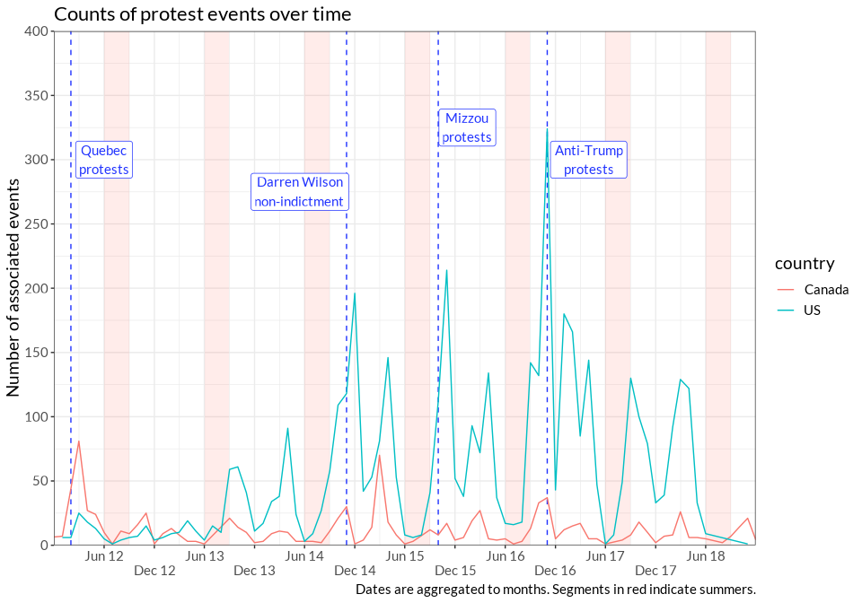<!-- -->

We can also begin to look at the top universities, counties, locations,
or states over time. This inevitably produces more complex summaries,
and it can be difficult to take an informative glimpse given so many
categories, so I’ve only shown the universities over time for now:

    ## [[1]]
    ## [[1]][[1]]

<!-- -->

    ## 
    ## [[1]][[2]]

<!-- -->

    ## 
    ## 
    ## [[2]]
    ## [[2]][[1]]

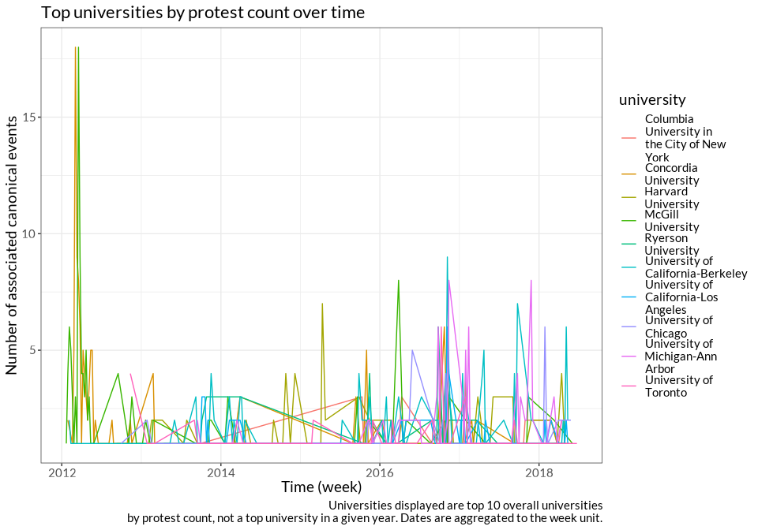<!-- -->

    ## 
    ## [[2]][[2]]

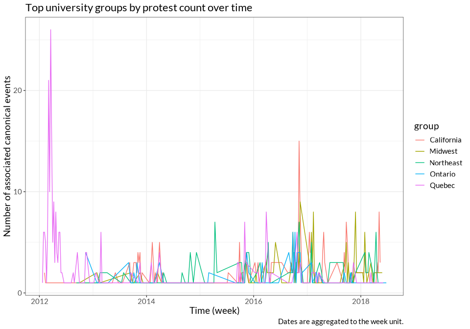<!-- -->

    ## 
    ## 
    ## [[3]]
    ## [[3]][[1]]

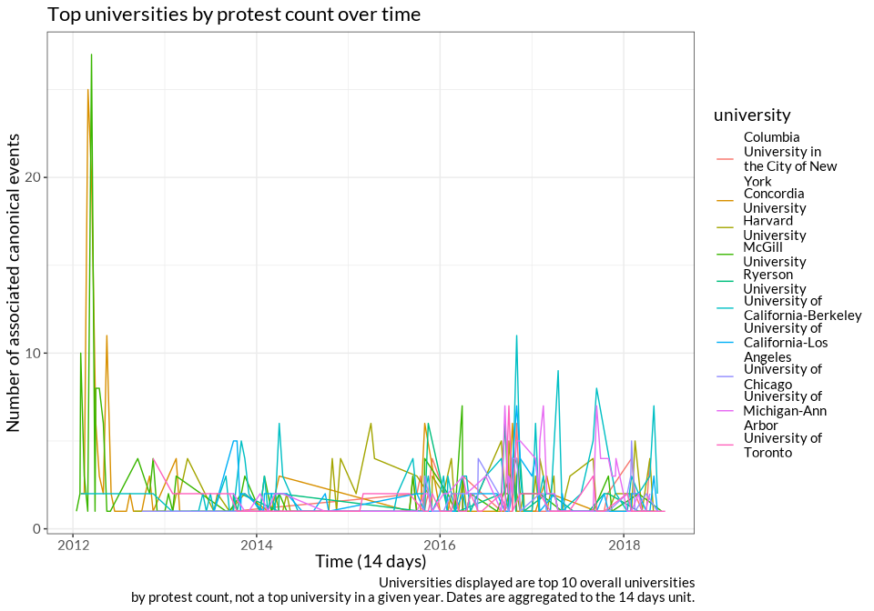<!-- -->

    ## 
    ## [[3]][[2]]

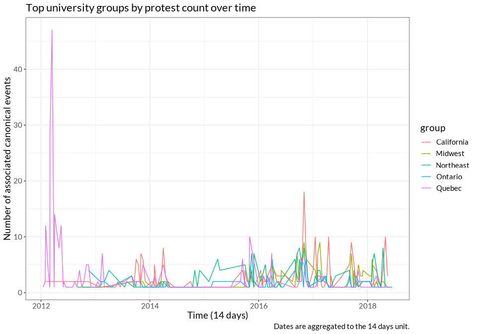<!-- -->

    ## 
    ## 
    ## [[4]]
    ## [[4]][[1]]

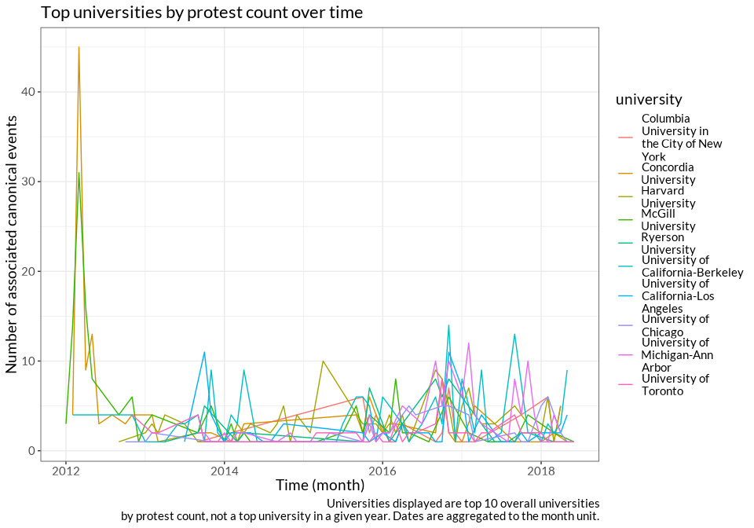<!-- -->

    ## 
    ## [[4]][[2]]

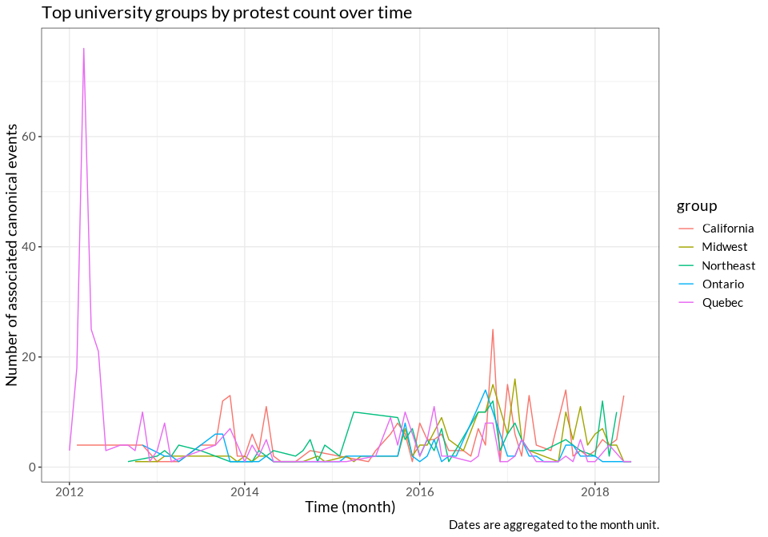<!-- -->

    ## 
    ## 
    ## [[5]]
    ## [[5]][[1]]

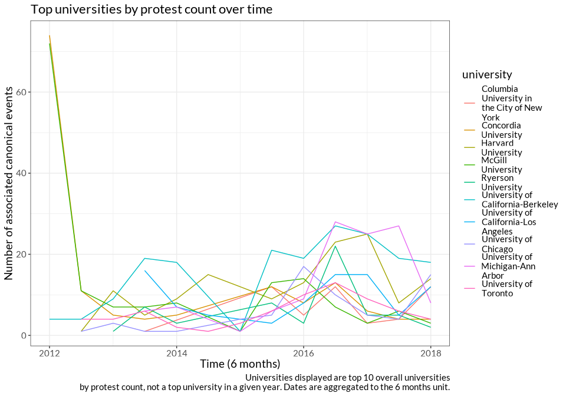<!-- -->

    ## 
    ## [[5]][[2]]

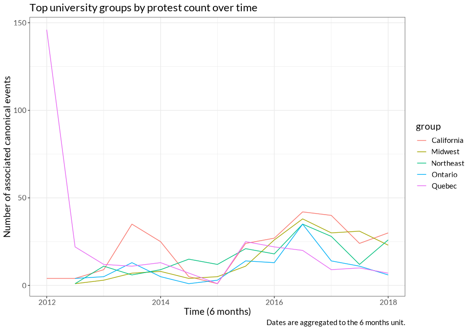<!-- -->

    ## 
    ## 
    ## [[6]]
    ## [[6]][[1]]

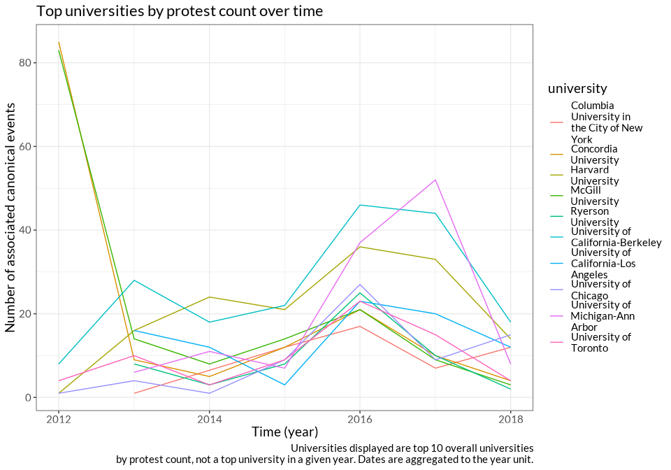<!-- -->

    ## 
    ## [[6]][[2]]

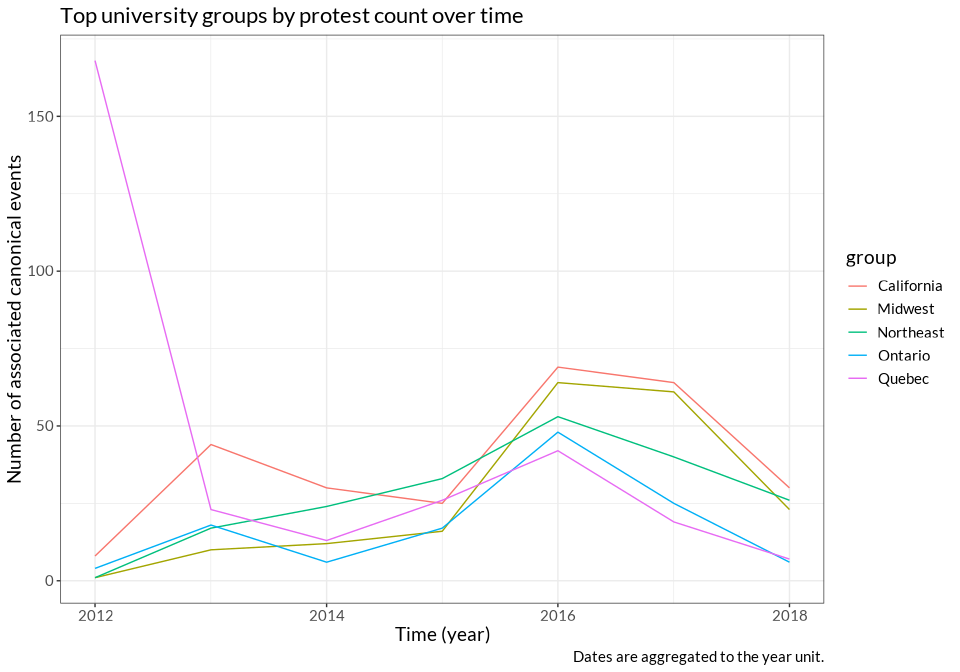<!-- -->

| issue      |   n |
|:-----------|----:|
| University |     |

governance, admin, policies, programs, curriculum \| 1526\| \|Labor and
work \| 885\| \|Trump and/or his administration (Against) \| 639\|
\|Tuition, fees, financial aid \| 562\| \|\_Other Issue \| 475\|
\|Environmental \| 398\| \|Sexual assault/violence \| 298\|
\|Feminism/women’s issues \| 296\| \|Economy/inequality \| 275\|
\|Faith-based discrimination \| 242\| \|Public funding for higher
education \| 215\| \|Far Right/Alt Right (Against) \| 130\| \|Hate
speech \| 117\| \|LGB+/Sexual orientation (For) \| 105\| \|Abortion
access \| 102\| \|Gun control \| 100\| \|LGB+/Sexual orientation \| 98\|
\|Police violence/anti-law enforcement/criminal justice \| 87\|
\|Transgender issues (For) \| 80\| \|Abortion (Against)/Pro-life \| 78\|
\|Free speech \| 71\| \|Pro-Palestine/BDS \| 67\| \|Transgender issues
\| 66\| \|Anti-war/peace \| 58\| \|Trump and/or his administration (For)
\| 52\| \|Social services and welfare \| 42\| \|Human rights \| 40\|
\|LGB+/Sexual orientation (Against) \| 39\| \|Far Right/Alt Right (For)
\| 33\| \|Domestic foreign policy \| 28\| \|Hate crimes/Anti-minority
violence \| 28\| \|Anti-colonial/political independence \| 24\|
\|Accessibility \| 22\| \|Animal rights \| 21\| \|Political
corruption/malfeasance \| 18\| \|Transgender issues (Against) \| 16\|
\|Pro-Israel/Zionism \| 13\| \|Gun owner rights \| 12\| \|Traditional
marriage/family \| 6\| \|Pro-law enforcement \| 4\| \|Men’s rights \|
2\|

    ## Warning: Removed 7 rows containing missing values (`geom_line()`).

<!-- -->

    ## Warning: Removed 7 rows containing missing values (`geom_line()`).

<!-- -->

<!-- -->

# Basic summary plots by variable

| name                    | type    |      mean |        sd |
|:------------------------|:--------|----------:|----------:|
| bachelors_granting      | boolean |     1.000 |        NA |
| campaign                | boolean |     0.248 |        NA |
| counterprotest          | boolean |     0.042 |        NA |
| hbcu                    | boolean |     0.010 |        NA |
| inaccurate_date         | boolean |     0.008 |        NA |
| masters_granting        | boolean |     1.000 |        NA |
| multiple_cities         | boolean |     0.027 |        NA |
| off_campus              | boolean |     0.067 |        NA |
| on_campus_no_student    | boolean |     0.071 |        NA |
| phd_granting            | boolean |     1.000 |        NA |
| private                 | boolean |     0.125 |        NA |
| quotes                  | boolean |     0.645 |        NA |
| ritual                  | boolean |     0.032 |        NA |
| tribal                  | boolean |     0.001 |        NA |
| enrollment_count        | numeric | 36583.172 |  9991.500 |
| eviction_filing_rate    | numeric |     4.029 |     5.174 |
| eviction_judgement_rate | numeric |     1.579 |     1.585 |
| median_household_income | numeric | 65260.556 | 17706.571 |
| republican_vote_prop    | numeric |     0.311 |     0.150 |
| unemp                   | numeric |     4.680 |     1.466 |

For boolean variables, “mean” is the proportion that they are TRUE. Many
of the variables recorded in MPEDS allowed for the input of multiple
values, so those are handled as list-cols and not shown here.

<!-- -->

The pairs plot is still very difficult to read after adjustments. This
should be treated as a glimpse or overview, and more detailed and
cleaner plots will be made later on.

    ## `stat_bin()` using `bins = 30`. Pick better value with `binwidth`.

<!-- -->

# Trying out joins with protest data

To recap from our last conversation, it’s a bit difficult to join the
CCC data and our data since a lot of MPEDS data points could presumably
be in the CCC records. Then CCC data could be telling us that there was
a protest in the same county, when it could just be talking about the
same protest in MPEDS and essentially be turning data quality into
another covariate.

We discussed two solutions to this problem to avoid deduplication:

-   Join so that CCC protests occurring one, three, five, or seven days
    before the MPEDS protest date are matched; the CCC variable then
    conceptually becomes “was there a recent protest in the same
    county.” Thus protests won’t find a match only because of duplicates
-   Join only after filtering the CCC dataset so that rows with keywords
    related to universities are kicked out – things like teachers,
    faculty, students, colleges, universities. This is less ideal than
    the above strategy because it is so nonspecific, potentially missing
    many university matches and kicking out protests related to primary
    and secondary schools.

The following chunk gives a glimpse at total number of matches:

| source    | date_offset | recent_protests | match_percentage |
|:----------|------------:|----------------:|-----------------:|
| CCC       |           0 |             636 |        36.890951 |
| CCC       |           1 |             278 |        16.125290 |
| CCC       |           3 |             544 |        31.554524 |
| CCC       |           5 |             705 |        40.893271 |
| CCC       |           7 |             838 |        48.607889 |
| Elephrame |           0 |             265 |         6.022727 |
| Elephrame |           1 |             100 |         2.272727 |
| Elephrame |           3 |             205 |         4.659091 |
| Elephrame |           5 |             337 |         7.659091 |
| Elephrame |           7 |             422 |         9.590909 |

Here, the `match_percentage` column indicates how many canonical events
saw another protest occur in the same county within `diff` days,
according to the dataset in `source`. The fact that the match rate for 0
is much higher than 1 for both Elephrame and CCC indicates that there is
some double-counting of protests; rather than multiple protests
occurring concurrently, we may have recorded a protest in our dataset
that is also present in another dataset.

So it seems that there are a fair number of duplicates occurring if we
don’t have a date offset, but once we add one (of any days) that pretty
much solves the data quality issue.

That being said, the likely larger problem with the CCC data is that
it’s only available after 2017, so it may not be relevant even after we
become satisfied with the deduped match process. This can be refined a
little bit by adding in Elephrame data on BLM protests, but we’ve had
problems there already, and the topic differences mean we can’t pretend
we have complete data.

# Maps and related things

<!-- -->

# Investigating specific movements: Mizzou and Quebec solidarity protests

The Mizzou umbrella was linked 104 times, with 98 unique canonical
events inside.

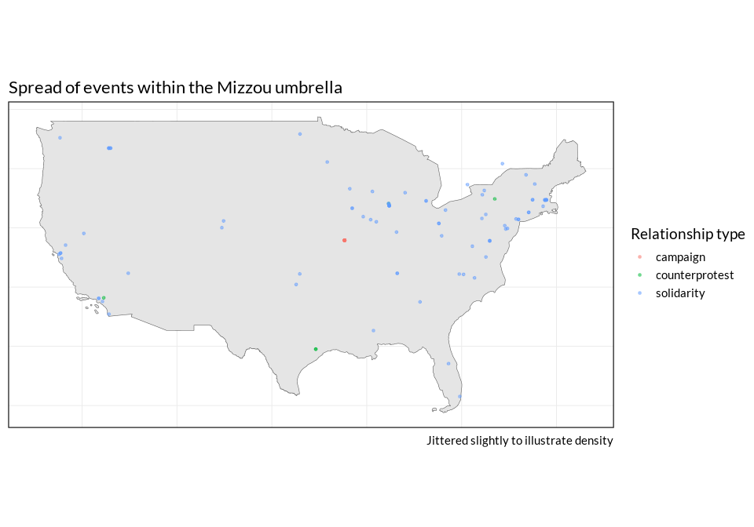<!-- -->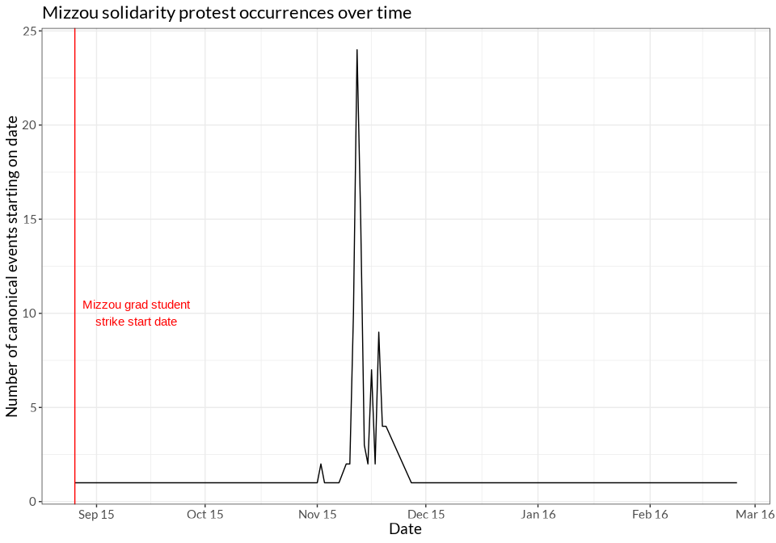<!-- -->
