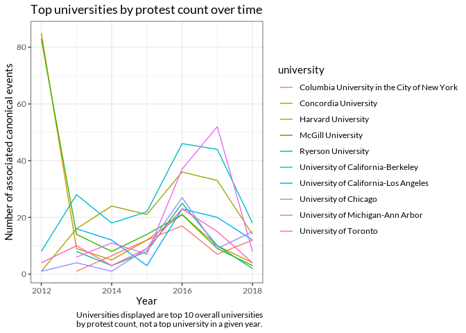

Exploratory Plots
================

# Basic counts

The initial import of the MPEDS db found 5220 unique canonical events,
and after all cleaning steps we still have 5220 canonical events.

However, there’s still an issue regarding duplicate matches in IPEDS we
can detect (there are likely also incorrect matches that we can’t detect
programmatically right now); there are lots of schools called “Columbia
College” (or another common name) inside IPEDS, so any schools with that
name in MPEDS will be assigned multiple schools. The MPEDS-IPEDS join is
crucial because we also use IPEDS to join county FIPS identifiers, and
thus no further joins will be accurate unless the MPEDS-IPEDS join is
accurate. We currently have 5578 rows in the final dataset, indicating
that this problem applies to some 358 canonical events.

Fixing it just requires a rewrite of how the join is done, so that we
join on IPEDS IDs, not names, for at least all ambiguous cases. This
doesn’t require adjustments to the instructions given to student coders,
but it does require a little bit of time on my part, so it hasn’t been
completed yet.

Of those events, there were 517 unique locations, 251 unique counties,
and 557 unique universities. Surprisingly, all of the locations that
were not universities found geocoding matches, and hand-checking the
most common ones indicates that there isn’t a strong pattern of missing
value substitution, e.g. Google isn’t sending the majority of results to
the centroid of America or to `(-1, -1)` or anything weird like that.
Universities had a harder time, with 20 universities and 190 rows
(canonical events) not returning lon/lat coords for universities.

That comes out to \~5% of universities not having coordinates, and
\~2.5% of canonical events not having universities with coordinates.

The top universities by appearances:

| university                                  |   n |
|:--------------------------------------------|----:|
| University of California-Berkeley           | 184 |
| McGill University                           | 154 |
| Concordia University                        | 146 |
| Harvard University                          | 145 |
| University of Michigan-Ann Arbor            | 122 |
| University of California-Los Angeles        |  86 |
| University of Toronto                       |  69 |
| University of Chicago                       |  66 |
| Ryerson University                          |  56 |
| Columbia University in the City of New York |  49 |
| Tufts University                            |  49 |
| University of Wisconsin-Madison             |  49 |
| Georgetown University                       |  48 |
| The University of Texas at Austin           |  47 |
| Cornell University                          |  46 |

And the top locations:

| location               |   n |
|:-----------------------|----:|
| Montreal, QC, Canada   | 352 |
| New York City, NY, USA | 172 |
| Berkeley, CA, USA      | 170 |
| Toronto, ON, Canada    | 157 |
| Cambridge, MA, USA     | 139 |
| Chicago, IL, USA       | 133 |
| Los Angeles, CA, USA   | 121 |
| Ann Arbor, MI, USA     | 113 |
| San Diego, CA, USA     |  77 |
| San Francisco, CA, USA |  76 |
| Boston, MA, USA        |  61 |
| Washington, D.C., USA  |  58 |
| Madison, WI, USA       |  48 |
| Davis, CA, USA         |  47 |
| Ithaca, NY, USA        |  47 |

Top states:

|   n | state_name           |
|----:|:---------------------|
| 562 | California           |
| 341 | Massachusetts        |
| 228 | Illinois             |
| 172 | Michigan             |
| 163 | New York             |
| 142 | Pennsylvania         |
| 113 | District of Columbia |
| 111 | Virginia             |
| 108 | Florida              |
| 103 | Texas                |
|  96 | Connecticut          |
|  79 | Wisconsin            |
|  77 | Ohio                 |
|  72 | North Carolina       |
|  59 | Washington           |

And finally the top counties:

|   n | county_name                                |
|----:|:-------------------------------------------|
| 238 | Middlesex County, Massachusetts            |
| 188 | Alameda County, California                 |
| 128 | Cook County, Illinois                      |
| 126 | Washtenaw County, Michigan                 |
| 113 | District of Columbia, District of Columbia |
|  80 | Los Angeles County, California             |
|  63 | New York County, New York                  |
|  59 | San Diego County, California               |
|  56 | San Francisco County, California           |
|  49 | Dane County, Wisconsin                     |
|  48 | Boone County, Missouri                     |
|  48 | Tompkins County, New York                  |
|  47 | Santa Clara County, California             |
|  47 | Travis County, Texas                       |
|  42 | Hampshire County, Massachusetts            |

These glimpses seem mostly in line with what we should expect, with a
strong caveat that the Missouri protests are not making a leading
appearance here. That’s a bit alarming; some playing around with the
dataset reveals there are a fair number of protests both in Missouri and
at University of Missouri-Columbia. There could still be errors here, so
I’m continuing to revise the code.

We can also begin to look at the top universities, counties, locations,
or states over time. This inevitably produces more complex summaries,
and it can be difficult to take an informative glimpse given so many
categories, so I’ve only shown the universities over time for now:

<!-- -->

# Basic summary plots

| name                    | type    |      mean |        sd |
|:------------------------|:--------|----------:|----------:|
| bachelors_granting      | boolean |     1.000 |        NA |
| campaign                | boolean |     0.248 |        NA |
| counterprotest          | boolean |     0.042 |        NA |
| hbcu                    | boolean |     0.010 |        NA |
| inaccurate_date         | boolean |     0.008 |        NA |
| masters_granting        | boolean |     1.000 |        NA |
| multiple_cities         | boolean |     0.027 |        NA |
| off_campus              | boolean |     0.067 |        NA |
| on_campus_no_student    | boolean |     0.071 |        NA |
| phd_granting            | boolean |     1.000 |        NA |
| private                 | boolean |     0.125 |        NA |
| quotes                  | boolean |     0.645 |        NA |
| ritual                  | boolean |     0.032 |        NA |
| tribal                  | boolean |     0.001 |        NA |
| enrollment_count        | numeric | 36583.172 |  9991.500 |
| eviction_filing_rate    | numeric |     4.029 |     5.174 |
| eviction_judgement_rate | numeric |     1.579 |     1.585 |
| median_household_income | numeric | 65260.556 | 17706.571 |
| republican_vote_prop    | numeric |     0.311 |     0.150 |
| unemp                   | numeric |     4.680 |     1.466 |

For boolean variables, “mean” is the proportion that they are TRUE. Many
of the variables recorded in MPEDS allowed for the input of multiple
values, so those are handled as list-cols and not shown here.

<!-- -->

The pairs plot is still very difficult to read after adjustments. This
should be treated as a glimpse or overview, and more detailed and
cleaner plots will be made later on.

    ## `stat_bin()` using `bins = 30`. Pick better value with `binwidth`.

<!-- -->

# Trying out joins with protest data

To recap from our last conversation, it’s a bit difficult to join the
CCC data and our data since a lot of MPEDS data points could presumably
be in the CCC records. Then CCC data could be telling us that there was
a protest in the same county, when it could just be talking about the
same protest in MPEDS and essentially be turning data quality into
another covariate.

We discussed two solutions to this problem to avoid deduplication:

-   Join so that CCC protests occurring one, three, five, or seven days
    before the MPEDS protest date are matched; the CCC variable then
    conceptually becomes “was there a recent protest in the same
    county.” Thus protests won’t find a match only because of duplicates
-   Join only after filtering the CCC dataset so that rows with keywords
    related to universities are kicked out – things like teachers,
    faculty, students, colleges, universities. This is less ideal than
    the above strategy because it is so nonspecific, potentially missing
    many university matches and kicking out protests related to primary
    and secondary schools.

The following chunk gives a glimpse at total number of matches:

| source    | date_offset | recent_protests | match_percentage |
|:----------|------------:|----------------:|-----------------:|
| CCC       |           0 |             634 |        36.774942 |
| CCC       |           1 |             277 |        16.067285 |
| CCC       |           3 |             535 |        31.032483 |
| CCC       |           5 |             694 |        40.255220 |
| CCC       |           7 |             825 |        47.853828 |
| Elephrame |           0 |             265 |         6.022727 |
| Elephrame |           1 |             100 |         2.272727 |
| Elephrame |           3 |             205 |         4.659091 |
| Elephrame |           5 |             337 |         7.659091 |
| Elephrame |           7 |             422 |         9.590909 |

Here, the `match_percentage` column indicates how many canonical events
saw another protest occur in the same county within `diff` days,
according to the dataset in `source`. The fact that the match rate for 0
is much higher than 1 for both Elephrame and CCC indicates that there is
some double-counting of protests; rather than multiple protests
occurring concurrently, we may have recorded a protest in our dataset
that is also present in another dataset.

So it seems that there are a fair number of duplicates occurring if we
don’t have a date offset, but once we add one (of any days) that pretty
much solves the data quality issue.

That being said, the likely larger problem with the CCC data is that
it’s only available after 2017, so it may not be relevant even after we
become satisfied with the deduped match process. This can be refined a
little bit by adding in Elephrame data on BLM protests, but we’ve had
problems there already, and the topic differences mean we can’t pretend
we have complete data.

# Maps and related things

<!-- -->
