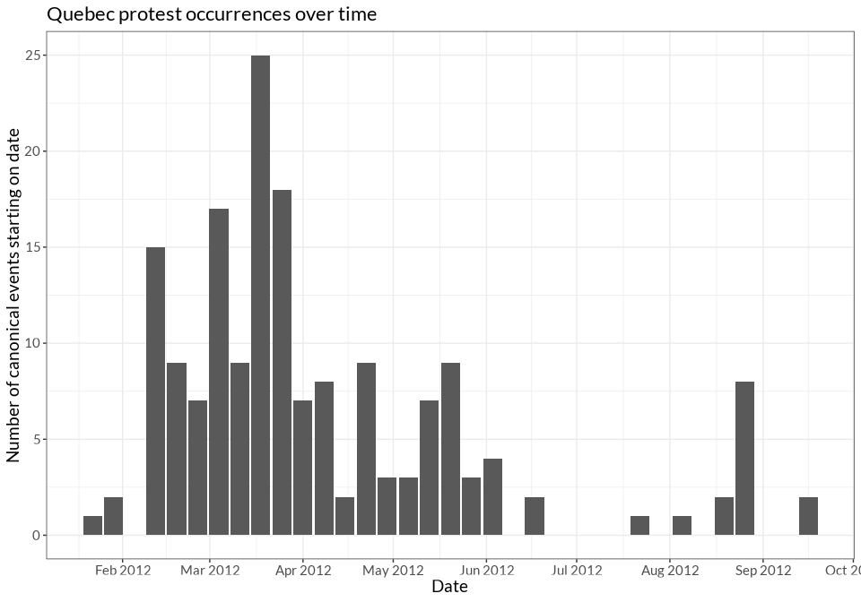

Exploratory Plots
================

- [Basic counts](#basic-counts)
  - [Counts by issue](#counts-by-issue)
  - [Counts by racial issue:](#counts-by-racial-issue)
- [Police involvement by issue](#police-involvement-by-issue)
- [Percentages of all protest with given
  preset](#percentages-of-all-protest-with-given-preset)
- [Counts over time](#counts-over-time)
  - [Racial and “nonracial” issues over time
    (collapsed)](#racial-and-nonracial-issues-over-time-collapsed)
- [Basic summary plots by variable](#basic-summary-plots-by-variable)
- [Trying out joins with protest
  data](#trying-out-joins-with-protest-data)
- [Maps and related things](#maps-and-related-things)
- [Investigating specific movements](#investigating-specific-movements)
  - [2015 Mizzou protests](#2015-mizzou-protests)
    - [Counts of university responses to Mizzou protest
      waves](#counts-of-university-responses-to-mizzou-protest-waves)
  - [2012 Quebec protest wave](#2012-quebec-protest-wave)
    - [Quebec events frequency stratified by police
      fields](#quebec-events-frequency-stratified-by-police-fields)
  - [Trump-related protests](#trump-related-protests)
    - [Issue composition November 9th and 17th
      protests](#issue-composition-november-9th-and-17th-protests)
- [Investigating reporting measures](#investigating-reporting-measures)

# Basic counts

| Statistic                                   | Value |
|:--------------------------------------------|------:|
| Total imported events                       |  6097 |
| Total events after cleaning                 |  6097 |
| Unique locations                            |   540 |
| US counties                                 |   313 |
| Canadian CMAs                               |    32 |
| Universities                                |   605 |
| Missing universities                        |    15 |
| CEs with missing universities               |    73 |
| \# of events with police activity recorded  |   868 |
| \# of events with any police field recorded |   925 |
| \# of events with university police only    |   450 |
| \# of events with government police only    |   284 |
| \# of events with both types of police      |   146 |

The initial import of the MPEDS db found 6097 unique canonical events,
and after all cleaning steps we still have 6097 canonical events.

However, there’s still an issue regarding duplicate matches in IPEDS we
can detect (there are likely also incorrect matches that we can’t detect
programmatically right now); there are lots of schools called “Columbia
College” (or another common name) inside IPEDS, so any schools with that
name in MPEDS will be assigned multiple schools. The MPEDS-IPEDS join is
crucial because we also use IPEDS to join county FIPS identifiers, and
thus no further joins will be accurate unless the MPEDS-IPEDS join is
accurate. As of Jan 30, 2023, we are in the middle of repairing this
join.

Of those events, there were 540 unique locations, 313 unique counties,
32 unique Canadian CMAs, and 605 unique universities. Surprisingly, all
of the locations that were not universities found geocoding matches, and
hand-checking the most common ones indicates that there isn’t a strong
pattern of missing value substitution, e.g. Google isn’t sending the
majority of results to the centroid of America or to `(-1, -1)` or
anything weird like that. Universities had a harder time, with 15
universities and 73 rows (canonical events) not returning lon/lat coords
for universities.

That comes out to ~5% of universities not having coordinates, and ~2.5%
of canonical events not having universities with coordinates.

The top universities by appearances:

| university                                  |   n |
|:--------------------------------------------|----:|
| University of California-Berkeley           | 228 |
| McGill University                           | 191 |
| Concordia University                        | 161 |
| Harvard University                          | 140 |
| University of Michigan-Ann Arbor            | 120 |
| University of California-Los Angeles        | 106 |
| University of Toronto                       |  90 |
| Ryerson University                          |  81 |
| Tufts University                            |  71 |
| University of Chicago                       |  66 |
| York University                             |  66 |
| Columbia University in the City of New York |  64 |
| The University of Texas at Austin           |  55 |
| Georgetown University                       |  52 |
| University of Wisconsin-Madison             |  50 |

And the top locations:

| location               |   n |
|:-----------------------|----:|
| Montreal, QC, Canada   | 377 |
| Toronto, ON, Canada    | 226 |
| Berkeley, CA, USA      | 211 |
| New York City, NY, USA | 173 |
| Los Angeles, CA, USA   | 134 |
| Cambridge, MA, USA     | 132 |
| Chicago, IL, USA       | 113 |
| Ann Arbor, MI, USA     | 111 |
| San Diego, CA, USA     |  85 |
| San Francisco, CA, USA |  85 |
| Washington, D.C., USA  |  74 |
| Boston, MA, USA        |  73 |
| Vancouver, BC, Canada  |  54 |
| Austin, TX, USA        |  53 |
| Ottawa, ON, Canada     |  51 |

Top states:

| area_name            |   n |
|:---------------------|----:|
| California           | 890 |
| Quebec               | 427 |
| Massachusetts        | 375 |
| Ontario              | 339 |
| New York             | 336 |
| Illinois             | 262 |
| Pennsylvania         | 187 |
| Michigan             | 170 |
| Texas                | 161 |
| Ohio                 | 137 |
| District of Columbia | 128 |
| Virginia             | 120 |
| British Col          | 118 |
| North Carolina       | 110 |
| Florida              | 107 |

And finally the top counties:

| locality_name        |   n |
|:---------------------|----:|
| Montréal             | 395 |
| Middlesex            | 296 |
| Toronto              | 248 |
| Alameda              | 236 |
| Los Angeles          | 206 |
| New York             | 179 |
| Cook                 | 137 |
| District of Columbia | 128 |
| Washtenaw            | 117 |
| San Diego            |  99 |
| San Francisco        |  86 |
| Vancouver            |  86 |
| Suffolk              |  75 |
| Santa Clara          |  59 |
| Travis               |  56 |

These glimpses seem mostly in line with what we should expect, with a
strong caveat that the Missouri protests are not making a leading
appearance in the counts by location, but there do seem to be a fair
number in Missouri when we take a look by state. It seems there are
non-MO locations being recognized as happening in Missouri. See our 1:1
notes Google Doc for details.

| police_presence_and_size |    n |
|:-------------------------|-----:|
| NA                       | 5294 |
| NA/Unclear               |  394 |
| Substantial              |  292 |
| Small/0 to 5 officers    |   86 |
| Heavily Policed          |   32 |
| Motorized Presence       |   17 |

| police_activities            |    n |
|:-----------------------------|-----:|
| NA                           | 5196 |
| Monitor/Present              |  410 |
| Instruct/Warn                |  174 |
| Arrest or Attempted          |  163 |
| Constrain                    |  160 |
| Formal Accusation            |  103 |
| Remove Individual Protesters |   63 |
| Force: Vague/Body            |   57 |
| End Protest                  |   56 |
| “Breaking the Rules”         |   51 |
| Detain                       |   46 |
| NA/Unclear                   |   33 |
| Force: Weapon                |   30 |
| Arrest- Large Scale          |   27 |
| Force: 2+ Weapon Types       |   27 |
| Present                      |   18 |
| Cooperate/Coordinate         |   14 |
| Disputed Actions             |    5 |
| Participate                  |    5 |
| “We’re Responsive”           |    1 |

| type_of_police        |    n |
|:----------------------|-----:|
| NA                    | 5188 |
| Univ police           |  452 |
| Govt police           |  300 |
| Univ police - assumed |  152 |
| Govt police - assumed |  134 |
| “Riot police”         |   68 |
| Private Security      |   27 |
| NA/Unclear            |    5 |
| Secret Service        |    2 |

| university_action_on_issue |    n |
|:---------------------------|-----:|
| NA                         | 4853 |
| NA/Unclear                 |  661 |
| Action in Process          |  312 |
| Reject Demand              |  160 |
| Structural Change          |   75 |
| Fulfill Demand             |   72 |
| No Cancellation            |   46 |
| Compromised Action         |   35 |
| Contrary Action/Refuse     |   22 |
| Hold Forum                 |   22 |
| Cancel Speaker/Event       |   16 |
| Resign/Fire                |    8 |
| Short Term Services        |    6 |
| Correct Racist History     |    3 |
| Sanction                   |    2 |

| university_discourse_on_issue   |    n |
|:--------------------------------|-----:|
| NA                              | 4821 |
| NA/Unclear                      |  456 |
| Explain Bureaucracy/Law         |  381 |
| Express Contrary Position       |  276 |
| Express Agreement               |  268 |
| Affirm Diversity                |   67 |
| Affirm Marginalized Students    |   49 |
| Affirm Free Speech when Bigotry |   48 |
| Emotional Appeal                |   37 |
| Oppose Oppression               |   21 |
| Oppose Racism                   |   17 |
| Apology/Responsibility          |   16 |
| Affirm BIPOC Students           |   13 |

| university_reactions_to_protest |    n |
|:--------------------------------|-----:|
| NA                              | 4835 |
| NA/Unclear                      |  604 |
| Monitor/Present                 |  227 |
| Get Confronted                  |  144 |
| Meet                            |  135 |
| Direct Communications           |  133 |
| Participate/Aid                 |   95 |
| Instruct/Warn                   |   94 |
| Penalize                        |   39 |
| No Intervention                 |   22 |
| Revisit Protest P&P             |   21 |
| Avoid Penalizing                |   19 |
| Refuse to Meet                  |   17 |
| End Protest                     |    8 |

“NA” marks canonical events where issues were not assigned at all, or
where text-selects were used but not one of the preset issue categories.
“\_Not relevant” *should* be marked when a racial issue was selected
instead, per the codebook. “\_Other issue” marks issues not within the
preset options; the codebook gives the examples of:

- protestors who use hateful speech, e.g. anti-LGBTQ preachers
- (objection to?) corporate practices
- access to higher education (?)
- science (?)
- Armenian genocide (?)

Hm.

## Counts by issue

| issue                                                        |    n |
|:-------------------------------------------------------------|-----:|
| University governance, admin, policies, programs, curriculum | 1715 |
| \_Not relevant                                               | 1011 |
| Labor and work                                               |  956 |
| Tuition, fees, financial aid                                 |  606 |
| NA                                                           |  590 |
| Trump and/or his administration (Against)                    |  573 |
| \_Other Issue                                                |  532 |
| Environmental                                                |  424 |
| Sexual assault/violence                                      |  331 |
| Economy/inequality                                           |  322 |
| Feminism/women’s issues                                      |  300 |
| Faith-based discrimination                                   |  256 |
| Public funding for higher education                          |  256 |
| Far Right/Alt Right (Against)                                |  121 |
| Abortion access                                              |  113 |
| Hate speech                                                  |  110 |
| LGB+/Sexual orientation                                      |  109 |
| LGB+/Sexual orientation (For)                                |  109 |
| Gun control                                                  |   99 |
| Police violence/anti-law enforcement/criminal justice        |   97 |
| Abortion (Against)/Pro-life                                  |   86 |
| Free speech                                                  |   84 |
| Transgender issues (For)                                     |   81 |
| Pro-Palestine/BDS                                            |   72 |
| Transgender issues                                           |   68 |
| Anti-war/peace                                               |   63 |
| Social services and welfare                                  |   59 |
| Trump and/or his administration (For)                        |   52 |
| Human rights                                                 |   45 |
| LGB+/Sexual orientation (Against)                            |   45 |
| Far Right/Alt Right (For)                                    |   36 |
| Domestic foreign policy                                      |   34 |
| Hate crimes/Anti-minority violence                           |   31 |
| Accessibility                                                |   27 |
| Animal rights                                                |   23 |
| Anti-colonial/political independence                         |   22 |
| Political corruption/malfeasance                             |   19 |
| Pro-Israel/Zionism                                           |   17 |
| Transgender issues (Against)                                 |   16 |
| Gun owner rights                                             |   13 |
| Pro-law enforcement                                          |    7 |
| Traditional marriage/family                                  |    6 |
| Men’s rights                                                 |    2 |
|                                                              |    1 |

## Counts by racial issue:

| racial_issue                                                 |    n |
|:-------------------------------------------------------------|-----:|
| \_Not relevant                                               | 3350 |
| Anti-racism                                                  |  861 |
| Police violence                                              |  574 |
| University governance, admin, policies, programs, curriculum |  531 |
| Immigration (For)                                            |  475 |
| Campus climate                                               |  433 |
| Indigenous issues                                            |  173 |
| White supremacy (Against)                                    |  154 |
| \_Other Issue                                                |  132 |
| Hate speech                                                  |   99 |
| Racist/racialized symbols                                    |   86 |
| Hate crimes/Anti-minority violence                           |   74 |
| Prison/mass incarceration                                    |   48 |
| Memorials & anniversaries                                    |   36 |
| Affirmative action (For)                                     |   33 |
| Immigration (Against)                                        |   20 |
| White supremacy (For)                                        |   20 |
| Cultural appropriation                                       |   18 |
| Racial/ethnic pride - white                                  |    7 |
| All Lives Matter                                             |    6 |
| Pro-police                                                   |    5 |
| Reparations                                                  |    5 |
| Affirmative action (Against)                                 |    4 |
|                                                              |    1 |
| K-12 education                                               |    1 |
| Racial/ethnic pride - minority                               |    1 |

# Police involvement by issue

We’re interested in describing police involvement by issue – what issues
attract the heaviest police presence and response?

I filtered our dataset to include only rows that had at least one
non-missing value for type of police, police actions, police activities,
and police presence and size, and tabulated the issues reported in the
remaining dataset. The table can thus be read as the most popular issues
among police-involved protests.

In the table below, counts may be inflated given each canonical event
could have multiple issues.

This table should be compared to the table of percentages of issues
across all events to be meaningful for the questions we’d like to
answer. For example, university governance makes a strong appearance
here, but that could be just because it is a popular issue at large, not
because protests around the issue attract police. On the other hand,
tuition and fees makes a solid jump here from having 10% prevalence
across all events but with 16% prevalence across police-involved events.
This makes sense given our knowledge that the Quebec tuition strike
protests were heavily policed.

| Issue                                                                 | Percent of events with given issue |
|:----------------------------------------------------------------------|-----------------------------------:|
| University governance, admin, policies, programs, curriculum          |                              28.65 |
| Tuition, fees, financial aid                                          |                              16.97 |
| Anti-racism (racial)                                                  |                              14.92 |
| Labor and work                                                        |                              12.43 |
| Police violence (racial)                                              |                              11.35 |
| \_Other Issue                                                         |                              11.03 |
| Trump and/or his administration (Against)                             |                               9.95 |
| Economy/inequality                                                    |                               8.32 |
| Environmental                                                         |                               6.81 |
| University governance, admin, policies, programs, curriculum (racial) |                               6.81 |
| Campus climate (racial)                                               |                               6.16 |
| Immigration (For) (racial)                                            |                               5.51 |
| Public funding for higher education                                   |                               5.51 |
| Far Right/Alt Right (Against)                                         |                               5.30 |
| Feminism/women’s issues                                               |                               5.19 |
| White supremacy (Against) (racial)                                    |                               5.19 |
| Faith-based discrimination                                            |                               4.43 |
| Sexual assault/violence                                               |                               4.32 |
| Police violence/anti-law enforcement/criminal justice                 |                               3.35 |
| Hate speech                                                           |                               3.14 |
| Abortion access                                                       |                               3.03 |
| LGB+/Sexual orientation (For)                                         |                               3.03 |
| LGB+/Sexual orientation                                               |                               2.59 |
| Abortion (Against)/Pro-life                                           |                               2.49 |
| Transgender issues (For)                                              |                               2.38 |
| Free speech                                                           |                               2.27 |
| Hate speech (racial)                                                  |                               2.27 |
| Social services and welfare                                           |                               2.27 |
| Far Right/Alt Right (For)                                             |                               2.16 |
| Indigenous issues (racial)                                            |                               2.16 |
| \_Other Issue (racial)                                                |                               2.16 |
| Anti-war/peace                                                        |                               1.84 |
| Racist/racialized symbols (racial)                                    |                               1.73 |
| LGB+/Sexual orientation (Against)                                     |                               1.62 |
| Pro-Palestine/BDS                                                     |                               1.62 |
| White supremacy (For) (racial)                                        |                               1.62 |
| Transgender issues                                                    |                               1.51 |
| Trump and/or his administration (For)                                 |                               0.97 |
| Domestic foreign policy                                               |                               0.86 |
| Hate crimes/Anti-minority violence (racial)                           |                               0.86 |
| Prison/mass incarceration (racial)                                    |                               0.86 |
| Transgender issues (Against)                                          |                               0.86 |
| Gun control                                                           |                               0.76 |
| Accessibility                                                         |                               0.65 |
| Animal rights                                                         |                               0.54 |
| Anti-colonial/political independence                                  |                               0.43 |
| Human rights                                                          |                               0.43 |
| Political corruption/malfeasance                                      |                               0.43 |
| Pro-Israel/Zionism                                                    |                               0.43 |
| All Lives Matter (racial)                                             |                               0.32 |
| Hate crimes/Anti-minority violence                                    |                               0.32 |
| Immigration (Against) (racial)                                        |                               0.32 |
| Racial/ethnic pride - white (racial)                                  |                               0.32 |
| Affirmative action (For) (racial)                                     |                               0.22 |
| Gun owner rights                                                      |                               0.22 |
| Memorials & anniversaries (racial)                                    |                               0.22 |
| Traditional marriage/family                                           |                               0.22 |
| Men’s rights                                                          |                               0.11 |

<!-- --><!-- -->

# Percentages of all protest with given preset

| issue                                                        |   pct |
|:-------------------------------------------------------------|------:|
| Percent of events with any value                             | 73.89 |
| University governance, admin, policies, programs, curriculum | 28.13 |
| \_Not relevant                                               | 16.58 |
| Labor and work                                               | 15.68 |
| Tuition, fees, financial aid                                 |  9.94 |
| NA                                                           |  9.68 |
| Trump and/or his administration (Against)                    |  9.40 |
| \_Other Issue                                                |  8.73 |
| Environmental                                                |  6.95 |
| Sexual assault/violence                                      |  5.43 |
| Economy/inequality                                           |  5.28 |
| Feminism/women’s issues                                      |  4.92 |
| Faith-based discrimination                                   |  4.20 |
| Public funding for higher education                          |  4.20 |
| Far Right/Alt Right (Against)                                |  1.98 |
| Abortion access                                              |  1.85 |
| Hate speech                                                  |  1.80 |
| LGB+/Sexual orientation                                      |  1.79 |
| LGB+/Sexual orientation (For)                                |  1.79 |
| Gun control                                                  |  1.62 |
| Police violence/anti-law enforcement/criminal justice        |  1.59 |
| Abortion (Against)/Pro-life                                  |  1.41 |
| Free speech                                                  |  1.38 |
| Transgender issues (For)                                     |  1.33 |
| Pro-Palestine/BDS                                            |  1.18 |
| Transgender issues                                           |  1.12 |
| Anti-war/peace                                               |  1.03 |
| Social services and welfare                                  |  0.97 |
| Trump and/or his administration (For)                        |  0.85 |
| Human rights                                                 |  0.74 |
| LGB+/Sexual orientation (Against)                            |  0.74 |
| Far Right/Alt Right (For)                                    |  0.59 |
| Domestic foreign policy                                      |  0.56 |
| Hate crimes/Anti-minority violence                           |  0.51 |
| Accessibility                                                |  0.44 |
| Animal rights                                                |  0.38 |
| Anti-colonial/political independence                         |  0.36 |
| Political corruption/malfeasance                             |  0.31 |
| Pro-Israel/Zionism                                           |  0.28 |
| Transgender issues (Against)                                 |  0.26 |
| Gun owner rights                                             |  0.21 |
| Pro-law enforcement                                          |  0.11 |
| Traditional marriage/family                                  |  0.10 |
| Men’s rights                                                 |  0.03 |
|                                                              |  0.02 |

| racial_issue                                                 |   pct |
|:-------------------------------------------------------------|------:|
| \_Not relevant                                               | 54.95 |
| Percent of events with any value                             | 45.19 |
| Anti-racism                                                  | 14.12 |
| Police violence                                              |  9.41 |
| University governance, admin, policies, programs, curriculum |  8.71 |
| Immigration (For)                                            |  7.79 |
| Campus climate                                               |  7.10 |
| Indigenous issues                                            |  2.84 |
| White supremacy (Against)                                    |  2.53 |
| \_Other Issue                                                |  2.16 |
| Hate speech                                                  |  1.62 |
| Racist/racialized symbols                                    |  1.41 |
| Hate crimes/Anti-minority violence                           |  1.21 |
| Prison/mass incarceration                                    |  0.79 |
| Memorials & anniversaries                                    |  0.59 |
| Affirmative action (For)                                     |  0.54 |
| Immigration (Against)                                        |  0.33 |
| White supremacy (For)                                        |  0.33 |
| Cultural appropriation                                       |  0.30 |
| Racial/ethnic pride - white                                  |  0.11 |
| All Lives Matter                                             |  0.10 |
| Pro-police                                                   |  0.08 |
| Reparations                                                  |  0.08 |
| Affirmative action (Against)                                 |  0.07 |
|                                                              |  0.02 |
| K-12 education                                               |  0.02 |
| Racial/ethnic pride - minority                               |  0.02 |

# Counts over time

<!-- -->

<!-- -->

<!-- -->

<!-- -->

<!-- -->

We can also begin to look at the top universities, counties, locations,
or states over time. This inevitably produces more complex summaries,
and it can be difficult to take an informative glimpse given so many
categories, so I’ve only shown the universities over time for now:

<!-- --><!-- -->

    ## Scale for x is already present.
    ## Adding another scale for x, which will replace the existing scale.

<!-- -->

    ## Scale for x is already present.
    ## Adding another scale for x, which will replace the existing scale.

<!-- -->

    ## Scale for x is already present.
    ## Adding another scale for x, which will replace the existing scale.

<!-- -->

    ## Scale for x is already present.
    ## Adding another scale for x, which will replace the existing scale.

<!-- -->

    ## Scale for x is already present.
    ## Adding another scale for x, which will replace the existing scale.

<!-- -->

    ## Scale for x is already present.
    ## Adding another scale for x, which will replace the existing scale.

<!-- -->

| racial_issue                                                 |   n |
|:-------------------------------------------------------------|----:|
| Anti-racism                                                  | 861 |
| Police violence                                              | 574 |
| University governance, admin, policies, programs, curriculum | 531 |
| Immigration (For)                                            | 475 |
| Campus climate                                               | 433 |
| Indigenous issues                                            | 173 |
| White supremacy (Against)                                    | 154 |
| \_Other Issue                                                | 132 |
| Hate speech                                                  |  99 |
| Racist/racialized symbols                                    |  86 |
| Hate crimes/Anti-minority violence                           |  74 |
| Prison/mass incarceration                                    |  48 |
| Memorials & anniversaries                                    |  36 |
| Affirmative action (For)                                     |  33 |
| Immigration (Against)                                        |  20 |
| White supremacy (For)                                        |  20 |
| Cultural appropriation                                       |  18 |
| Racial/ethnic pride - white                                  |   7 |
| All Lives Matter                                             |   6 |
| Pro-police                                                   |   5 |
| Reparations                                                  |   5 |
| Affirmative action (Against)                                 |   4 |
|                                                              |   1 |
| K-12 education                                               |   1 |
| Racial/ethnic pride - minority                               |   1 |

<!-- --><!-- --><!-- -->

## Racial and “nonracial” issues over time (collapsed)

<!-- --><!-- --><!-- -->

I’ve collapsed both types of issues here to show racial and nonracial
issues alongside each other. Racial issue counts here are taken at a
maximum of one per canonical event, so that events that relate to many
issues do not outweight others and we have a clearer understanding of
the weight of protest occurrence. The same goes for nonracial issues.

# Basic summary plots by variable

| name                 | type    |      mean |        sd |
|:---------------------|:--------|----------:|----------:|
| bachelors_granting   | boolean |     1.000 |        NA |
| campaign             | boolean |     0.243 |        NA |
| counterprotest       | boolean |     0.044 |        NA |
| hbcu                 | boolean |     0.011 |        NA |
| inaccurate_date      | boolean |     0.009 |        NA |
| masters_granting     | boolean |     1.000 |        NA |
| multiple_cities      | boolean |     0.024 |        NA |
| off_campus           | boolean |     0.072 |        NA |
| on_campus_no_student | boolean |     0.070 |        NA |
| phd_granting         | boolean |     1.000 |        NA |
| private              | boolean |     0.053 |        NA |
| quotes               | boolean |     0.630 |        NA |
| ritual               | boolean |     0.029 |        NA |
| tribal               | boolean |     0.000 |        NA |
| enrollment_count     | numeric | 43568.548 | 10014.084 |
| mhi                  | numeric | 67565.793 | 16808.029 |
| rent_burden          | numeric |     0.517 |     0.082 |
| republican_vote_prop | numeric |     0.317 |     0.153 |
| unemp                | numeric |     5.131 |     1.661 |
| white_prop           | numeric |     0.693 |     0.166 |

For boolean variables, “mean” is the proportion that they are TRUE. Many
of the variables recorded in MPEDS allowed for the input of multiple
values, so those are handled as list-cols and not shown here.

<!-- -->

The pairs plot is still very difficult to read after adjustments. This
should be treated as a glimpse or overview, and more detailed and
cleaner plots will be made later on.

    ## `stat_bin()` using `bins = 30`. Pick better value with `binwidth`.

<!-- -->

# Trying out joins with protest data

To recap from our last conversation, it’s a bit difficult to join the
CCC data and our data since a lot of MPEDS data points could presumably
be in the CCC records. Then CCC data could be telling us that there was
a protest in the same county, when it could just be talking about the
same protest in MPEDS and essentially be turning data quality into
another covariate.

We discussed two solutions to this problem to avoid deduplication:

- Join so that CCC protests occurring one, three, five, or seven days
  before the MPEDS protest date are matched; the CCC variable then
  conceptually becomes “was there a recent protest in the same county.”
  Thus protests won’t find a match only because of duplicates
- Join only after filtering the CCC dataset so that rows with keywords
  related to universities are kicked out – things like teachers,
  faculty, students, colleges, universities. This is less ideal than the
  above strategy because it is so nonspecific, potentially missing many
  university matches and kicking out protests related to primary and
  secondary schools.

The following chunk gives a glimpse at total number of matches:

| source    | date_offset | recent_protests | match_percentage |
|:----------|------------:|----------------:|-----------------:|
| CCC       |           0 |               5 |        0.2988643 |
| CCC       |           1 |               1 |        0.0597729 |
| CCC       |           3 |               4 |        0.2390915 |
| CCC       |           5 |               8 |        0.4781829 |
| CCC       |           7 |              10 |        0.5977286 |
| Elephrame |           0 |              10 |        0.2070822 |
| Elephrame |           1 |               7 |        0.1449575 |
| Elephrame |           3 |              10 |        0.2070822 |
| Elephrame |           5 |              16 |        0.3313315 |
| Elephrame |           7 |              18 |        0.3727480 |

Here, the `match_percentage` column indicates how many canonical events
saw another protest occur in the same county within `diff` days,
according to the dataset in `source`. The fact that the match rate for 0
is much higher than 1 for both Elephrame and CCC indicates that there is
some double-counting of protests; rather than multiple protests
occurring concurrently, we may have recorded a protest in our dataset
that is also present in another dataset.

So it seems that there are a fair number of duplicates occurring if we
don’t have a date offset, but once we add one (of any days) that pretty
much solves the data quality issue.

That being said, the likely larger problem with the CCC data is that
it’s only available after 2017, so it may not be relevant even after we
become satisfied with the deduped match process. This can be refined a
little bit by adding in Elephrame data on BLM protests, but we’ve had
problems there already, and the topic differences mean we can’t pretend
we have complete data.

# Maps and related things

<!-- -->

# Investigating specific movements

## 2015 Mizzou protests

| Statistics for Mizzou protests |   n |
|:-------------------------------|----:|
| Total number of links          | 146 |
| Unique events                  | 104 |
| Campaign events only           |  19 |
| Coinciding events only         |   9 |
| Counterprotest events only     |  11 |
| Solidarity events only         | 107 |

The discrepancy between the total number of links from the original
Mizzou event to the total number of unique events comes from some events
being both campaign events and counterprotest events, or campaign events
and solidarity events.

<!-- --><!-- -->

### Counts of university responses to Mizzou protest waves

| University discourse on issue | Number of associated canonical events |
|:------------------------------|--------------------------------------:|
| NA/Unclear                    |                                    15 |
| Total with valid response     |                                    14 |
| Express Agreement             |                                     9 |
| Affirm Diversity              |                                     5 |
| Apology/Responsibility        |                                     3 |
| Emotional Appeal              |                                     3 |
| Explain Bureaucracy/Law       |                                     3 |
| Oppose Racism                 |                                     3 |
| Affirm BIPOC Students         |                                     2 |
| Affirm Marginalized Students  |                                     1 |
| Express Contrary Position     |                                     1 |
| Oppose Oppression             |                                     1 |

| University discourse on protest | Number of associated canonical events |
|:--------------------------------|--------------------------------------:|
| Total with valid response       |                                    21 |
| “Listen/Dialogue”               |                                    12 |
| Protest: Positive               |                                    11 |
| NA/Unclear                      |                                     8 |
| Protest: Exercising Speech      |                                     3 |
| “Work w/ Protestors”            |                                     2 |
| Protest: Illegitimate           |                                     2 |
| “Safety”                        |                                     1 |
| Protest: Other Prob/Negative    |                                     1 |

| University action on issue | Number of associated canonical events |
|:---------------------------|--------------------------------------:|
| NA/Unclear                 |                                    16 |
| Total with valid response  |                                    13 |
| Action in Process          |                                     8 |
| Fulfill Demand             |                                     4 |
| Resign/Fire                |                                     3 |
| Structural Change          |                                     3 |
| Correct Racist History     |                                     1 |
| Hold Forum                 |                                     1 |
| Reject Demand              |                                     1 |

| University reactions to protest | Number of associated canonical events |
|:--------------------------------|--------------------------------------:|
| Total with valid response       |                                    20 |
| Monitor/Present                 |                                     9 |
| NA/Unclear                      |                                     9 |
| Participate/Aid                 |                                     8 |
| Direct Communications           |                                     7 |
| Meet                            |                                     6 |
| Get Confronted                  |                                     3 |
| Refuse to Meet                  |                                     1 |

## 2012 Quebec protest wave

| Statistics for Quebec protests |   n |
|:-------------------------------|----:|
| Total number of links          | 165 |
| Unique events                  | 166 |
| Campaign events only           | 158 |
| Solidarity events only         |   7 |

<!-- --><!-- -->

### Quebec events frequency stratified by police fields

For the solidarity paper, we’re interested in a frequency graph of
Quebec-related protests stratified by police presence, activities, and
type. It’s hard to do this on a single graph because there are many
categories involved, so instead I’ve made three separate graphs. I can
also make a single image composed of three sub-plots for presence,
activities, and type.

<!-- --><!-- --><!-- -->

Brainstorming a breakdown for activity recategorization:

- Active Constraint: Arrest or Attempted, Arrest- Large Scale,
  Constrain, Detain,  
  Remove Individual Protestors
- Passive Control: Cooperate/Coordinate, Monitor/Present
- Verbal Communication: Instruct/Warn, “Breaking the Rules”
- Use of Force (all force mentions)
- NA/Unclear

## Trump-related protests

Unlike the above two protest wave profiles, I’m searching for these
protests based on issues, not by canonical event relationships.

<!-- -->

    ## [[1]]

<!-- -->

    ## 
    ## [[2]]

<!-- -->

### Issue composition November 9th and 17th protests

In our notes document, Dr. Berrey noted that she was surprised to see
most of the November 17th protests were non-racial, and did not have to
do with sanctuary cities. I wanted to offer some more context on that,
as well as on her next comment on the heterogeneity of Trump-related
protests, so I made some tables on this point.

The day with the highest number of protests in our dataset was November
9th, 2016, holding 73 protests, followed by November 12th, 2015 November
16th, 2016. I’ve included tables for the 2016 dates showing the issue
breakdown on all of these dates and also for the November 17th protests
in case it offers any additional clarity.

It seems that “Immigration (For)”, which is the issue closest to the
topic of sanctuary cities that you thought would be at the heart of
these protests, does make a strong appearance for these days, but the
general category of Trump-related protests still far outnumber it.
Because the general Trump category is coded as a non-racial issue, the
chart above showing racial and nonracial issues over time shows more
nonracial issues than racial issues for November 2016.

| Top dates by protest occurrence | \# of events |
|:--------------------------------|-------------:|
| 2016-11-09                      |           73 |
| 2015-11-12                      |           52 |
| 2016-11-16                      |           48 |
| 2018-03-14                      |           47 |
| 2014-12-01                      |           39 |
| 2014-11-25                      |           38 |

| Top dates for immigration-related protests |   n |
|:-------------------------------------------|----:|
| 2016-11-16                                 |  22 |
| 2017-05-01                                 |  16 |
| 2017-02-01                                 |  14 |
| 2017-02-09                                 |  14 |
| 2017-01-31                                 |  13 |
| 2017-01-29                                 |  12 |

| Top ten issues for November 9th, 2016                                 |   n |
|:----------------------------------------------------------------------|----:|
| Trump and/or his administration (Against)                             |  61 |
| Immigration (For) (racial)                                            |  10 |
| Anti-racism (racial)                                                  |   8 |
| University governance, admin, policies, programs, curriculum (racial) |   7 |
| Feminism/women’s issues                                               |   4 |
| Trump and/or his administration (For)                                 |   4 |
| Faith-based discrimination                                            |   3 |
| Hate speech                                                           |   3 |
| LGB+/Sexual orientation (For)                                         |   3 |
| Sexual assault/violence                                               |   3 |

| Top ten issues for November 16th, 2016                                |   n |
|:----------------------------------------------------------------------|----:|
| Trump and/or his administration (Against)                             |  30 |
| Immigration (For) (racial)                                            |  22 |
| University governance, admin, policies, programs, curriculum (racial) |  18 |
| University governance, admin, policies, programs, curriculum          |  10 |
| Anti-racism (racial)                                                  |   9 |
| Campus climate (racial)                                               |   6 |
| Faith-based discrimination                                            |   5 |
| Hate crimes/Anti-minority violence (racial)                           |   5 |
| \_Other Issue (racial)                                                |   4 |
| Environmental                                                         |   3 |

| Top ten issues for November 17th, 2016                                |   n |
|:----------------------------------------------------------------------|----:|
| Trump and/or his administration (Against)                             |   4 |
| University governance, admin, policies, programs, curriculum          |   4 |
| Immigration (For) (racial)                                            |   3 |
| Anti-racism (racial)                                                  |   2 |
| Economy/inequality                                                    |   2 |
| Environmental                                                         |   2 |
| Indigenous issues (racial)                                            |   2 |
| Tuition, fees, financial aid                                          |   2 |
| University governance, admin, policies, programs, curriculum (racial) |   2 |
| Hate crimes/Anti-minority violence                                    |   1 |

# Investigating reporting measures

- Graph of articles per event vs size of protest
  - if reporting perfect, articles should increase linearly with size of
    protest
  - obv will not – what kinds of events attract lots of coverage despite
    being
