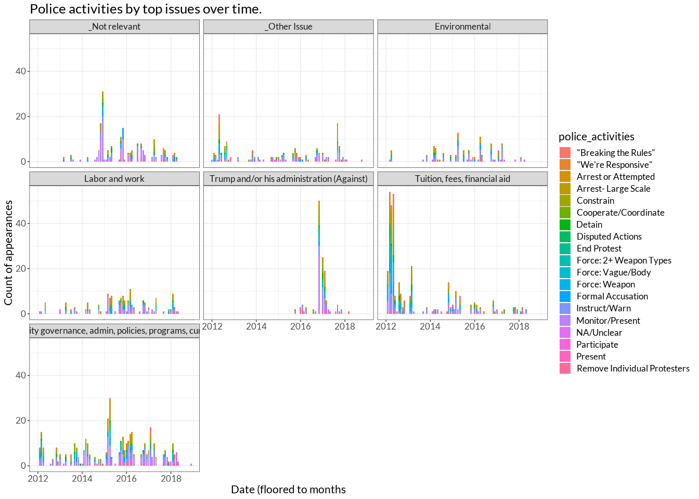
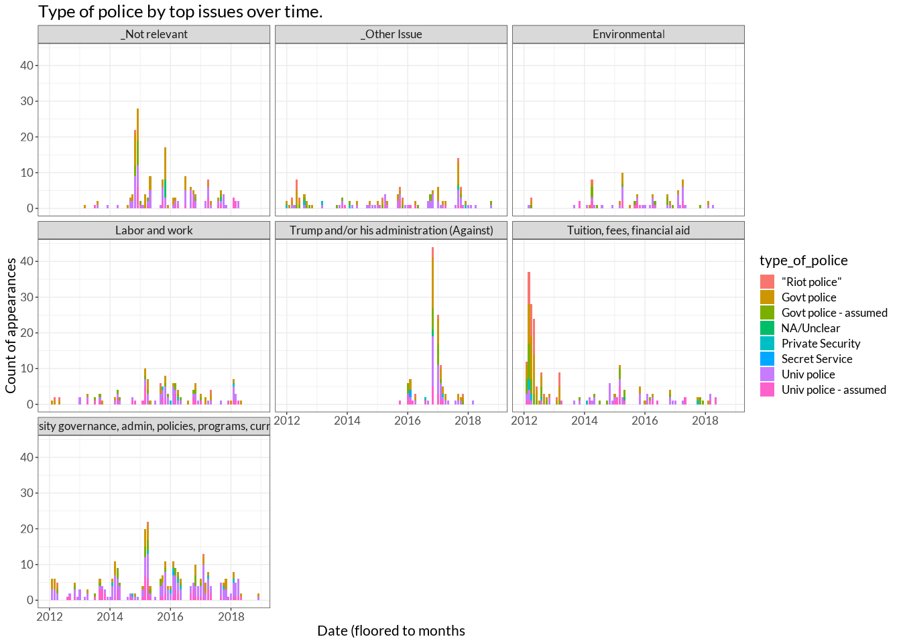

Exploratory Plots
================

# Basic counts

The initial import of the MPEDS db found 6096 unique canonical events,
and after all cleaning steps we still have 6096 canonical events.

However, there’s still an issue regarding duplicate matches in IPEDS we
can detect (there are likely also incorrect matches that we can’t detect
programmatically right now); there are lots of schools called “Columbia
College” (or another common name) inside IPEDS, so any schools with that
name in MPEDS will be assigned multiple schools. The MPEDS-IPEDS join is
crucial because we also use IPEDS to join county FIPS identifiers, and
thus no further joins will be accurate unless the MPEDS-IPEDS join is
accurate. As of Jan 30, 2023, we are in the middle of repairing this
join.

Of those events, there were 540 unique locations, 314 unique counties,
and 604 unique universities. Surprisingly, all of the locations that
were not universities found geocoding matches, and hand-checking the
most common ones indicates that there isn’t a strong pattern of missing
value substitution, e.g. Google isn’t sending the majority of results to
the centroid of America or to `(-1, -1)` or anything weird like that.
Universities had a harder time, with 21 universities and 101 rows
(canonical events) not returning lon/lat coords for universities.

That comes out to \~5% of universities not having coordinates, and
\~2.5% of canonical events not having universities with coordinates.

The top universities by appearances:

| university                                  |   n |
|:--------------------------------------------|----:|
| University of California-Berkeley           | 228 |
| McGill University                           | 191 |
| Concordia University                        | 168 |
| Harvard University                          | 140 |
| University of Michigan-Ann Arbor            | 120 |
| University of California-Los Angeles        | 106 |
| University of Toronto                       |  90 |
| Ryerson University                          |  81 |
| Tufts University                            |  71 |
| University of Chicago                       |  66 |
| York University                             |  66 |
| Columbia University in the City of New York |  64 |
| The University of Texas at Austin           |  55 |
| Georgetown University                       |  52 |
| University of Wisconsin-Madison             |  50 |

And the top locations:

| location               |   n |
|:-----------------------|----:|
| Montreal, QC, Canada   | 384 |
| Toronto, ON, Canada    | 226 |
| Berkeley, CA, USA      | 212 |
| New York City, NY, USA | 189 |
| Los Angeles, CA, USA   | 134 |
| Cambridge, MA, USA     | 132 |
| Chicago, IL, USA       | 125 |
| Ann Arbor, MI, USA     | 111 |
| San Francisco, CA, USA |  89 |
| San Diego, CA, USA     |  85 |
| Washington, D.C., USA  |  74 |
| Boston, MA, USA        |  73 |
| Vancouver, BC, Canada  |  54 |
| Austin, TX, USA        |  53 |
| Ottawa, ON, Canada     |  51 |

Top states:

|   n | state_name           |
|----:|:---------------------|
| 900 | California           |
| 375 | Massachusetts        |
| 358 | New York             |
| 275 | Illinois             |
| 187 | Pennsylvania         |
| 170 | Michigan             |
| 161 | Texas                |
| 137 | Ohio                 |
| 128 | District of Columbia |
| 120 | Virginia             |
| 110 | North Carolina       |
| 107 | Florida              |
| 106 | Indiana              |
| 102 | Missouri             |
|  93 | Connecticut          |

And finally the top counties:

|   n | county_name                                |
|----:|:-------------------------------------------|
| 239 | Middlesex County, Massachusetts            |
| 237 | Alameda County, California                 |
| 209 | Los Angeles County, California             |
| 195 | New York County, New York                  |
| 149 | Cook County, Illinois                      |
| 128 | District of Columbia, District of Columbia |
| 117 | Washtenaw County, Michigan                 |
| 101 | San Diego County, California               |
|  90 | San Francisco County, California           |
|  75 | Suffolk County, Massachusetts              |
|  59 | Santa Clara County, California             |
|  56 | Travis County, Texas                       |
|  50 | Yolo County, California                    |
|  50 | Dane County, Wisconsin                     |
|  46 | Boulder County, Colorado                   |
|  46 | Tompkins County, New York                  |

These glimpses seem mostly in line with what we should expect, with a
strong caveat that the Missouri protests are not making a leading
appearance in the counts by location, but there do seem to be a fair
number in Missouri when we take a look by state. What’s going on there?

Associated semantic locations with canonical events assigned the
Missouri FIPS code, and the Boone county FIPS code:

| location                |   n |
|:------------------------|----:|
| Cape Girardeau, MO, USA |   1 |
| Columbia, MO, USA       |  36 |
| Jefferson City, MO, USA |   7 |
| Kansas City, MO, USA    |   4 |
| Maryville, MO, USA      |   1 |
| Springfield, MO, USA    |   1 |
| St. Charles, MO, USA    |   1 |
| St. Joseph, MO, USA     |   3 |
| St. Louis, MO, USA      |  42 |
| Webster Groves, MO, USA |   1 |
| Webster Groves, MO, USA |   5 |

| location          |   n |
|:------------------|----:|
| Columbia, MO, USA |  36 |

Ah, that’s not good. It seems there are non-MO locations being
recognized as happening in Missouri. See Google Doc for details

| police_presence_and_size |    n |
|:-------------------------|-----:|
| NA                       | 5331 |
| NA/Unclear               |  410 |
| Substantial              |  295 |
| Small/0 to 5 officers    |   88 |
| Heavily Policed          |   32 |
| Motorized Presence       |   17 |

| police_activities            |    n |
|:-----------------------------|-----:|
| NA                           | 5233 |
| Monitor/Present              |  420 |
| Instruct/Warn                |  176 |
| Arrest or Attempted          |  166 |
| Constrain                    |  162 |
| Formal Accusation            |  111 |
| Remove Individual Protesters |   63 |
| Force: Vague/Body            |   61 |
| End Protest                  |   58 |
| “Breaking the Rules”         |   51 |
| Detain                       |   46 |
| NA/Unclear                   |   33 |
| Force: Weapon                |   32 |
| Force: 2+ Weapon Types       |   28 |
| Arrest- Large Scale          |   27 |
| Present                      |   18 |
| Cooperate/Coordinate         |   14 |
| Disputed Actions             |    5 |
| Participate                  |    5 |
| “We’re Responsive”           |    1 |

| type_of_police        |    n |
|:----------------------|-----:|
| NA                    | 5225 |
| Univ police           |  455 |
| Govt police           |  306 |
| Univ police - assumed |  156 |
| Govt police - assumed |  139 |
| “Riot police”         |   69 |
| Private Security      |   27 |
| NA/Unclear            |    9 |
| Secret Service        |    2 |

| university_action_on_issue |    n |
|:---------------------------|-----:|
| NA                         | 5655 |
| NA/Unclear                 |  236 |
| Action in Process          |  134 |
| Reject Demand              |   90 |
| Structural Change          |   27 |
| Fulfill Demand             |   25 |
| Compromised Action         |   19 |
| Contrary Action/Refuse     |   16 |
| No Cancellation            |   16 |
| Hold Forum                 |   11 |
| Cancel Speaker/Event       |    8 |
| Resign/Fire                |    4 |
| Short Term Services        |    4 |
| Sanction                   |    2 |

| university_discourse_on_issue   |    n |
|:--------------------------------|-----:|
| NA                              | 5622 |
| NA/Unclear                      |  176 |
| Explain Bureaucracy/Law         |  165 |
| Express Contrary Position       |  141 |
| Express Agreement               |   90 |
| Affirm Diversity                |   19 |
| Emotional Appeal                |   17 |
| Affirm Free Speech when Bigotry |   14 |
| Affirm BIPOC Students           |    8 |
| Affirm Marginalized Students    |    8 |
| Oppose Oppression               |    6 |
| Oppose Racism                   |    6 |
| Apology/Responsibility          |    4 |

| university_reactions_to_protest |    n |
|:--------------------------------|-----:|
| NA                              | 5640 |
| NA/Unclear                      |  187 |
| Monitor/Present                 |   98 |
| Meet                            |   78 |
| Get Confronted                  |   77 |
| Instruct/Warn                   |   65 |
| Direct Communications           |   62 |
| Participate/Aid                 |   42 |
| Penalize                        |   25 |
| No Intervention                 |   23 |
| End Protest                     |    9 |
| Revisit Protest P&P             |    9 |
| Avoid Penalizing                |    7 |
| Refuse to Meet                  |    7 |

# Crosstabs by issue and reactions to protes

Showing top 7 issues by total count, by various subgroups:

| issue                                                        | police_presence_and_size |   n |
|:-------------------------------------------------------------|:-------------------------|----:|
| Environmental                                                | Heavily Policed          |   4 |
| Environmental                                                | Motorized Presence       |   1 |
| Environmental                                                | NA/Unclear               |  24 |
| Environmental                                                | Small/0 to 5 officers    |   7 |
| Environmental                                                | Substantial              |  17 |
| Labor and work                                               | Heavily Policed          |   1 |
| Labor and work                                               | Motorized Presence       |   2 |
| Labor and work                                               | NA/Unclear               |  62 |
| Labor and work                                               | Small/0 to 5 officers    |  11 |
| Labor and work                                               | Substantial              |  25 |
| Trump and/or his administration (Against)                    | Heavily Policed          |   4 |
| Trump and/or his administration (Against)                    | NA/Unclear               |  44 |
| Trump and/or his administration (Against)                    | Small/0 to 5 officers    |   7 |
| Trump and/or his administration (Against)                    | Substantial              |  31 |
| Tuition, fees, financial aid                                 | Heavily Policed          |   7 |
| Tuition, fees, financial aid                                 | Motorized Presence       |   8 |
| Tuition, fees, financial aid                                 | NA/Unclear               |  50 |
| Tuition, fees, financial aid                                 | Small/0 to 5 officers    |  10 |
| Tuition, fees, financial aid                                 | Substantial              |  82 |
| University governance, admin, policies, programs, curriculum | Heavily Policed          |   7 |
| University governance, admin, policies, programs, curriculum | Motorized Presence       |   1 |
| University governance, admin, policies, programs, curriculum | NA/Unclear               | 125 |
| University governance, admin, policies, programs, curriculum | Small/0 to 5 officers    |  34 |
| University governance, admin, policies, programs, curriculum | Substantial              |  55 |
| \_Not relevant                                               | Heavily Policed          |   2 |
| \_Not relevant                                               | Motorized Presence       |   2 |
| \_Not relevant                                               | NA/Unclear               |  78 |
| \_Not relevant                                               | Small/0 to 5 officers    |  16 |
| \_Not relevant                                               | Substantial              |  31 |
| \_Other Issue                                                | Heavily Policed          |   1 |
| \_Other Issue                                                | Motorized Presence       |   1 |
| \_Other Issue                                                | NA/Unclear               |  46 |
| \_Other Issue                                                | Small/0 to 5 officers    |   6 |
| \_Other Issue                                                | Substantial              |  41 |

| issue                                                        | police_activities            |   n |
|:-------------------------------------------------------------|:-----------------------------|----:|
| Environmental                                                | “Breaking the Rules”         |   6 |
| Environmental                                                | Arrest or Attempted          |  15 |
| Environmental                                                | Arrest- Large Scale          |   4 |
| Environmental                                                | Constrain                    |   7 |
| Environmental                                                | Cooperate/Coordinate         |   1 |
| Environmental                                                | Detain                       |   1 |
| Environmental                                                | Disputed Actions             |   2 |
| Environmental                                                | End Protest                  |   4 |
| Environmental                                                | Force: 2+ Weapon Types       |   1 |
| Environmental                                                | Force: Vague/Body            |   3 |
| Environmental                                                | Formal Accusation            |  10 |
| Environmental                                                | Instruct/Warn                |  21 |
| Environmental                                                | Monitor/Present              |  28 |
| Environmental                                                | NA/Unclear                   |   1 |
| Environmental                                                | Remove Individual Protesters |   5 |
| Labor and work                                               | “Breaking the Rules”         |   1 |
| Labor and work                                               | Arrest or Attempted          |  20 |
| Labor and work                                               | Arrest- Large Scale          |   5 |
| Labor and work                                               | Constrain                    |  21 |
| Labor and work                                               | Cooperate/Coordinate         |   2 |
| Labor and work                                               | Detain                       |   3 |
| Labor and work                                               | End Protest                  |   7 |
| Labor and work                                               | Force: 2+ Weapon Types       |   3 |
| Labor and work                                               | Force: Vague/Body            |   7 |
| Labor and work                                               | Force: Weapon                |   1 |
| Labor and work                                               | Formal Accusation            |  11 |
| Labor and work                                               | Instruct/Warn                |  17 |
| Labor and work                                               | Monitor/Present              |  50 |
| Labor and work                                               | NA/Unclear                   |   2 |
| Labor and work                                               | Present                      |   3 |
| Labor and work                                               | Remove Individual Protesters |   5 |
| Trump and/or his administration (Against)                    | “Breaking the Rules”         |   2 |
| Trump and/or his administration (Against)                    | Arrest or Attempted          |  12 |
| Trump and/or his administration (Against)                    | Arrest- Large Scale          |   1 |
| Trump and/or his administration (Against)                    | Constrain                    |  16 |
| Trump and/or his administration (Against)                    | Cooperate/Coordinate         |   3 |
| Trump and/or his administration (Against)                    | Detain                       |   6 |
| Trump and/or his administration (Against)                    | End Protest                  |   5 |
| Trump and/or his administration (Against)                    | Force: 2+ Weapon Types       |   2 |
| Trump and/or his administration (Against)                    | Force: Vague/Body            |   2 |
| Trump and/or his administration (Against)                    | Force: Weapon                |   2 |
| Trump and/or his administration (Against)                    | Formal Accusation            |   5 |
| Trump and/or his administration (Against)                    | Instruct/Warn                |  11 |
| Trump and/or his administration (Against)                    | Monitor/Present              |  48 |
| Trump and/or his administration (Against)                    | NA/Unclear                   |   3 |
| Trump and/or his administration (Against)                    | Participate                  |   1 |
| Trump and/or his administration (Against)                    | Present                      |   2 |
| Trump and/or his administration (Against)                    | Remove Individual Protesters |   7 |
| Tuition, fees, financial aid                                 | “Breaking the Rules”         |  21 |
| Tuition, fees, financial aid                                 | Arrest or Attempted          |  43 |
| Tuition, fees, financial aid                                 | Arrest- Large Scale          |  14 |
| Tuition, fees, financial aid                                 | Constrain                    |  48 |
| Tuition, fees, financial aid                                 | Cooperate/Coordinate         |   1 |
| Tuition, fees, financial aid                                 | Detain                       |  12 |
| Tuition, fees, financial aid                                 | Disputed Actions             |   1 |
| Tuition, fees, financial aid                                 | End Protest                  |  17 |
| Tuition, fees, financial aid                                 | Force: 2+ Weapon Types       |  16 |
| Tuition, fees, financial aid                                 | Force: Vague/Body            |  26 |
| Tuition, fees, financial aid                                 | Force: Weapon                |  13 |
| Tuition, fees, financial aid                                 | Formal Accusation            |  28 |
| Tuition, fees, financial aid                                 | Instruct/Warn                |  43 |
| Tuition, fees, financial aid                                 | Monitor/Present              |  53 |
| Tuition, fees, financial aid                                 | NA/Unclear                   |   1 |
| Tuition, fees, financial aid                                 | Present                      |   2 |
| Tuition, fees, financial aid                                 | Remove Individual Protesters |   6 |
| University governance, admin, policies, programs, curriculum | “Breaking the Rules”         |  12 |
| University governance, admin, policies, programs, curriculum | Arrest or Attempted          |  39 |
| University governance, admin, policies, programs, curriculum | Arrest- Large Scale          |   4 |
| University governance, admin, policies, programs, curriculum | Constrain                    |  49 |
| University governance, admin, policies, programs, curriculum | Cooperate/Coordinate         |   2 |
| University governance, admin, policies, programs, curriculum | Detain                       |  10 |
| University governance, admin, policies, programs, curriculum | Disputed Actions             |   1 |
| University governance, admin, policies, programs, curriculum | End Protest                  |  22 |
| University governance, admin, policies, programs, curriculum | Force: 2+ Weapon Types       |   4 |
| University governance, admin, policies, programs, curriculum | Force: Vague/Body            |  11 |
| University governance, admin, policies, programs, curriculum | Force: Weapon                |   4 |
| University governance, admin, policies, programs, curriculum | Formal Accusation            |  30 |
| University governance, admin, policies, programs, curriculum | Instruct/Warn                |  61 |
| University governance, admin, policies, programs, curriculum | Monitor/Present              | 115 |
| University governance, admin, policies, programs, curriculum | NA/Unclear                   |  11 |
| University governance, admin, policies, programs, curriculum | Participate                  |   1 |
| University governance, admin, policies, programs, curriculum | Present                      |   7 |
| University governance, admin, policies, programs, curriculum | Remove Individual Protesters |  16 |
| \_Not relevant                                               | “Breaking the Rules”         |   2 |
| \_Not relevant                                               | Arrest or Attempted          |  16 |
| \_Not relevant                                               | Arrest- Large Scale          |   1 |
| \_Not relevant                                               | Constrain                    |  11 |
| \_Not relevant                                               | Cooperate/Coordinate         |   6 |
| \_Not relevant                                               | Detain                       |   6 |
| \_Not relevant                                               | End Protest                  |   3 |
| \_Not relevant                                               | Force: Vague/Body            |   5 |
| \_Not relevant                                               | Force: Weapon                |   1 |
| \_Not relevant                                               | Formal Accusation            |  16 |
| \_Not relevant                                               | Instruct/Warn                |  16 |
| \_Not relevant                                               | Monitor/Present              |  86 |
| \_Not relevant                                               | NA/Unclear                   |   5 |
| \_Not relevant                                               | Participate                  |   2 |
| \_Not relevant                                               | Present                      |   2 |
| \_Not relevant                                               | Remove Individual Protesters |   8 |
| \_Other Issue                                                | “Breaking the Rules”         |   7 |
| \_Other Issue                                                | “We’re Responsive”           |   1 |
| \_Other Issue                                                | Arrest or Attempted          |  22 |
| \_Other Issue                                                | Arrest- Large Scale          |   3 |
| \_Other Issue                                                | Constrain                    |  15 |
| \_Other Issue                                                | Cooperate/Coordinate         |   4 |
| \_Other Issue                                                | Detain                       |   7 |
| \_Other Issue                                                | Disputed Actions             |   1 |
| \_Other Issue                                                | End Protest                  |   3 |
| \_Other Issue                                                | Force: 2+ Weapon Types       |   2 |
| \_Other Issue                                                | Force: Vague/Body            |   3 |
| \_Other Issue                                                | Force: Weapon                |   4 |
| \_Other Issue                                                | Formal Accusation            |  13 |
| \_Other Issue                                                | Instruct/Warn                |  19 |
| \_Other Issue                                                | Monitor/Present              |  44 |
| \_Other Issue                                                | NA/Unclear                   |   6 |
| \_Other Issue                                                | Remove Individual Protesters |   9 |

| issue                                                        | type_of_police        |   n |
|:-------------------------------------------------------------|:----------------------|----:|
| Environmental                                                | “Riot police”         |   2 |
| Environmental                                                | Govt police           |  16 |
| Environmental                                                | Govt police - assumed |  12 |
| Environmental                                                | Univ police           |  33 |
| Environmental                                                | Univ police - assumed |  13 |
| Labor and work                                               | “Riot police”         |   4 |
| Labor and work                                               | Govt police           |  29 |
| Labor and work                                               | Govt police - assumed |  16 |
| Labor and work                                               | Private Security      |   4 |
| Labor and work                                               | Univ police           |  46 |
| Labor and work                                               | Univ police - assumed |  27 |
| Trump and/or his administration (Against)                    | “Riot police”         |   7 |
| Trump and/or his administration (Against)                    | Govt police           |  36 |
| Trump and/or his administration (Against)                    | Govt police - assumed |  17 |
| Trump and/or his administration (Against)                    | NA/Unclear            |   2 |
| Trump and/or his administration (Against)                    | Private Security      |   2 |
| Trump and/or his administration (Against)                    | Secret Service        |   2 |
| Trump and/or his administration (Against)                    | Univ police           |  37 |
| Trump and/or his administration (Against)                    | Univ police - assumed |  17 |
| Tuition, fees, financial aid                                 | “Riot police”         |  37 |
| Tuition, fees, financial aid                                 | Govt police           |  63 |
| Tuition, fees, financial aid                                 | Govt police - assumed |  41 |
| Tuition, fees, financial aid                                 | NA/Unclear            |   1 |
| Tuition, fees, financial aid                                 | Private Security      |   8 |
| Tuition, fees, financial aid                                 | Univ police           |  41 |
| Tuition, fees, financial aid                                 | Univ police - assumed |  21 |
| University governance, admin, policies, programs, curriculum | “Riot police”         |   3 |
| University governance, admin, policies, programs, curriculum | Govt police           |  56 |
| University governance, admin, policies, programs, curriculum | Govt police - assumed |  26 |
| University governance, admin, policies, programs, curriculum | Private Security      |  10 |
| University governance, admin, policies, programs, curriculum | Secret Service        |   1 |
| University governance, admin, policies, programs, curriculum | Univ police           | 151 |
| University governance, admin, policies, programs, curriculum | Univ police - assumed |  62 |
| \_Not relevant                                               | “Riot police”         |   2 |
| \_Not relevant                                               | Govt police           |  58 |
| \_Not relevant                                               | Govt police - assumed |  14 |
| \_Not relevant                                               | NA/Unclear            |   6 |
| \_Not relevant                                               | Univ police           |  69 |
| \_Not relevant                                               | Univ police - assumed |  26 |
| \_Other Issue                                                | “Riot police”         |  10 |
| \_Other Issue                                                | Govt police           |  36 |
| \_Other Issue                                                | Govt police - assumed |  17 |
| \_Other Issue                                                | Private Security      |   6 |
| \_Other Issue                                                | Univ police           |  48 |
| \_Other Issue                                                | Univ police - assumed |  11 |

| issue                                                        | university_action_on_issue |   n |
|:-------------------------------------------------------------|:---------------------------|----:|
| Environmental                                                | Action in Process          |  10 |
| Environmental                                                | Compromised Action         |   2 |
| Environmental                                                | Fulfill Demand             |   1 |
| Environmental                                                | Hold Forum                 |   1 |
| Environmental                                                | NA/Unclear                 |  13 |
| Environmental                                                | Reject Demand              |  19 |
| Environmental                                                | Structural Change          |   2 |
| Labor and work                                               | Action in Process          |  65 |
| Labor and work                                               | Compromised Action         |   3 |
| Labor and work                                               | Contrary Action/Refuse     |  10 |
| Labor and work                                               | Fulfill Demand             |   9 |
| Labor and work                                               | Hold Forum                 |   1 |
| Labor and work                                               | NA/Unclear                 |  38 |
| Labor and work                                               | Reject Demand              |  25 |
| Labor and work                                               | Structural Change          |   5 |
| Trump and/or his administration (Against)                    | Action in Process          |   2 |
| Trump and/or his administration (Against)                    | NA/Unclear                 |   1 |
| Trump and/or his administration (Against)                    | Structural Change          |   2 |
| Tuition, fees, financial aid                                 | Action in Process          |  16 |
| Tuition, fees, financial aid                                 | Cancel Speaker/Event       |   1 |
| Tuition, fees, financial aid                                 | Compromised Action         |   4 |
| Tuition, fees, financial aid                                 | Contrary Action/Refuse     |   2 |
| Tuition, fees, financial aid                                 | Fulfill Demand             |   1 |
| Tuition, fees, financial aid                                 | Hold Forum                 |   2 |
| Tuition, fees, financial aid                                 | NA/Unclear                 |  51 |
| Tuition, fees, financial aid                                 | Reject Demand              |  22 |
| Tuition, fees, financial aid                                 | Structural Change          |   1 |
| University governance, admin, policies, programs, curriculum | Action in Process          |  95 |
| University governance, admin, policies, programs, curriculum | Cancel Speaker/Event       |   5 |
| University governance, admin, policies, programs, curriculum | Compromised Action         |  15 |
| University governance, admin, policies, programs, curriculum | Contrary Action/Refuse     |  14 |
| University governance, admin, policies, programs, curriculum | Fulfill Demand             |  13 |
| University governance, admin, policies, programs, curriculum | Hold Forum                 |   8 |
| University governance, admin, policies, programs, curriculum | NA/Unclear                 |  92 |
| University governance, admin, policies, programs, curriculum | No Cancellation            |  12 |
| University governance, admin, policies, programs, curriculum | Reject Demand              |  68 |
| University governance, admin, policies, programs, curriculum | Resign/Fire                |   2 |
| University governance, admin, policies, programs, curriculum | Sanction                   |   1 |
| University governance, admin, policies, programs, curriculum | Short Term Services        |   1 |
| University governance, admin, policies, programs, curriculum | Structural Change          |  19 |
| \_Not relevant                                               | Action in Process          |  14 |
| \_Not relevant                                               | Fulfill Demand             |   7 |
| \_Not relevant                                               | Hold Forum                 |   2 |
| \_Not relevant                                               | NA/Unclear                 |  41 |
| \_Not relevant                                               | No Cancellation            |   1 |
| \_Not relevant                                               | Reject Demand              |   3 |
| \_Not relevant                                               | Short Term Services        |   3 |
| \_Not relevant                                               | Structural Change          |   7 |
| \_Other Issue                                                | Action in Process          |   5 |
| \_Other Issue                                                | Fulfill Demand             |   2 |
| \_Other Issue                                                | NA/Unclear                 |  17 |
| \_Other Issue                                                | No Cancellation            |   3 |
| \_Other Issue                                                | Reject Demand              |   6 |
| \_Other Issue                                                | Resign/Fire                |   1 |
| \_Other Issue                                                | Structural Change          |   3 |

| issue                                                        | university_discourse_on_issue   |   n |
|:-------------------------------------------------------------|:--------------------------------|----:|
| Environmental                                                | Affirm Diversity                |   2 |
| Environmental                                                | Affirm Free Speech when Bigotry |   1 |
| Environmental                                                | Explain Bureaucracy/Law         |  14 |
| Environmental                                                | Express Agreement               |   6 |
| Environmental                                                | Express Contrary Position       |  26 |
| Environmental                                                | NA/Unclear                      |   9 |
| Labor and work                                               | Affirm Diversity                |   3 |
| Labor and work                                               | Emotional Appeal                |   3 |
| Labor and work                                               | Explain Bureaucracy/Law         |  46 |
| Labor and work                                               | Express Agreement               |  10 |
| Labor and work                                               | Express Contrary Position       |  53 |
| Labor and work                                               | NA/Unclear                      |  44 |
| Trump and/or his administration (Against)                    | Affirm Marginalized Students    |   1 |
| Trump and/or his administration (Against)                    | Express Agreement               |   2 |
| Trump and/or his administration (Against)                    | NA/Unclear                      |   1 |
| Tuition, fees, financial aid                                 | Affirm BIPOC Students           |   1 |
| Tuition, fees, financial aid                                 | Affirm Diversity                |   3 |
| Tuition, fees, financial aid                                 | Apology/Responsibility          |   1 |
| Tuition, fees, financial aid                                 | Emotional Appeal                |   2 |
| Tuition, fees, financial aid                                 | Explain Bureaucracy/Law         |  33 |
| Tuition, fees, financial aid                                 | Express Agreement               |  12 |
| Tuition, fees, financial aid                                 | Express Contrary Position       |  26 |
| Tuition, fees, financial aid                                 | NA/Unclear                      |  41 |
| Tuition, fees, financial aid                                 | Oppose Oppression               |   1 |
| Tuition, fees, financial aid                                 | Oppose Racism                   |   1 |
| University governance, admin, policies, programs, curriculum | Affirm BIPOC Students           |   3 |
| University governance, admin, policies, programs, curriculum | Affirm Diversity                |   8 |
| University governance, admin, policies, programs, curriculum | Affirm Free Speech when Bigotry |   8 |
| University governance, admin, policies, programs, curriculum | Affirm Marginalized Students    |   2 |
| University governance, admin, policies, programs, curriculum | Apology/Responsibility          |   3 |
| University governance, admin, policies, programs, curriculum | Emotional Appeal                |  10 |
| University governance, admin, policies, programs, curriculum | Explain Bureaucracy/Law         |  98 |
| University governance, admin, policies, programs, curriculum | Express Agreement               |  35 |
| University governance, admin, policies, programs, curriculum | Express Contrary Position       | 105 |
| University governance, admin, policies, programs, curriculum | NA/Unclear                      |  83 |
| University governance, admin, policies, programs, curriculum | Oppose Oppression               |   2 |
| University governance, admin, policies, programs, curriculum | Oppose Racism                   |   1 |
| \_Not relevant                                               | Affirm BIPOC Students           |   5 |
| \_Not relevant                                               | Affirm Diversity                |   6 |
| \_Not relevant                                               | Affirm Free Speech when Bigotry |   3 |
| \_Not relevant                                               | Affirm Marginalized Students    |   3 |
| \_Not relevant                                               | Apology/Responsibility          |   1 |
| \_Not relevant                                               | Emotional Appeal                |   3 |
| \_Not relevant                                               | Explain Bureaucracy/Law         |  12 |
| \_Not relevant                                               | Express Agreement               |  33 |
| \_Not relevant                                               | Express Contrary Position       |   3 |
| \_Not relevant                                               | NA/Unclear                      |  21 |
| \_Not relevant                                               | Oppose Oppression               |   3 |
| \_Not relevant                                               | Oppose Racism                   |   4 |
| \_Other Issue                                                | Affirm Diversity                |   1 |
| \_Other Issue                                                | Affirm Free Speech when Bigotry |   2 |
| \_Other Issue                                                | Explain Bureaucracy/Law         |  10 |
| \_Other Issue                                                | Express Agreement               |   4 |
| \_Other Issue                                                | Express Contrary Position       |   5 |
| \_Other Issue                                                | NA/Unclear                      |  13 |

| issue                                                        | university_reactions_to_protest |   n |
|:-------------------------------------------------------------|:--------------------------------|----:|
| Environmental                                                | Avoid Penalizing                |   1 |
| Environmental                                                | Direct Communications           |   1 |
| Environmental                                                | Get Confronted                  |  16 |
| Environmental                                                | Instruct/Warn                   |   8 |
| Environmental                                                | Meet                            |   7 |
| Environmental                                                | Monitor/Present                 |   8 |
| Environmental                                                | NA/Unclear                      |  15 |
| Environmental                                                | Participate/Aid                 |   2 |
| Environmental                                                | Penalize                        |   2 |
| Labor and work                                               | Direct Communications           |  12 |
| Labor and work                                               | Get Confronted                  |  12 |
| Labor and work                                               | Instruct/Warn                   |  16 |
| Labor and work                                               | Meet                            |  22 |
| Labor and work                                               | Monitor/Present                 |  11 |
| Labor and work                                               | NA/Unclear                      |  63 |
| Labor and work                                               | No Intervention                 |   5 |
| Labor and work                                               | Participate/Aid                 |   1 |
| Labor and work                                               | Penalize                        |   2 |
| Labor and work                                               | Refuse to Meet                  |   2 |
| Trump and/or his administration (Against)                    | Direct Communications           |   3 |
| Trump and/or his administration (Against)                    | Meet                            |   1 |
| Trump and/or his administration (Against)                    | Monitor/Present                 |   3 |
| Trump and/or his administration (Against)                    | Participate/Aid                 |   2 |
| Tuition, fees, financial aid                                 | Avoid Penalizing                |   4 |
| Tuition, fees, financial aid                                 | Direct Communications           |  22 |
| Tuition, fees, financial aid                                 | End Protest                     |   2 |
| Tuition, fees, financial aid                                 | Get Confronted                  |  20 |
| Tuition, fees, financial aid                                 | Instruct/Warn                   |  20 |
| Tuition, fees, financial aid                                 | Meet                            |  11 |
| Tuition, fees, financial aid                                 | Monitor/Present                 |  19 |
| Tuition, fees, financial aid                                 | NA/Unclear                      |  19 |
| Tuition, fees, financial aid                                 | No Intervention                 |  20 |
| Tuition, fees, financial aid                                 | Participate/Aid                 |   3 |
| Tuition, fees, financial aid                                 | Penalize                        |   7 |
| Tuition, fees, financial aid                                 | Refuse to Meet                  |   3 |
| Tuition, fees, financial aid                                 | Revisit Protest P&P             |   1 |
| University governance, admin, policies, programs, curriculum | Avoid Penalizing                |   1 |
| University governance, admin, policies, programs, curriculum | Direct Communications           |  23 |
| University governance, admin, policies, programs, curriculum | End Protest                     |   5 |
| University governance, admin, policies, programs, curriculum | Get Confronted                  |  59 |
| University governance, admin, policies, programs, curriculum | Instruct/Warn                   |  32 |
| University governance, admin, policies, programs, curriculum | Meet                            |  57 |
| University governance, admin, policies, programs, curriculum | Monitor/Present                 |  55 |
| University governance, admin, policies, programs, curriculum | NA/Unclear                      | 100 |
| University governance, admin, policies, programs, curriculum | No Intervention                 |   8 |
| University governance, admin, policies, programs, curriculum | Participate/Aid                 |   8 |
| University governance, admin, policies, programs, curriculum | Penalize                        |  11 |
| University governance, admin, policies, programs, curriculum | Refuse to Meet                  |   6 |
| University governance, admin, policies, programs, curriculum | Revisit Protest P&P             |   7 |
| \_Not relevant                                               | Avoid Penalizing                |   2 |
| \_Not relevant                                               | Direct Communications           |  14 |
| \_Not relevant                                               | End Protest                     |   2 |
| \_Not relevant                                               | Get Confronted                  |   8 |
| \_Not relevant                                               | Instruct/Warn                   |   2 |
| \_Not relevant                                               | Meet                            |  13 |
| \_Not relevant                                               | Monitor/Present                 |  22 |
| \_Not relevant                                               | NA/Unclear                      |  14 |
| \_Not relevant                                               | Participate/Aid                 |  20 |
| \_Not relevant                                               | Penalize                        |   2 |
| \_Other Issue                                                | Avoid Penalizing                |   1 |
| \_Other Issue                                                | Direct Communications           |   2 |
| \_Other Issue                                                | Instruct/Warn                   |   4 |
| \_Other Issue                                                | Meet                            |   3 |
| \_Other Issue                                                | Monitor/Present                 |   4 |
| \_Other Issue                                                | NA/Unclear                      |  15 |
| \_Other Issue                                                | Participate/Aid                 |   3 |
| \_Other Issue                                                | Penalize                        |   1 |
| \_Other Issue                                                | Revisit Protest P&P             |   1 |

# Counts over time

<!-- -->

<!-- -->

We can also begin to look at the top universities, counties, locations,
or states over time. This inevitably produces more complex summaries,
and it can be difficult to take an informative glimpse given so many
categories, so I’ve only shown the universities over time for now:

<!-- --><!-- -->

    ## Scale for x is already present.
    ## Adding another scale for x, which will replace the existing scale.

    ## Warning: Removed 1 rows containing missing values (`position_stack()`).

<!-- -->

    ## Scale for x is already present.
    ## Adding another scale for x, which will replace the existing scale.

    ## Warning: Removed 7 rows containing missing values (`position_stack()`).

<!-- -->

    ## Scale for x is already present.
    ## Adding another scale for x, which will replace the existing scale.

    ## Warning: Removed 3 rows containing missing values (`position_stack()`).

<!-- -->

    ## Scale for x is already present.
    ## Adding another scale for x, which will replace the existing scale.

    ## Warning: Removed 4 rows containing missing values (`position_stack()`).

<!-- -->

    ## Scale for x is already present.
    ## Adding another scale for x, which will replace the existing scale.

    ## Warning: Removed 3 rows containing missing values (`position_stack()`).

<!-- -->

    ## Scale for x is already present.
    ## Adding another scale for x, which will replace the existing scale.

    ## Warning: Removed 1 rows containing missing values (`position_stack()`).

<!-- -->

| issue                                                        |    n |
|:-------------------------------------------------------------|-----:|
| University governance, admin, policies, programs, curriculum | 1728 |
| Labor and work                                               |  975 |
| Tuition, fees, financial aid                                 |  615 |
| Trump and/or his administration (Against)                    |  581 |
| \_Other Issue                                                |  533 |
| Environmental                                                |  425 |
| Sexual assault/violence                                      |  337 |
| Economy/inequality                                           |  327 |
| Feminism/women’s issues                                      |  302 |
| Faith-based discrimination                                   |  257 |
| Public funding for higher education                          |  256 |
| Far Right/Alt Right (Against)                                |  121 |
| Abortion access                                              |  113 |
| LGB+/Sexual orientation                                      |  111 |
| Hate speech                                                  |  110 |
| LGB+/Sexual orientation (For)                                |  109 |
| Gun control                                                  |  100 |
| Police violence/anti-law enforcement/criminal justice        |   99 |
| Abortion (Against)/Pro-life                                  |   86 |
| Free speech                                                  |   84 |
| Transgender issues (For)                                     |   81 |
| Pro-Palestine/BDS                                            |   72 |
| Transgender issues                                           |   68 |
| Anti-war/peace                                               |   63 |
| Social services and welfare                                  |   59 |
| Trump and/or his administration (For)                        |   52 |
| Human rights                                                 |   45 |
| LGB+/Sexual orientation (Against)                            |   45 |
| Far Right/Alt Right (For)                                    |   36 |
| Domestic foreign policy                                      |   34 |
| Hate crimes/Anti-minority violence                           |   32 |
| Accessibility                                                |   27 |
| Animal rights                                                |   23 |
| Anti-colonial/political independence                         |   22 |
| Political corruption/malfeasance                             |   19 |
| Pro-Israel/Zionism                                           |   17 |
| Transgender issues (Against)                                 |   16 |
| Gun owner rights                                             |   13 |
| Pro-law enforcement                                          |    7 |
| Traditional marriage/family                                  |    6 |
| Men’s rights                                                 |    2 |
|                                                              |    1 |

| racial_issue                                                 |   n |
|:-------------------------------------------------------------|----:|
| Anti-racism                                                  | 872 |
| Police violence                                              | 576 |
| University governance, admin, policies, programs, curriculum | 532 |
| Immigration (For)                                            | 480 |
| Campus climate                                               | 442 |
| Indigenous issues                                            | 159 |
| White supremacy (Against)                                    | 154 |
| \_Other Issue                                                | 132 |
| Hate speech                                                  |  99 |
| Racist/racialized symbols                                    |  86 |
| Hate crimes/Anti-minority violence                           |  74 |
| Prison/mass incarceration                                    |  48 |
| Memorials & anniversaries                                    |  39 |
| Affirmative action (For)                                     |  33 |
| Immigration (Against)                                        |  20 |
| White supremacy (For)                                        |  20 |
| Cultural appropriation                                       |  18 |
| Indigenous Issues                                            |  14 |
| Racial/ethnic pride - white                                  |   7 |
| All Lives Matter                                             |   6 |
| Pro-police                                                   |   5 |
| Reparations                                                  |   5 |
| Affirmative action (Against)                                 |   4 |
|                                                              |   1 |
| K-12 education                                               |   1 |
| Racial/ethnic pride - minority                               |   1 |

<!-- -->

    ## Warning: There was 1 warning in `mutate()`.
    ## ℹ In argument: `issue = fct_relevel(as.factor(issue),
    ##   c(issues_count$issue[1:4], racial_issue_count$racial_issue[1:4]))`.
    ## Caused by warning:
    ## ! 3 unknown levels in `f`: Anti-racism, Police violence, and Immigration (For)

<!-- -->

    ## Warning: Removed 7 rows containing missing values (`position_stack()`).

<!-- -->

# Issue crosstabs over time

    ## Warning: Removed 4 rows containing missing values (`position_stack()`).

<!-- -->

    ## Warning: Removed 5 rows containing missing values (`position_stack()`).

<!-- -->

    ## Warning: Removed 6 rows containing missing values (`position_stack()`).

<!-- -->

    ## Warning: Removed 7 rows containing missing values (`position_stack()`).

<!-- -->

    ## Warning: Removed 6 rows containing missing values (`position_stack()`).

<!-- -->

    ## Warning: Removed 5 rows containing missing values (`position_stack()`).

<!-- -->

# Basic summary plots by variable

| name                    | type    |      mean |        sd |
|:------------------------|:--------|----------:|----------:|
| bachelors_granting      | boolean |     1.000 |        NA |
| campaign                | boolean |     0.244 |        NA |
| counterprotest          | boolean |     0.043 |        NA |
| hbcu                    | boolean |     0.011 |        NA |
| inaccurate_date         | boolean |     0.009 |        NA |
| masters_granting        | boolean |     1.000 |        NA |
| multiple_cities         | boolean |     0.024 |        NA |
| off_campus              | boolean |     0.072 |        NA |
| on_campus_no_student    | boolean |     0.070 |        NA |
| phd_granting            | boolean |     1.000 |        NA |
| private                 | boolean |     0.053 |        NA |
| quotes                  | boolean |     0.631 |        NA |
| ritual                  | boolean |     0.030 |        NA |
| tribal                  | boolean |     0.000 |        NA |
| enrollment_count        | numeric | 43568.548 | 10014.084 |
| eviction_filing_rate    | numeric |     4.006 |     5.561 |
| eviction_judgement_rate | numeric |     1.543 |     1.573 |
| median_household_income | numeric | 64121.256 | 16573.401 |
| republican_vote_prop    | numeric |     0.315 |     0.152 |
| unemp                   | numeric |     4.866 |     1.572 |

For boolean variables, “mean” is the proportion that they are TRUE. Many
of the variables recorded in MPEDS allowed for the input of multiple
values, so those are handled as list-cols and not shown here.

<!-- -->

The pairs plot is still very difficult to read after adjustments. This
should be treated as a glimpse or overview, and more detailed and
cleaner plots will be made later on.

    ## `stat_bin()` using `bins = 30`. Pick better value with `binwidth`.

<!-- -->

# Trying out joins with protest data

To recap from our last conversation, it’s a bit difficult to join the
CCC data and our data since a lot of MPEDS data points could presumably
be in the CCC records. Then CCC data could be telling us that there was
a protest in the same county, when it could just be talking about the
same protest in MPEDS and essentially be turning data quality into
another covariate.

We discussed two solutions to this problem to avoid deduplication:

-   Join so that CCC protests occurring one, three, five, or seven days
    before the MPEDS protest date are matched; the CCC variable then
    conceptually becomes “was there a recent protest in the same
    county.” Thus protests won’t find a match only because of duplicates
-   Join only after filtering the CCC dataset so that rows with keywords
    related to universities are kicked out – things like teachers,
    faculty, students, colleges, universities. This is less ideal than
    the above strategy because it is so nonspecific, potentially missing
    many university matches and kicking out protests related to primary
    and secondary schools.

The following chunk gives a glimpse at total number of matches:

| source    | date_offset | recent_protests | match_percentage |
|:----------|------------:|----------------:|-----------------:|
| CCC       |           0 |             768 |        45.551601 |
| CCC       |           1 |             328 |        19.454330 |
| CCC       |           3 |             626 |        37.129300 |
| CCC       |           5 |             786 |        46.619217 |
| CCC       |           7 |             914 |        54.211151 |
| Elephrame |           0 |             327 |         6.696703 |
| Elephrame |           1 |             123 |         2.518943 |
| Elephrame |           3 |             241 |         4.935491 |
| Elephrame |           5 |             378 |         7.741143 |
| Elephrame |           7 |             476 |         9.748106 |

Here, the `match_percentage` column indicates how many canonical events
saw another protest occur in the same county within `diff` days,
according to the dataset in `source`. The fact that the match rate for 0
is much higher than 1 for both Elephrame and CCC indicates that there is
some double-counting of protests; rather than multiple protests
occurring concurrently, we may have recorded a protest in our dataset
that is also present in another dataset.

So it seems that there are a fair number of duplicates occurring if we
don’t have a date offset, but once we add one (of any days) that pretty
much solves the data quality issue.

That being said, the likely larger problem with the CCC data is that
it’s only available after 2017, so it may not be relevant even after we
become satisfied with the deduped match process. This can be refined a
little bit by adding in Elephrame data on BLM protests, but we’ve had
problems there already, and the topic differences mean we can’t pretend
we have complete data.

# Maps and related things

<!-- -->

# Investigating specific movements: Mizzou and Quebec solidarity protests

The Mizzou umbrella was linked 104 times, with 98 unique canonical
events inside.

<!-- --><!-- -->
