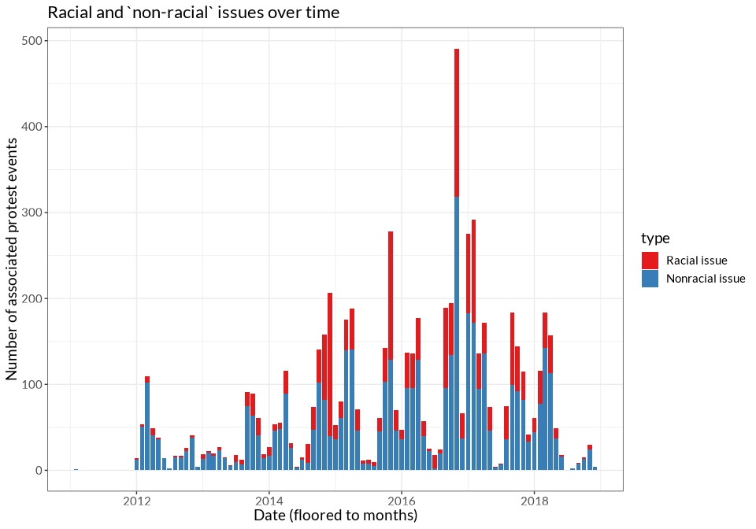

Exploratory Plots
================

- [Basic counts](#basic-counts)
  - [Counts by (combined) issue](#counts-by-combined-issue)
  - [Counts by combined issue, separated by
    country](#counts-by-combined-issue-separated-by-country)
  - [Counts by (split) issue and racial
    issue](#counts-by-split-issue-and-racial-issue)
  - [Counts of forms](#counts-of-forms)
  - [Counts of targets](#counts-of-targets)
- [Police involvement by issue](#police-involvement-by-issue)
- [Percentages of all protest with given
  preset](#percentages-of-all-protest-with-given-preset)
- [Counts over time](#counts-over-time)
  - [Police activities over time](#police-activities-over-time)
  - [Racial and “nonracial” issues over time
    (collapsed)](#racial-and-nonracial-issues-over-time-collapsed)
- [Basic summary plots by variable](#basic-summary-plots-by-variable)
- [Trying out joins with protest
  data](#trying-out-joins-with-protest-data)
- [Maps and related things](#maps-and-related-things)
- [Investigating specific movements](#investigating-specific-movements)
  - [2015 Mizzou protests](#2015-mizzou-protests)
    - [Mizzou issues](#mizzou-issues)
    - [2015 Antiracism protest profiles and
      comparison](#2015-antiracism-protest-profiles-and-comparison)
    - [Newspaper coverage for Mizzou
      umbrella](#newspaper-coverage-for-mizzou-umbrella)
  - [2012 Quebec protest wave](#2012-quebec-protest-wave)
    - [Quebec events frequency stratified by police
      fields](#quebec-events-frequency-stratified-by-police-fields)
  - [Trump-related protests](#trump-related-protests)
    - [Issue composition November 9th and 17th
      protests](#issue-composition-november-9th-and-17th-protests)
- [Investigating reporting measures](#investigating-reporting-measures)

# Basic counts

| Events with many issues                 | Number of issues |
|:----------------------------------------|-----------------:|
| 20160305_Toronto_March_Feminism         |               14 |
| 20151112_Athens_Rally_Tuition           |               10 |
| 20160928_Hempstead_Rally_Trump(Against) |               10 |
| 20180201_Toronto_March_Anti-War         |               10 |
| 20140208_Raleigh_March_PublicFunding    |                9 |

| Statistic                                             |   Value |
|:------------------------------------------------------|--------:|
| Total imported events                                 | 5897.00 |
| Total non-umbrella events                             | 5488.00 |
| Unique locations                                      |  534.00 |
| US counties                                           |  312.00 |
| Canadian CMAs                                         |   32.00 |
| Universities                                          |  585.00 |
| CEs with missing universities                         |    3.00 |
| Universities with missing locations                   |   41.00 |
| \# of events with police activity recorded            |  867.00 |
| \# of events with any police field recorded           |  921.00 |
| \# of events with university police only              |  449.00 |
| \# of events with government police only              |  282.00 |
| \# of events with both types of police                |  147.00 |
| \# of events with at least one issue or racial issue  | 5454.00 |
| \# of events with at least one issue and racial issue | 1047.00 |
| mode of issue counts                                  |    1.00 |
| mean of issue counts                                  |    2.09 |
| \# of events with just one issue                      | 2017.00 |

The initial import of the MPEDS db found 5897 unique canonical events,
and after all cleaning steps we still have 5928 canonical events.

However, there’s still an issue regarding duplicate matches in IPEDS we
can detect (there are likely also incorrect matches that we can’t detect
programmatically right now); there are lots of schools called “Columbia
College” (or another common name) inside IPEDS, so any schools with that
name in MPEDS will be assigned multiple schools. The MPEDS-IPEDS join is
crucial because we also use IPEDS to join county FIPS identifiers, and
thus no further joins will be accurate unless the MPEDS-IPEDS join is
accurate. As of Jan 30, 2023, we are in the middle of repairing this
join.

Of those events, there were 534 unique locations, 312 unique counties,
32 unique Canadian CMAs, and 585 unique universities. Surprisingly, all
of the locations that were not universities found geocoding matches, and
hand-checking the most common ones indicates that there isn’t a strong
pattern of missing value substitution, e.g. Google isn’t sending the
majority of results to the centroid of America or to `(-1, -1)` or
anything weird like that. Universities had a harder time, with 3
canonical events missing lon/lat coords for universities.

That comes out to ~5% of universities not having coordinates, and ~2.5%
of canonical events not having universities with coordinates.

The top universities by appearances:

| university_name                      |   n |
|:-------------------------------------|----:|
| University of California Berkeley    | 282 |
| McGill University                    | 258 |
| Concordia University                 | 214 |
| Harvard University                   | 148 |
| University of Toronto                | 132 |
| University of Michigan Ann Arbor     | 123 |
| University of California Los Angeles | 116 |
| Ryerson University                   |  93 |
| York University                      |  84 |
| Columbia University                  |  82 |
| Tufts University                     |  77 |
| University of Chicago                |  73 |
| University of Texas Austin           |  58 |
| University of Wisconsin Madison      |  58 |
| Georgetown University                |  55 |

And the top locations:

| location               |   n |
|:-----------------------|----:|
| Montreal, QC, Canada   | 375 |
| Toronto, ON, Canada    | 224 |
| Berkeley, CA, USA      | 222 |
| New York City, NY, USA | 166 |
| Los Angeles, CA, USA   | 135 |
| Cambridge, MA, USA     | 129 |
| Chicago, IL, USA       | 116 |
| Ann Arbor, MI, USA     | 110 |
| San Diego, CA, USA     |  92 |
| San Francisco, CA, USA |  84 |
| Washington, D.C., USA  |  72 |
| Medford, MA, USA       |  58 |
| Boston, MA, USA        |  56 |
| Austin, TX, USA        |  53 |
| Vancouver, BC, Canada  |  53 |

Top states:

| area_name            |   n |
|:---------------------|----:|
| California           | 899 |
| Quebec               | 422 |
| Massachusetts        | 355 |
| Ontario              | 334 |
| New York             | 329 |
| Illinois             | 260 |
| Pennsylvania         | 188 |
| Michigan             | 166 |
| Texas                | 161 |
| Ohio                 | 139 |
| District of Columbia | 125 |
| Virginia             | 119 |
| British Col          | 115 |
| Indiana              | 106 |
| North Carolina       | 104 |

And finally the top counties:

| locality_name        |   n |
|:---------------------|----:|
| Montréal             | 391 |
| Middlesex            | 292 |
| Alameda              | 246 |
| Toronto              | 244 |
| Los Angeles          | 205 |
| New York             | 174 |
| Cook                 | 140 |
| District of Columbia | 125 |
| Washtenaw            | 117 |
| San Diego            | 100 |
| San Francisco        |  85 |
| Vancouver            |  85 |
| Santa Clara          |  59 |
| Suffolk              |  57 |
| Travis               |  56 |

These glimpses seem mostly in line with what we should expect, with a
strong caveat that the Missouri protests are not making a leading
appearance in the counts by location, but there do seem to be a fair
number in Missouri when we take a look by state. It seems there are
non-MO locations being recognized as happening in Missouri. See our 1:1
notes Google Doc for details.

| police_presence_and_size |    n |
|:-------------------------|-----:|
| NA                       | 5130 |
| NA/Unclear               |  392 |
| Substantial              |  289 |
| Small/0 to 5 officers    |   87 |
| Heavily Policed          |   32 |
| Motorized Presence       |   17 |

| police_activities            |    n |
|:-----------------------------|-----:|
| NA                           | 5029 |
| Monitor/Present              |  410 |
| Instruct/Warn                |  175 |
| Arrest or Attempted          |  161 |
| Constrain                    |  160 |
| Formal Accusation            |  103 |
| Remove Individual Protesters |   63 |
| End Protest                  |   57 |
| Force: Vague/Body            |   57 |
| “Breaking the Rules”         |   52 |
| Detain                       |   48 |
| NA/Unclear                   |   32 |
| Force: Weapon                |   30 |
| Force: 2+ Weapon Types       |   27 |
| Arrest- Large Scale          |   26 |
| Present                      |   19 |
| Cooperate/Coordinate         |   14 |
| Participate                  |    6 |
| Disputed Actions             |    5 |
| “We’re Responsive”           |    1 |

| type_of_police        |    n |
|:----------------------|-----:|
| NA                    | 5021 |
| Univ police           |  455 |
| Govt police           |  299 |
| Univ police - assumed |  149 |
| Govt police - assumed |  134 |
| “Riot police”         |   68 |
| Private Security      |   27 |
| NA/Unclear            |    5 |
| Secret Service        |    2 |

| university_action_on_issue |    n |
|:---------------------------|-----:|
| NA                         | 4423 |
| NA/Unclear                 |  802 |
| Action in Process          |  388 |
| Reject Demand              |  186 |
| Fulfill Demand             |   98 |
| Structural Change          |   92 |
| No Cancellation            |   58 |
| Compromised Action         |   46 |
| Hold Forum                 |   32 |
| Contrary Action/Refuse     |   30 |
| Cancel Speaker/Event       |   24 |
| Resign/Fire                |   15 |
| Short Term Services        |   11 |
| Correct Racist History     |    6 |
| Sanction                   |    3 |

| university_discourse_on_issue   |    n |
|:--------------------------------|-----:|
| NA                              | 4399 |
| NA/Unclear                      |  530 |
| Explain Bureaucracy/Law         |  487 |
| Express Contrary Position       |  338 |
| Express Agreement               |  327 |
| Affirm Diversity                |   94 |
| Affirm Free Speech when Bigotry |   75 |
| Affirm Marginalized Students    |   60 |
| Emotional Appeal                |   46 |
| Oppose Racism                   |   28 |
| Apology/Responsibility          |   26 |
| Oppose Oppression               |   26 |
| Affirm BIPOC Students           |   18 |

| university_reactions_to_protest |    n |
|:--------------------------------|-----:|
| NA                              | 4408 |
| NA/Unclear                      |  709 |
| Monitor/Present                 |  280 |
| Meet                            |  181 |
| Direct Communications           |  178 |
| Get Confronted                  |  175 |
| Instruct/Warn                   |  120 |
| Participate/Aid                 |  116 |
| Penalize                        |   49 |
| Revisit Protest P&P             |   32 |
| No Intervention                 |   29 |
| Avoid Penalizing                |   26 |
| Refuse to Meet                  |   21 |
| End Protest                     |    9 |
| Protest Elsewhere               |    3 |

“NA” marks canonical events where issues were not assigned at all, or
where text-selects were used but not one of the preset issue categories.
“\_Not relevant” *should* be marked when a racial issue was selected
instead, per the codebook. “\_Other issue” marks issues not within the
preset options; the codebook gives the examples of:

- protestors who use hateful speech, e.g. anti-LGBTQ preachers
- (objection to?) corporate practices
- access to higher education (?)
- science (?)
- Armenian genocide (?)

Hm.

## Counts by (combined) issue

Issue counts here were combined for each canonical event, such that no
issue, racial issue, or some combination of the two is counted twice. If
an event has “University governance” for both issue and racial issue, it
is counted once.

The table below thus represents the proportion of all events a given
combined racial-nonracial issue was relevant to.

    ## `summarise()` has grouped output by 'key'. You can override using the `.groups`
    ## argument.
    ## Adding missing grouping variables: `key`

| issue                                                        | n      |
|:-------------------------------------------------------------|:-------|
| University governance, admin, policies, programs, curriculum | 38.9%  |
| Labor and work                                               | 17.3%  |
| Anti-racism                                                  | 15.15% |
| \_Other Issue                                                | 11.32% |
| Tuition, fees, financial aid                                 | 10.95% |
| Police violence                                              | 10.45% |
| Trump and/or his administration (Against)                    | 10.33% |
| Immigration (For)                                            | 8.51%  |
| Campus climate                                               | 7.69%  |
| Environmental                                                | 7.56%  |
| Sexual assault/violence                                      | 5.8%   |
| Economy/inequality                                           | 5.74%  |
| Feminism/women’s issues                                      | 5.08%  |
| Public funding for higher education                          | 4.68%  |
| Faith-based discrimination                                   | 4.49%  |
| LGB+/Sexual orientation (For)                                | 3.47%  |
| Hate speech                                                  | 3.37%  |
| Indigenous issues                                            | 3.03%  |
| White supremacy (Against)                                    | 2.66%  |
| Far Right/Alt Right (Against)                                | 2.18%  |
| Abortion access                                              | 1.85%  |
| Gun control                                                  | 1.82%  |
| Police violence/anti-law enforcement/criminal justice        | 1.82%  |
| Abortion (Against)/Pro-life                                  | 1.71%  |
| Hate crimes/Anti-minority violence                           | 1.69%  |
| Racist/racialized symbols                                    | 1.58%  |
| Free speech                                                  | 1.54%  |
| Pro-Palestine/BDS                                            | 1.34%  |
| Transgender issues (For)                                     | 1.34%  |
| Transgender issues                                           | 1.12%  |
| Anti-war/peace                                               | 1.08%  |
| Social services and welfare                                  | 1.03%  |
| LGB+/Sexual orientation (Against)                            | 0.92%  |
| Trump and/or his administration (For)                        | 0.92%  |
| Prison/mass incarceration                                    | 0.88%  |
| Human rights                                                 | 0.75%  |
| Far Right/Alt Right (For)                                    | 0.68%  |
| Memorials & anniversaries                                    | 0.68%  |
| Affirmative action (For)                                     | 0.61%  |
| Domestic foreign policy                                      | 0.59%  |
| Accessibility                                                | 0.42%  |
| Animal rights                                                | 0.4%   |
| Anti-colonial/political independence                         | 0.4%   |
| Immigration (Against)                                        | 0.35%  |
| White supremacy (For)                                        | 0.35%  |
| Cultural appropriation                                       | 0.33%  |
| Pro-Israel/Zionism                                           | 0.31%  |
| Political corruption/malfeasance                             | 0.29%  |
| Transgender issues (Against)                                 | 0.29%  |
| Gun owner rights                                             | 0.24%  |
| Racial/ethnic pride - white                                  | 0.13%  |
| All Lives Matter                                             | 0.11%  |
| Pro-law enforcement                                          | 0.11%  |
| Traditional marriage/family                                  | 0.11%  |
| Pro-police                                                   | 0.09%  |
| Reparations                                                  | 0.09%  |
| Affirmative action (Against)                                 | 0.07%  |
| Men’s rights                                                 | 0.04%  |
| K-12 education                                               | 0.02%  |
| Racial/ethnic pride - minority                               | 0.02%  |

## Counts by combined issue, separated by country

    ## Adding missing grouping variables: `key`
    ## Adding missing grouping variables: `key`

| issue                                                        | US     | Canada |
|:-------------------------------------------------------------|:-------|:-------|
| University governance, admin, policies, programs, curriculum | 39.53% | 34.1%  |
| Anti-racism                                                  | 17.32% | 5.53%  |
| Labor and work                                               | 16.79% | 20.23% |
| Police violence                                              | 12.62% | 1.46%  |
| Trump and/or his administration (Against)                    | 12.53% | 0.83%  |
| \_Other Issue                                                | 10.37% | 15.22% |
| Immigration (For)                                            | 10.16% | 0.94%  |
| Campus climate                                               | 9.02%  | 1.36%  |
| Environmental                                                | 7.75%  | 6.88%  |
| Tuition, fees, financial aid                                 | 6.68%  | 31.07% |
| Sexual assault/violence                                      | 5.95%  | 5.11%  |
| Economy/inequality                                           | 5.08%  | 9.38%  |
| Feminism/women’s issues                                      | 4.9%   | 5.74%  |
| Faith-based discrimination                                   | 4.53%  | 4.07%  |
| LGB+/Sexual orientation (For)                                | 3.8%   | 2.09%  |
| Public funding for higher education                          | 3.71%  | 9.18%  |
| Hate speech                                                  | 3.6%   | 1.67%  |
| White supremacy (Against)                                    | 2.94%  | 1.36%  |
| Indigenous issues                                            | 2.53%  | 5.32%  |
| Far Right/Alt Right (Against)                                | 2.37%  | 1.25%  |
| Gun control                                                  | 2.21%  | 0.21%  |
| Racist/racialized symbols                                    | 1.8%   | 0.42%  |
| Police violence/anti-law enforcement/criminal justice        | 1.75%  | 2.29%  |
| Hate crimes/Anti-minority violence                           | 1.69%  | 1.77%  |
| Abortion (Against)/Pro-life                                  | 1.64%  | 2.19%  |
| Abortion access                                              | 1.64%  | 2.82%  |
| Transgender issues (For)                                     | 1.39%  | 1.25%  |
| Free speech                                                  | 1.37%  | 2.09%  |
| Transgender issues                                           | 1.18%  | 0.73%  |
| Trump and/or his administration (For)                        | 1.14%  | NA     |
| LGB+/Sexual orientation (Against)                            | 1.07%  | 0.21%  |
| Prison/mass incarceration                                    | 1.05%  | 0.1%   |
| Pro-Palestine/BDS                                            | 1%     | 3.02%  |
| Anti-war/peace                                               | 0.91%  | 1.88%  |
| Memorials & anniversaries                                    | 0.75%  | 0.42%  |
| Affirmative action (For)                                     | 0.73%  | NA     |
| Far Right/Alt Right (For)                                    | 0.73%  | 0.42%  |
| Domestic foreign policy                                      | 0.59%  | 0.42%  |
| Human rights                                                 | 0.57%  | 1.56%  |
| Immigration (Against)                                        | 0.43%  | NA     |
| Animal rights                                                | 0.41%  | 0.42%  |
| Cultural appropriation                                       | 0.41%  | NA     |
| White supremacy (For)                                        | 0.39%  | 0.21%  |
| Accessibility                                                | 0.36%  | 0.63%  |
| Social services and welfare                                  | 0.36%  | 4.17%  |
| Transgender issues (Against)                                 | 0.32%  | 0.21%  |
| Gun owner rights                                             | 0.3%   | NA     |
| Political corruption/malfeasance                             | 0.3%   | 0.31%  |
| Anti-colonial/political independence                         | 0.18%  | 1.36%  |
| All Lives Matter                                             | 0.14%  | NA     |
| Pro-Israel/Zionism                                           | 0.14%  | 0.94%  |
| Racial/ethnic pride - white                                  | 0.14%  | 0.1%   |
| Traditional marriage/family                                  | 0.14%  | NA     |
| Pro-police                                                   | 0.11%  | NA     |
| Affirmative action (Against)                                 | 0.09%  | NA     |
| Pro-law enforcement                                          | 0.09%  | 0.1%   |
| Reparations                                                  | 0.07%  | 0.21%  |
| K-12 education                                               | 0.02%  | NA     |
| Racial/ethnic pride - minority                               | 0.02%  | NA     |

## Counts by (split) issue and racial issue

| issue                                                        |    n |
|:-------------------------------------------------------------|-----:|
| University governance, admin, policies, programs, curriculum | 1694 |
| \_Not relevant                                               |  989 |
| Labor and work                                               |  943 |
| Tuition, fees, financial aid                                 |  597 |
| Trump and/or his administration (Against)                    |  563 |
| NA                                                           |  510 |
| \_Other Issue                                                |  509 |
| Environmental                                                |  412 |
| Sexual assault/violence                                      |  316 |
| Economy/inequality                                           |  313 |
| Feminism/women’s issues                                      |  277 |
| Public funding for higher education                          |  255 |
| Faith-based discrimination                                   |  245 |
| LGB+/Sexual orientation (For)                                |  189 |
| Far Right/Alt Right (Against)                                |  119 |
| Hate speech                                                  |  104 |
| Abortion access                                              |  101 |
| Gun control                                                  |   99 |
| Police violence/anti-law enforcement/criminal justice        |   99 |
| Abortion (Against)/Pro-life                                  |   93 |
| Free speech                                                  |   84 |
| Pro-Palestine/BDS                                            |   73 |
| Transgender issues (For)                                     |   73 |
| Transgender issues                                           |   61 |
| Anti-war/peace                                               |   59 |
| Social services and welfare                                  |   56 |
| LGB+/Sexual orientation (Against)                            |   50 |
| Trump and/or his administration (For)                        |   50 |
| Human rights                                                 |   41 |
| Far Right/Alt Right (For)                                    |   37 |
| Domestic foreign policy                                      |   32 |
| Hate crimes/Anti-minority violence                           |   24 |
| Accessibility                                                |   23 |
| Animal rights                                                |   22 |
| Anti-colonial/political independence                         |   22 |
| Pro-Israel/Zionism                                           |   17 |
| Political corruption/malfeasance                             |   16 |
| Transgender issues (Against)                                 |   16 |
| Gun owner rights                                             |   13 |
| Pro-law enforcement                                          |    6 |
| Traditional marriage/family                                  |    6 |
| Men’s rights                                                 |    2 |
|                                                              |    1 |

| racial_issue                                                 |    n |
|:-------------------------------------------------------------|-----:|
| \_Not relevant                                               | 3288 |
| Anti-racism                                                  |  826 |
| Police violence                                              |  570 |
| University governance, admin, policies, programs, curriculum |  526 |
| Immigration (For)                                            |  464 |
| Campus climate                                               |  419 |
| Indigenous issues                                            |  165 |
| White supremacy (Against)                                    |  145 |
| \_Other Issue                                                |  124 |
| Hate speech                                                  |   93 |
| Racist/racialized symbols                                    |   86 |
| Hate crimes/Anti-minority violence                           |   70 |
| Prison/mass incarceration                                    |   48 |
| Memorials & anniversaries                                    |   37 |
| Affirmative action (For)                                     |   33 |
| Immigration (Against)                                        |   19 |
| White supremacy (For)                                        |   19 |
| Cultural appropriation                                       |   18 |
| Racial/ethnic pride - white                                  |    7 |
| All Lives Matter                                             |    6 |
| Pro-police                                                   |    5 |
| Reparations                                                  |    5 |
| Affirmative action (Against)                                 |    4 |
| K-12 education                                               |    1 |
| Racial/ethnic pride - minority                               |    1 |

## Counts of forms

| form                                          |    n |
|:----------------------------------------------|-----:|
| Rally/demonstration                           | 2758 |
| March                                         | 1578 |
| NA                                            |  663 |
| Petition                                      |  603 |
| Blockade/slowdown/disruption                  |  542 |
| Symbolic display/symbolic action              |  532 |
| Strike/walkout/lockout                        |  503 |
| \_Other Form                                  |  491 |
| Occupation/sit-in                             |  308 |
| Information distribution                      |  266 |
| Picketing                                     |  185 |
| Vigil                                         |  175 |
| Property damage                               |   43 |
| Boycott                                       |   28 |
| Violence/attack against persons by protesters |   25 |
| Information distribution/leafleting           |   22 |
| Press conference                              |   19 |
| Hunger Strike                                 |   17 |
| Riot                                          |    9 |
| Civil disobedience                            |    2 |
| Violence/attack                               |    2 |

## Counts of targets

| target                         |    n |
|:-------------------------------|-----:|
| University/school              | 2416 |
| Domestic government            | 1393 |
| Individual                     |  795 |
| \_No target                    |  721 |
| Police                         |  621 |
| NA                             |  500 |
| \_Other target                 |  412 |
| Private/business               |  184 |
| Non-governmental organization  |   99 |
| Foreign government             |   39 |
| Medical facility/organization  |   22 |
| Political party                |   17 |
| Other minority group           |    9 |
| Ethnic/racial group            |    5 |
| Intergovernmental organization |    2 |

# Police involvement by issue

We’re interested in describing police involvement by issue – what issues
attract the heaviest police presence and response?

I filtered our dataset to include only rows that had at least one
non-missing value for type of police, police actions, police activities,
and police presence and size, and tabulated the issues reported in the
remaining dataset. The table can thus be read as the most popular issues
among police-involved protests.

In the table below, counts may be inflated given each canonical event
could have multiple issues.

This table should be compared to the table of percentages of issues
across all events to be meaningful for the questions we’d like to
answer. For example, university governance makes a strong appearance
here, but that could be just because it is a popular issue at large, not
because protests around the issue attract police. On the other hand,
tuition and fees makes a solid jump here from having 10% prevalence
across all events but with 16% prevalence across police-involved events.
This makes sense given our knowledge that the Quebec tuition strike
protests were heavily policed.

| Issue                                                                 | Percent of events with given issue |
|:----------------------------------------------------------------------|-----------------------------------:|
| University governance, admin, policies, programs, curriculum          |                              28.45 |
| Tuition, fees, financial aid                                          |                              16.83 |
| Anti-racism (racial)                                                  |                              14.66 |
| Labor and work                                                        |                              12.16 |
| Police violence (racial)                                              |                              11.29 |
| \_Other Issue                                                         |                              10.75 |
| Trump and/or his administration (Against)                             |                               9.99 |
| Economy/inequality                                                    |                               8.03 |
| University governance, admin, policies, programs, curriculum (racial) |                               7.38 |
| Environmental                                                         |                               6.62 |
| Campus climate (racial)                                               |                               6.30 |
| Public funding for higher education                                   |                               5.54 |
| Far Right/Alt Right (Against)                                         |                               5.43 |
| Immigration (For) (racial)                                            |                               5.32 |
| White supremacy (Against) (racial)                                    |                               5.21 |
| LGB+/Sexual orientation (For)                                         |                               4.89 |
| Feminism/women’s issues                                               |                               4.56 |
| Sexual assault/violence                                               |                               4.23 |
| Faith-based discrimination                                            |                               4.13 |
| Police violence/anti-law enforcement/criminal justice                 |                               3.37 |
| Hate speech                                                           |                               2.93 |
| Abortion access                                                       |                               2.82 |
| Abortion (Against)/Pro-life                                           |                               2.61 |
| Free speech                                                           |                               2.39 |
| Far Right/Alt Right (For)                                             |                               2.28 |
| Hate speech (racial)                                                  |                               2.17 |
| Social services and welfare                                           |                               2.17 |
| Transgender issues (For)                                              |                               2.17 |
| Indigenous issues (racial)                                            |                               2.06 |
| \_Other Issue (racial)                                                |                               1.85 |
| Anti-war/peace                                                        |                               1.74 |
| LGB+/Sexual orientation (Against)                                     |                               1.74 |
| Racist/racialized symbols (racial)                                    |                               1.74 |
| Pro-Palestine/BDS                                                     |                               1.63 |
| White supremacy (For) (racial)                                        |                               1.52 |
| Transgender issues                                                    |                               1.41 |
| Trump and/or his administration (For)                                 |                               0.98 |
| Domestic foreign policy                                               |                               0.87 |
| Hate crimes/Anti-minority violence (racial)                           |                               0.87 |
| Prison/mass incarceration (racial)                                    |                               0.87 |
| Transgender issues (Against)                                          |                               0.87 |
| Gun control                                                           |                               0.76 |
| Animal rights                                                         |                               0.54 |
| Accessibility                                                         |                               0.43 |
| Affirmative action (For) (racial)                                     |                               0.43 |
| Anti-colonial/political independence                                  |                               0.43 |
| Political corruption/malfeasance                                      |                               0.43 |
| Pro-Israel/Zionism                                                    |                               0.43 |
| All Lives Matter (racial)                                             |                               0.33 |
| Human rights                                                          |                               0.33 |
| Immigration (Against) (racial)                                        |                               0.33 |
| Racial/ethnic pride - white (racial)                                  |                               0.33 |
| Gun owner rights                                                      |                               0.22 |
| Hate crimes/Anti-minority violence                                    |                               0.22 |
| Memorials & anniversaries (racial)                                    |                               0.22 |
| Traditional marriage/family                                           |                               0.22 |
| Men’s rights                                                          |                               0.11 |

<!-- --><!-- --><!-- -->

<!-- --><!-- -->

<!-- -->

# Percentages of all protest with given preset

| issue                                                        |   pct |
|:-------------------------------------------------------------|------:|
| Percent of events with any value                             | 74.83 |
| University governance, admin, policies, programs, curriculum | 28.58 |
| \_Not relevant                                               | 16.68 |
| Labor and work                                               | 15.91 |
| Tuition, fees, financial aid                                 | 10.07 |
| Trump and/or his administration (Against)                    |  9.50 |
| NA                                                           |  8.60 |
| \_Other Issue                                                |  8.59 |
| Environmental                                                |  6.95 |
| Sexual assault/violence                                      |  5.33 |
| Economy/inequality                                           |  5.28 |
| Feminism/women’s issues                                      |  4.67 |
| Public funding for higher education                          |  4.30 |
| Faith-based discrimination                                   |  4.13 |
| LGB+/Sexual orientation (For)                                |  3.19 |
| Far Right/Alt Right (Against)                                |  2.01 |
| Hate speech                                                  |  1.75 |
| Abortion access                                              |  1.70 |
| Gun control                                                  |  1.67 |
| Police violence/anti-law enforcement/criminal justice        |  1.67 |
| Abortion (Against)/Pro-life                                  |  1.57 |
| Free speech                                                  |  1.42 |
| Pro-Palestine/BDS                                            |  1.23 |
| Transgender issues (For)                                     |  1.23 |
| Transgender issues                                           |  1.03 |
| Anti-war/peace                                               |  1.00 |
| Social services and welfare                                  |  0.94 |
| LGB+/Sexual orientation (Against)                            |  0.84 |
| Trump and/or his administration (For)                        |  0.84 |
| Human rights                                                 |  0.69 |
| Far Right/Alt Right (For)                                    |  0.62 |
| Domestic foreign policy                                      |  0.54 |
| Hate crimes/Anti-minority violence                           |  0.40 |
| Accessibility                                                |  0.39 |
| Animal rights                                                |  0.37 |
| Anti-colonial/political independence                         |  0.37 |
| Pro-Israel/Zionism                                           |  0.29 |
| Political corruption/malfeasance                             |  0.27 |
| Transgender issues (Against)                                 |  0.27 |
| Gun owner rights                                             |  0.22 |
| Pro-law enforcement                                          |  0.10 |
| Traditional marriage/family                                  |  0.10 |
| Men’s rights                                                 |  0.03 |
|                                                              |  0.02 |

| racial_issue                                                 |   pct |
|:-------------------------------------------------------------|------:|
| \_Not relevant                                               | 55.47 |
| Percent of events with any value                             | 44.67 |
| Anti-racism                                                  | 13.93 |
| Police violence                                              |  9.62 |
| University governance, admin, policies, programs, curriculum |  8.87 |
| Immigration (For)                                            |  7.83 |
| Campus climate                                               |  7.07 |
| Indigenous issues                                            |  2.78 |
| White supremacy (Against)                                    |  2.45 |
| \_Other Issue                                                |  2.09 |
| Hate speech                                                  |  1.57 |
| Racist/racialized symbols                                    |  1.45 |
| Hate crimes/Anti-minority violence                           |  1.18 |
| Prison/mass incarceration                                    |  0.81 |
| Memorials & anniversaries                                    |  0.62 |
| Affirmative action (For)                                     |  0.56 |
| Immigration (Against)                                        |  0.32 |
| White supremacy (For)                                        |  0.32 |
| Cultural appropriation                                       |  0.30 |
| Racial/ethnic pride - white                                  |  0.12 |
| All Lives Matter                                             |  0.10 |
| Pro-police                                                   |  0.08 |
| Reparations                                                  |  0.08 |
| Affirmative action (Against)                                 |  0.07 |
| K-12 education                                               |  0.02 |
| Racial/ethnic pride - minority                               |  0.02 |

# Counts over time

<!-- --><!-- -->

<!-- -->

<!-- -->

<!-- -->

<!-- -->

We can also begin to look at the top universities, counties, locations,
or states over time. This inevitably produces more complex summaries,
and it can be difficult to take an informative glimpse given so many
categories, so I’ve only shown the universities over time for now:

<!-- --><!-- -->

    ## Scale for x is already present.
    ## Adding another scale for x, which will replace the existing scale.

<!-- -->

    ## Scale for x is already present.
    ## Adding another scale for x, which will replace the existing scale.

<!-- -->

    ## Scale for x is already present.
    ## Adding another scale for x, which will replace the existing scale.

<!-- -->

    ## Scale for x is already present.
    ## Adding another scale for x, which will replace the existing scale.

<!-- -->

    ## Scale for x is already present.
    ## Adding another scale for x, which will replace the existing scale.

<!-- -->

    ## Scale for x is already present.
    ## Adding another scale for x, which will replace the existing scale.

<!-- -->

### Police activities over time

Regrouped to be interpretable according to the following crosswalk:

| New umbrella category | Existing police activity     |
|:----------------------|:-----------------------------|
| Use of Force          | Force: Vague/Body            |
| Use of Force          | Force: Weapon                |
| Use of Force          | Force: 2+ Weapon Types       |
| Active Constraint     | Remove Individual Protesters |
| Active Constraint     | Arrest or Attempted          |
| Active Constraint     | Constrain                    |
| Active Constraint     | Arrest- Large Scale          |
| Active Constraint     | Detain                       |
| Active Constraint     | End Protest                  |
| Passive Control       | Cooperate/Coordinate         |
| Passive Control       | Monitor/Present              |
| Passive Control       | Participate                  |
| Passive Control       | Present                      |
| Verbal Communication  | Instruct/Warn                |
| Verbal Communication  | “Breaking the Rules”         |
| Verbal Communication  | Formal Accusation            |
| Verbal Communication  | Disputed Actions             |
| Verbal Communication  | “We’re Responsive”           |
| NA/Unclear            | NA/Unclear                   |

<!-- -->

| racial_issue                                                 |   n |
|:-------------------------------------------------------------|----:|
| Anti-racism                                                  | 826 |
| Police violence                                              | 570 |
| University governance, admin, policies, programs, curriculum | 526 |
| Immigration (For)                                            | 464 |
| Campus climate                                               | 419 |
| Indigenous issues                                            | 165 |
| White supremacy (Against)                                    | 145 |
| \_Other Issue                                                | 124 |
| Hate speech                                                  |  93 |
| Racist/racialized symbols                                    |  86 |
| Hate crimes/Anti-minority violence                           |  70 |
| Prison/mass incarceration                                    |  48 |
| Memorials & anniversaries                                    |  37 |
| Affirmative action (For)                                     |  33 |
| Immigration (Against)                                        |  19 |
| White supremacy (For)                                        |  19 |
| Cultural appropriation                                       |  18 |
| Racial/ethnic pride - white                                  |   7 |
| All Lives Matter                                             |   6 |
| Pro-police                                                   |   5 |
| Reparations                                                  |   5 |
| Affirmative action (Against)                                 |   4 |
| K-12 education                                               |   1 |
| Racial/ethnic pride - minority                               |   1 |

<!-- --><!-- --><!-- -->

## Racial and “nonracial” issues over time (collapsed)

<!-- --><!-- --><!-- -->

I’ve collapsed both types of issues here to show racial and nonracial
issues alongside each other. Racial issue counts here are taken at a
maximum of one per canonical event, so that events that relate to many
issues do not outweight others and we have a clearer understanding of
the weight of protest occurrence. The same goes for nonracial issues.

We’re also interested in understanding if the biggest upticks in protest
counts are driven by an uptick in racial issues. This is

    ## `geom_smooth()` using method = 'loess' and formula = 'y ~ x'

<!-- --><!-- -->

# Basic summary plots by variable

| name                 | type    |   mean |     sd |
|:---------------------|:--------|-------:|-------:|
| campaign             | boolean |  0.248 |     NA |
| counterprotest       | boolean |  0.045 |     NA |
| inaccurate_date      | boolean |  0.009 |     NA |
| multiple_cities      | boolean |  0.025 |     NA |
| off_campus           | boolean |  0.074 |     NA |
| on_campus_no_student | boolean |  0.072 |     NA |
| quotes               | boolean |  0.644 |     NA |
| ritual               | boolean |  0.030 |     NA |
| slogans              | boolean |  0.403 |     NA |
| adjudicator_id       | numeric | 53.329 |  2.572 |
| mhi                  | numeric | 67.555 | 16.829 |
| rent_burden          | numeric |  0.517 |  0.082 |
| republican_vote_prop | numeric |  0.317 |  0.153 |
| unemp                | numeric |  7.204 |  1.288 |
| white_prop           | numeric |  0.693 |  0.167 |

For boolean variables, “mean” is the proportion that they are TRUE. Many
of the variables recorded in MPEDS allowed for the input of multiple
values, so those are handled as list-cols and not shown here.

<!-- -->

The pairs plot is still very difficult to read after adjustments. This
should be treated as a glimpse or overview, and more detailed and
cleaner plots will be made later on.

    ## `stat_bin()` using `bins = 30`. Pick better value with `binwidth`.

<!-- -->

# Trying out joins with protest data

To recap from our last conversation, it’s a bit difficult to join the
CCC data and our data since a lot of MPEDS data points could presumably
be in the CCC records. Then CCC data could be telling us that there was
a protest in the same county, when it could just be talking about the
same protest in MPEDS and essentially be turning data quality into
another covariate.

We discussed two solutions to this problem to avoid deduplication:

- Join so that CCC protests occurring one, three, five, or seven days
  before the MPEDS protest date are matched; the CCC variable then
  conceptually becomes “was there a recent protest in the same county.”
  Thus protests won’t find a match only because of duplicates
- Join only after filtering the CCC dataset so that rows with keywords
  related to universities are kicked out – things like teachers,
  faculty, students, colleges, universities. This is less ideal than the
  above strategy because it is so nonspecific, potentially missing many
  university matches and kicking out protests related to primary and
  secondary schools.

The following chunk gives a glimpse at total number of matches:

| source    | date_offset | recent_protests | match_percentage |
|:----------|------------:|----------------:|-----------------:|
| CCC       |           0 |               0 |                0 |
| CCC       |           1 |               0 |                0 |
| CCC       |           3 |               0 |                0 |
| CCC       |           5 |               0 |                0 |
| CCC       |           7 |               0 |                0 |
| Elephrame |           0 |               0 |                0 |
| Elephrame |           1 |               0 |                0 |
| Elephrame |           3 |               0 |                0 |
| Elephrame |           5 |               0 |                0 |
| Elephrame |           7 |               0 |                0 |

Here, the `match_percentage` column indicates how many canonical events
saw another protest occur in the same county within `diff` days,
according to the dataset in `source`. The fact that the match rate for 0
is much higher than 1 for both Elephrame and CCC indicates that there is
some double-counting of protests; rather than multiple protests
occurring concurrently, we may have recorded a protest in our dataset
that is also present in another dataset.

So it seems that there are a fair number of duplicates occurring if we
don’t have a date offset, but once we add one (of any days) that pretty
much solves the data quality issue.

That being said, the likely larger problem with the CCC data is that
it’s only available after 2017, so it may not be relevant even after we
become satisfied with the deduped match process. This can be refined a
little bit by adding in Elephrame data on BLM protests, but we’ve had
problems there already, and the topic differences mean we can’t pretend
we have complete data.

# Maps and related things

    ## Downloading: 51 kB     Downloading: 51 kB     Downloading: 51 kB     Downloading: 51 kB     Downloading: 52 kB     Downloading: 52 kB     Downloading: 52 kB     Downloading: 52 kB     Downloading: 81 kB     Downloading: 81 kB     Downloading: 81 kB     Downloading: 81 kB     Downloading: 81 kB     Downloading: 81 kB     Downloading: 81 kB     Downloading: 81 kB     Downloading: 81 kB     Downloading: 81 kB     Downloading: 110 kB     Downloading: 110 kB     Downloading: 110 kB     Downloading: 110 kB     Downloading: 110 kB     Downloading: 110 kB     Downloading: 110 kB     Downloading: 110 kB     Downloading: 130 kB     Downloading: 130 kB     Downloading: 130 kB     Downloading: 130 kB     Downloading: 160 kB     Downloading: 160 kB     Downloading: 180 kB     Downloading: 180 kB     Downloading: 180 kB     Downloading: 180 kB     Downloading: 180 kB     Downloading: 180 kB     Downloading: 180 kB     Downloading: 180 kB     Downloading: 180 kB     Downloading: 180 kB     Downloading: 200 kB     Downloading: 200 kB     Downloading: 200 kB     Downloading: 200 kB     Downloading: 200 kB     Downloading: 200 kB     Downloading: 200 kB     Downloading: 200 kB     Downloading: 200 kB     Downloading: 200 kB     Downloading: 220 kB     Downloading: 220 kB     Downloading: 240 kB     Downloading: 240 kB     Downloading: 240 kB     Downloading: 240 kB     Downloading: 240 kB     Downloading: 240 kB     Downloading: 240 kB     Downloading: 240 kB     Downloading: 240 kB     Downloading: 240 kB     Downloading: 310 kB     Downloading: 310 kB     Downloading: 310 kB     Downloading: 310 kB     Downloading: 310 kB     Downloading: 310 kB     Downloading: 310 kB     Downloading: 310 kB     Downloading: 310 kB     Downloading: 310 kB     Downloading: 340 kB     Downloading: 340 kB     Downloading: 340 kB     Downloading: 340 kB     Downloading: 380 kB     Downloading: 380 kB     Downloading: 380 kB     Downloading: 380 kB     Downloading: 380 kB     Downloading: 380 kB

<!-- -->

# Investigating specific movements

## 2015 Mizzou protests

| Statistics for Mizzou protests |   n |
|:-------------------------------|----:|
| Total number of links          | 113 |
| Unique events                  | 113 |
| Campaign events only           |  11 |
| Solidarity events only         | 102 |

The discrepancy between the total number of links from the original
Mizzou event to the total number of unique events comes from some events
being both campaign events and counterprotest events, or campaign events
and solidarity events.

<!-- --><!-- -->

### Mizzou issues

| value                                                                 |   n |
|:----------------------------------------------------------------------|----:|
| Anti-racism (racial)                                                  | 105 |
| Campus climate (racial)                                               |  87 |
| University governance, admin, policies, programs, curriculum (racial) |  70 |
| University governance, admin, policies, programs, curriculum          |  16 |
| Police violence (racial)                                              |   9 |
| Hate speech (racial)                                                  |   8 |
| Racist/racialized symbols (racial)                                    |   8 |
| Hate crimes/Anti-minority violence (racial)                           |   6 |
| Labor and work                                                        |   6 |
| Tuition, fees, financial aid                                          |   6 |
| Economy/inequality                                                    |   5 |
| \_Other Issue                                                         |   4 |
| Public funding for higher education                                   |   3 |
| Transgender issues                                                    |   3 |
| \_Other Issue (racial)                                                |   3 |
| Affirmative action (For) (racial)                                     |   2 |
| Cultural appropriation (racial)                                       |   2 |
| Environmental                                                         |   2 |
| Indigenous issues (racial)                                            |   2 |
| LGB+/Sexual orientation (For)                                         |   2 |
| Pro-Palestine/BDS                                                     |   2 |
| Sexual assault/violence                                               |   2 |
| Free speech                                                           |   1 |
| Prison/mass incarceration (racial)                                    |   1 |

### 2015 Antiracism protest profiles and comparison

<!-- -->

### Newspaper coverage for Mizzou umbrella

| canonical_key                                         | Article Mentions | Newspaper Mentions |
|:------------------------------------------------------|-----------------:|-------------------:|
| 20151102_Columbia_HungerStrike_UniversityGovernance   |              105 |                 78 |
| 20151107_Columbia_Boycott_UniversityGovernance        |              105 |                 74 |
| 20151010_Columbia_Blockade_UniversityGovernance       |               35 |                 27 |
| Umbrella_Mizzou_Anti-Racism_2015_Oct-Nov              |               18 |                 16 |
| 20151109_Columbia_Rally_CampusClimate                 |               14 |                 13 |
| 20151102_Columbia_Occupation_UniversityGovernance     |               12 |                  8 |
| 20151110_Columbia_FacultyWalkout_UniversityGovernance |                6 |                  6 |
| 20151001_Columbia_March_AntiRacism                    |                3 |                  2 |
| 20151021_Columbia_OtherForm_UniversityGovernance      |                3 |                  3 |
| 20151109_Columbia_OtherForm_FreeSpeech                |                3 |                  3 |
| 20151006_Columbia_Sit-in_AntiRacism                   |                1 |                  1 |
| 20151107_Columbia_Demonstration_CampusClimate         |                1 |                  1 |

## 2012 Quebec protest wave

| Statistics for Quebec protests |   n |
|:-------------------------------|----:|
| Total number of links          | 173 |
| Unique events                  | 174 |
| Campaign events only           | 165 |
| Solidarity events only         |   8 |

<!-- -->

### Quebec events frequency stratified by police fields

For the solidarity paper, we’re interested in a frequency graph of
Quebec-related protests stratified by police presence, activities, and
type. It’s hard to do this on a single graph because there are many
categories involved, so instead I’ve made three separate graphs. I can
also make a single image composed of three sub-plots for presence,
activities, and type.

<!-- --><!-- --><!-- -->

    ## `summarise()` has grouped output by 'date'. You can override using the
    ## `.groups` argument.
    ## `summarise()` has grouped output by 'date'. You can override using the
    ## `.groups` argument.

<!-- -->

    ## `summarise()` has grouped output by 'type', 'name'. You can override using the
    ## `.groups` argument.

<!-- -->

Brainstorming a breakdown for activity recategorization:

- Active Constraint: Arrest or Attempted, Arrest- Large Scale,
  Constrain, Detain,  
  Remove Individual Protestors
- Passive Control: Cooperate/Coordinate, Monitor/Present
- Verbal Communication: Instruct/Warn, “Breaking the Rules”
- Use of Force (all force mentions)
- NA/Unclear

## Trump-related protests

Unlike the above two protest wave profiles, I’m searching for these
protests based on issues, not by canonical event relationships.

<!-- -->

    ## [[1]]

<!-- -->

    ## 
    ## [[2]]

<!-- -->
<!-- -->

### Issue composition November 9th and 17th protests

In our notes document, Dr. Berrey noted that she was surprised to see
most of the November 17th protests were non-racial, and did not have to
do with sanctuary cities. I wanted to offer some more context on that,
as well as on her next comment on the heterogeneity of Trump-related
protests, so I made some tables on this point.

The day with the highest number of protests in our dataset was November
9th, 2016, holding 73 protests, followed by November 12th, 2015 November
16th, 2016. I’ve included tables for the 2016 dates showing the issue
breakdown on all of these dates and also for the November 17th protests
in case it offers any additional clarity.

It seems that “Immigration (For)”, which is the issue closest to the
topic of sanctuary cities that you thought would be at the heart of
these protests, does make a strong appearance for these days, but the
general category of Trump-related protests still far outnumber it.
Because the general Trump category is coded as a non-racial issue, the
chart above showing racial and nonracial issues over time shows more
nonracial issues than racial issues for November 2016.

| Top dates by protest occurrence | \# of events |
|:--------------------------------|-------------:|
| 2016-11-09                      |           72 |
| 2015-11-12                      |           50 |
| 2016-11-16                      |           48 |
| 2018-03-14                      |           47 |
| 2014-12-01                      |           42 |
| 2014-11-25                      |           40 |

| Top dates for immigration-related protests |   n |
|:-------------------------------------------|----:|
| 2016-11-16                                 |  22 |
| 2017-05-01                                 |  17 |
| 2017-02-01                                 |  14 |
| 2017-02-09                                 |  14 |
| 2017-01-31                                 |  13 |
| 2017-01-29                                 |  12 |

| Top ten issues for November 9th, 2016                                 |   n |
|:----------------------------------------------------------------------|----:|
| Trump and/or his administration (Against)                             |  60 |
| Anti-racism (racial)                                                  |   9 |
| Immigration (For) (racial)                                            |   8 |
| University governance, admin, policies, programs, curriculum (racial) |   7 |
| Trump and/or his administration (For)                                 |   4 |
| White supremacy (Against) (racial)                                    |   3 |
| Sexual assault/violence                                               |   2 |
| Campus climate (racial)                                               |   1 |
| Faith-based discrimination                                            |   1 |
| Far Right/Alt Right (Against)                                         |   1 |

| Top ten issues for November 16th, 2016                                |   n |
|:----------------------------------------------------------------------|----:|
| Trump and/or his administration (Against)                             |  30 |
| Immigration (For) (racial)                                            |  22 |
| University governance, admin, policies, programs, curriculum (racial) |  18 |
| University governance, admin, policies, programs, curriculum          |   8 |
| Anti-racism (racial)                                                  |   6 |
| Campus climate (racial)                                               |   5 |
| Faith-based discrimination                                            |   3 |
| Hate crimes/Anti-minority violence (racial)                           |   3 |
| LGB+/Sexual orientation (For)                                         |   3 |
| \_Other Issue (racial)                                                |   3 |

| Top ten issues for November 17th, 2016                                |   n |
|:----------------------------------------------------------------------|----:|
| Trump and/or his administration (Against)                             |   4 |
| University governance, admin, policies, programs, curriculum          |   4 |
| Immigration (For) (racial)                                            |   3 |
| Anti-racism (racial)                                                  |   2 |
| Economy/inequality                                                    |   2 |
| Environmental                                                         |   2 |
| Indigenous issues (racial)                                            |   2 |
| Tuition, fees, financial aid                                          |   2 |
| University governance, admin, policies, programs, curriculum (racial) |   2 |
| Hate crimes/Anti-minority violence                                    |   1 |

# Investigating reporting measures

- Graph of articles per event vs size of protest
  - if reporting perfect, articles should increase linearly with size of
    protest
  - obv will not – what kinds of events attract lots of coverage despite
    being
