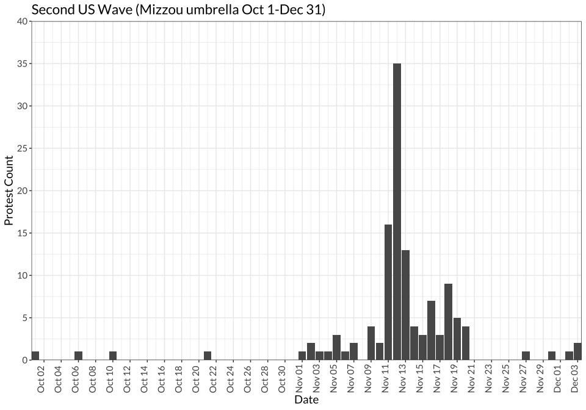

Tables and Figures for *Trends in Higher Ed Protest*
================

- [Figure 1: Frequency of U.S. and Canadian higher ed protest events,
  Jan. 2012 - July
  2018](#figure-1-frequency-of-us-and-canadian-higher-ed-protest-events-jan-2012---july-2018)
- [Figure 2: Frequency of U.S. higher ed protest events and major waves,
  Jan. 2012 - July
  2018](#figure-2-frequency-of-us-higher-ed-protest-events-and-major-waves-jan-2012---july-2018)
- [Figure 3. Frequency of Canadian higher ed protest events and major
  waves, Jan. 2012 -
  Dec. 2018](#figure-3-frequency-of-canadian-higher-ed-protest-events-and-major-waves-jan-2012---dec-2018)
- [Table 1: Top 10 U.S. and Canadian universities and locations for
  higher ed
  protests](#table-1-top-10-us-and-canadian-universities-and-locations-for-higher-ed-protests)
- [Table 2: Top 15 U.S. Higher Ed Protest
  Issues](#table-2-top-15-us-higher-ed-protest-issues)
- [Table 3: Top 15 U.S. Higher Ed Protest Issues with University as the
  Target](#table-3-top-15-us-higher-ed-protest-issues-with-university-as-the-target)
- [Table x: Top 15 Canadian Higher Ed Protest
  Issues](#table-x-top-15-canadian-higher-ed-protest-issues)
- [Table x. Top 10 Canadian Higher Ed Protest Issues with University as
  the
  Target](#table-x-top-10-canadian-higher-ed-protest-issues-with-university-as-the-target)
- [NEW TABLES BELOW THIS POINT](#new-tables-below-this-point)
- [Table x. Top 10 U.S. Higher Ed Protest Issues percentages by
  year](#table-x-top-10-us-higher-ed-protest-issues-percentages-by-year)
- [Table x. Top 10 Canada Higher Ed Protest Issues percentages by
  year](#table-x-top-10-canada-higher-ed-protest-issues-percentages-by-year)
- [U.S. Waves Count](#us-waves-count)
  - [First Wave - BLM 2014](#first-wave---blm-2014)
  - [Second Wave - Mizzou](#second-wave---mizzou)
  - [Third Wave - Trump](#third-wave---trump)
  - [US Waves Summary](#us-waves-summary)
- [Canada Waves Count](#canada-waves-count)
  - [First Wave - Quebec 2012](#first-wave---quebec-2012)
  - [Second Wave - Toronto Labor](#second-wave---toronto-labor)
- [Statistics for in-text citations](#statistics-for-in-text-citations)
  - [Country-level counts](#country-level-counts)
  - [Wave-specific counts](#wave-specific-counts)

# Figure 1: Frequency of U.S. and Canadian higher ed protest events, Jan. 2012 - July 2018

<!-- -->

# Figure 2: Frequency of U.S. higher ed protest events and major waves, Jan. 2012 - July 2018

<!-- -->

# Figure 3. Frequency of Canadian higher ed protest events and major waves, Jan. 2012 - Dec. 2018

<!-- -->

# Table 1: Top 10 U.S. and Canadian universities and locations for higher ed protests

| uni_name                                    | university_n | location               | location_n |
|:--------------------------------------------|-------------:|:-----------------------|-----------:|
| University of California-Berkeley           |          246 | Montreal, QC, Canada   |        376 |
| Harvard University                          |          144 | Berkeley, CA, USA      |        221 |
| University of California-Los Angeles        |          116 | Toronto, ON, Canada    |        219 |
| University of Michigan-Ann Arbor            |          112 | New York City, NY, USA |        164 |
| University of Chicago                       |           72 | Los Angeles, CA, USA   |        135 |
| Columbia University in the City of New York |           69 | Cambridge, MA, USA     |        129 |
| Tufts University                            |           68 | Chicago, IL, USA       |        116 |
| University of California-Davis              |           58 | Ann Arbor, MI, USA     |        109 |
| The University of Texas at Austin           |           56 | San Diego, CA, USA     |         92 |
| Georgetown University                       |           53 | San Francisco, CA, USA |         84 |
| University of Wisconsin-Madison             |           49 | Washington, D.C., USA  |         73 |
| New York University                         |           48 | Columbia, MO, USA      |         66 |
| San Diego State University                  |           48 | Boston, MA, USA        |         56 |
| University of California-San Diego          |           46 | Austin, TX, USA        |         54 |
| Ohio University-Main Campus                 |           45 | Vancouver, BC, Canada  |         53 |

# Table 2: Top 15 U.S. Higher Ed Protest Issues

| issue_name                                                   | total          | non-racial     | racial       |
|:-------------------------------------------------------------|:---------------|:---------------|:-------------|
| University governance, admin, policies, programs, curriculum | 39.79% (1,793) | 30.03% (1,353) | 11.83% (533) |
| All anti-racist racial issues                                | 37.79% (1,703) |                |              |
| Labor and work                                               | 16.27% (733)   | 16.27% (733)   |              |
| Police violence                                              | 12.36% (557)   |                | 12.36% (557) |
| Trump and/or his administration (Against)                    | 12.32% (555)   | 12.32% (555)   |              |
| \_Other Issue                                                | 10.14% (457)   | 7.92% (357)    | 2.44% (110)  |
| Immigration (For)                                            | 10.08% (454)   |                | 10.08% (454) |
| Campus climate                                               | 9.41% (424)    |                | 9.41% (424)  |
| Environmental                                                | 7.66% (345)    | 7.66% (345)    |              |
| Tuition, fees, financial aid                                 | 6.61% (298)    | 6.61% (298)    |              |
| Sexual assault/violence                                      | 5.9% (266)     | 5.9% (266)     |              |
| Economy/inequality                                           | 4.99% (225)    | 4.99% (225)    |              |
| Feminism/women’s issues                                      | 4.9% (221)     | 4.9% (221)     |              |
| Faith-based discrimination                                   | 4.46% (201)    | 4.46% (201)    |              |
| All racist issues                                            | 1.18% (53)     |                |              |

# Table 3: Top 15 U.S. Higher Ed Protest Issues with University as the Target

| issue_name                                                   | total          | non-racial    | racial       |
|:-------------------------------------------------------------|:---------------|:--------------|:-------------|
| University governance, admin, policies, programs, curriculum | 82.11% (1,671) | 62.8% (1,278) | 23.73% (483) |
| All anti-racist racial issues                                | 32.63% (664)   |               |              |
| Labor and work                                               | 29.58% (602)   | 29.58% (602)  |              |
| Campus climate                                               | 14.55% (296)   |               | 14.55% (296) |
| Tuition, fees, financial aid                                 | 11.11% (226)   | 11.11% (226)  |              |
| Environmental                                                | 9.98% (203)    | 9.98% (203)   |              |
| Immigration (For)                                            | 8.94% (182)    |               | 8.94% (182)  |
| Economy/inequality                                           | 7.62% (155)    | 7.62% (155)   |              |
| Sexual assault/violence                                      | 6.73% (137)    | 6.73% (137)   |              |
| Trump and/or his administration (Against)                    | 5.95% (121)    | 5.95% (121)   |              |
| \_Other Issue                                                | 5.9% (120)     | 4.52% (92)    | 1.57% (32)   |
| Police violence                                              | 5.16% (105)    |               | 5.16% (105)  |
| Racist/racialized symbols                                    | 3.44% (70)     |               | 3.44% (70)   |
| Feminism/women’s issues                                      | 3.24% (66)     | 3.24% (66)    |              |
| All racist issues                                            | 0.69% (14)     |               |              |

# Table x: Top 15 Canadian Higher Ed Protest Issues

| issue_name                                                   | total        | non-racial   | racial     |
|:-------------------------------------------------------------|:-------------|:-------------|:-----------|
| University governance, admin, policies, programs, curriculum | 34.51% (341) | 33% (326)    | 2.13% (21) |
| Tuition, fees, financial aid                                 | 30.36% (300) | 30.36% (300) |            |
| Labor and work                                               | 19.33% (191) | 19.33% (191) |            |
| \_Other Issue                                                | 15.38% (152) | 14.57% (144) | 1.32% (13) |
| All anti-racist racial issues                                | 11.84% (117) |              |            |
| Public funding for higher education                          | 9.21% (91)   | 9.21% (91)   |            |
| Economy/inequality                                           | 9.11% (90)   | 9.11% (90)   |            |
| Environmental                                                | 6.68% (66)   | 6.68% (66)   |            |
| Feminism/women’s issues                                      | 5.77% (57)   | 5.77% (57)   |            |
| Indigenous issues                                            | 5.26% (52)   |              | 5.26% (52) |
| Sexual assault/violence                                      | 5.26% (52)   | 5.26% (52)   |            |
| Faith-based discrimination                                   | 4.25% (42)   | 4.25% (42)   |            |
| Social services and welfare                                  | 4.05% (40)   | 4.05% (40)   |            |
| Pro-Palestine/BDS                                            | 2.94% (29)   | 2.94% (29)   |            |
| All racist issues                                            | 0.3% (3)     |              |            |

# Table x. Top 10 Canadian Higher Ed Protest Issues with University as the Target

| issue                                                        | n            |
|:-------------------------------------------------------------|:-------------|
| University governance, admin, policies, programs, curriculum | 78.48% (299) |
| Labor and work                                               | 36.75% (140) |
| Tuition, fees, financial aid                                 | 21.26% (81)  |
| Any racial issue                                             | 10.76% (41)  |
| Environmental                                                | 9.71% (37)   |
| Sexual assault/violence                                      | 7.35% (28)   |
| \_Other Issue                                                | 5.77% (22)   |
| Economy/inequality                                           | 4.2% (16)    |
| Feminism/women’s issues                                      | 4.2% (16)    |
| Free speech                                                  | 2.62% (10)   |

# NEW TABLES BELOW THIS POINT

# Table x. Top 10 U.S. Higher Ed Protest Issues percentages by year

| issue                                                        | type         | issue_n_all_years | 2012a       | 2012b       | 2013a       | 2013b       | 2014a       | 2014b        | 2015a        | 2015b        | 2016a        | 2016b        | 2017a        | 2017b        | 2018a        |
|:-------------------------------------------------------------|:-------------|------------------:|:------------|:------------|:------------|:------------|:------------|:-------------|:-------------|:-------------|:-------------|:-------------|:-------------|:-------------|:-------------|
| Environmental                                                | issue        |               345 | NA          | 10.81% (4)  | 15% (9)     | 9.05% (18)  | 14.08% (30) | 4.82% (25)   | 10.08% (38)  | 8.76% (41)   | 7.33% (30)   | 10.14% (70)  | 11.41% (72)  | 0.5% (2)     | 1.17% (5)    |
| Trump and/or his administration (Against)                    | issue        |               555 | NA          | NA          | NA          | NA          | NA          | NA           | NA           | 0.85% (4)    | 6.6% (27)    | 30.43% (210) | 40.89% (258) | 9.98% (40)   | 3.5% (15)    |
| Campus climate                                               | racial_issue |               424 | 1.37% (1)   | 5.41% (2)   | NA          | 5.03% (10)  | 5.63% (12)  | 6.74% (35)   | 7.96% (30)   | 32.26% (151) | 10.76% (44)  | 6.09% (42)   | 4.12% (26)   | 9.48% (38)   | 7.69% (33)   |
| Labor and work                                               | issue        |               733 | 21.92% (16) | 16.22% (6)  | 30% (18)    | 20.1% (40)  | 18.31% (39) | 6.74% (35)   | 23.08% (87)  | 18.59% (87)  | 25.67% (105) | 12.17% (84)  | 9.67% (61)   | 15.96% (64)  | 21.21% (91)  |
| Police violence                                              | racial_issue |               557 | 9.59% (7)   | NA          | NA          | 4.02% (8)   | 1.41% (3)   | 55.11% (286) | 18.3% (69)   | 6.41% (30)   | 4.4% (18)    | 12.61% (87)  | 0.95% (6)    | 5.49% (22)   | 4.9% (21)    |
| Tuition, fees, financial aid                                 | issue        |               298 | 19.18% (14) | 21.62% (8)  | 8.33% (5)   | 4.52% (9)   | 10.8% (23)  | 6.94% (36)   | 7.43% (28)   | 7.91% (37)   | 10.51% (43)  | 1.74% (12)   | 3.17% (20)   | 6.73% (27)   | 8.39% (36)   |
| University governance, admin, policies, programs, curriculum | issue        |              1353 | 34.25% (25) | 45.95% (17) | 48.33% (29) | 35.18% (70) | 44.13% (94) | 20.81% (108) | 37.67% (142) | 32.48% (152) | 38.39% (157) | 19.86% (137) | 24.41% (154) | 26.43% (106) | 37.76% (162) |
| University governance, admin, policies, programs, curriculum | racial_issue |               533 | 2.74% (2)   | 2.7% (1)    | NA          | 7.04% (14)  | 7.98% (17)  | 5.01% (26)   | 6.63% (25)   | 30.56% (143) | 12.96% (53)  | 13.19% (91)  | 10.46% (66)  | 12.72% (51)  | 10.26% (44)  |
| \_Other Issue                                                | issue        |               357 | 9.59% (7)   | 2.7% (1)    | 10% (6)     | 8.54% (17)  | 7.04% (15)  | 4.43% (23)   | 8.22% (31)   | 6.41% (30)   | 6.85% (28)   | 5.8% (40)    | 9.19% (58)   | 13.47% (54)  | 10.96% (47)  |
| Immigration (For)                                            | racial_issue |               454 | NA          | NA          | 5% (3)      | 13.07% (26) | 8.92% (19)  | 1.93% (10)   | 2.39% (9)    | 2.35% (11)   | 4.16% (17)   | 11.16% (77)  | 31.22% (197) | 13.72% (55)  | 6.99% (30)   |

<!-- # Table x. Top 10 U.S. Higher Ed Protest Issues by month -->

# Table x. Top 10 Canada Higher Ed Protest Issues percentages by year

| issue                                                        | type         | issue_n_all_years | 2012a        | 2012b       | 2013a       | 2013b       | 2014a       | 2014b       | 2015a       | 2015b       | 2016a       | 2016b       | 2017a       | 2017b       | 2018a       | 2018b       |
|:-------------------------------------------------------------|:-------------|------------------:|:-------------|:------------|:------------|:------------|:------------|:------------|:------------|:------------|:------------|:------------|:------------|:------------|:------------|:------------|
| University governance, admin, policies, programs, curriculum | issue        |               326 | 13.2% (26)   | 35.94% (23) | 28.95% (11) | 25% (12)    | 48.72% (19) | 24.64% (17) | 51.79% (58) | 31.37% (16) | 61.19% (41) | 27.17% (25) | 27.27% (15) | 30.23% (13) | 46.67% (28) | 40.38% (21) |
| Economy/inequality                                           | issue        |                90 | 2.54% (5)    | 9.38% (6)   | 2.63% (1)   | 2.08% (1)   | 10.26% (4)  | 15.94% (11) | 25% (28)    | 19.61% (10) | 10.45% (7)  | 4.35% (4)   | 7.27% (4)   | 4.65% (2)   | 5% (3)      | 7.69% (4)   |
| Environmental                                                | issue        |                66 | 1.52% (3)    | NA          | 26.32% (10) | 12.5% (6)   | 15.38% (6)  | 4.35% (3)   | 2.68% (3)   | 13.73% (7)  | 17.91% (12) | 5.43% (5)   | 5.45% (3)   | 6.98% (3)   | 5% (3)      | 3.85% (2)   |
| Feminism/women’s issues                                      | issue        |                57 | 1.52% (3)    | 3.12% (2)   | 5.26% (2)   | 10.42% (5)  | 5.13% (2)   | 1.45% (1)   | 4.46% (5)   | 5.88% (3)   | 8.96% (6)   | 8.7% (8)    | 10.91% (6)  | 11.63% (5)  | 5% (3)      | 11.54% (6)  |
| Labor and work                                               | issue        |               191 | 5.58% (11)   | 43.75% (28) | 10.53% (4)  | 14.58% (7)  | 25.64% (10) | 7.25% (5)   | 32.14% (36) | 9.8% (5)    | 17.91% (12) | 21.74% (20) | 29.09% (16) | 32.56% (14) | 21.67% (13) | 19.23% (10) |
| Public funding for higher education                          | issue        |                91 | 4.57% (9)    | 9.38% (6)   | 26.32% (10) | 6.25% (3)   | 12.82% (5)  | 11.59% (8)  | 20.54% (23) | 21.57% (11) | 5.97% (4)   | 10.87% (10) | NA          | 2.33% (1)   | 1.67% (1)   | NA          |
| Sexual assault/violence                                      | issue        |                52 | 0.51% (1)    | 3.12% (2)   | NA          | 6.25% (3)   | 2.56% (1)   | 10.14% (7)  | 4.46% (5)   | 5.88% (3)   | 10.45% (7)  | 13.04% (12) | 10.91% (6)  | NA          | 8.33% (5)   | NA          |
| Tuition, fees, financial aid                                 | issue        |               300 | 84.26% (166) | 32.81% (21) | 42.11% (16) | 4.17% (2)   | 12.82% (5)  | 17.39% (12) | 24.11% (27) | 13.73% (7)  | 14.93% (10) | 14.13% (13) | 7.27% (4)   | 13.95% (6)  | 15% (9)     | 3.85% (2)   |
| \_Other Issue                                                | issue        |               144 | 12.69% (25)  | 17.19% (11) | 7.89% (3)   | 31.25% (15) | 7.69% (3)   | 11.59% (8)  | 8.93% (10)  | 17.65% (9)  | 10.45% (7)  | 17.39% (16) | 9.09% (5)   | 11.63% (5)  | 21.67% (13) | 26.92% (14) |
| Indigenous issues                                            | racial_issue |                52 | NA           | 1.56% (1)   | 18.42% (7)  | 4.17% (2)   | 2.56% (1)   | 2.9% (2)    | 1.79% (2)   | 7.84% (4)   | 7.46% (5)   | 9.78% (9)   | 12.73% (7)  | 4.65% (2)   | 10% (6)     | 7.69% (4)   |

<!-- # Table x. Top 10 Canada Higher Ed Protest Issues by month -->

# U.S. Waves Count

### First Wave - BLM 2014

<!-- -->

#### First Wave Summary

| wave                     | criteria                                                                  | n_protests |
|:-------------------------|:--------------------------------------------------------------------------|-----------:|
| First US Wave (BLM 2014) | dates = late November/early December and racial_issue = “Police violence” |        213 |

## Second Wave - Mizzou

<!-- -->

<!-- -->

<!-- -->

#### Second Wave Summary

| wave                    | criteria                                                           | n_protests |
|:------------------------|:-------------------------------------------------------------------|-----------:|
| Second US Wave (Mizzou) | Mizzou umbrella                                                    |        125 |
| Second US Wave (Mizzou) | racial_issue == Univ governance… OR racial_issue == Campus climate |        353 |

## Third Wave - Trump

<!-- -->

<!-- -->

## US Waves Summary

| wave                                     | n_protests |
|:-----------------------------------------|-----------:|
| First Wave                               |        213 |
| Second Wave (Mizzou umbrella)            |        125 |
| Third Wave (trump AND immigration count) |        178 |

# Canada Waves Count

## First Wave - Quebec 2012

| wave                            | criteria                                            | n_protests |
|:--------------------------------|:----------------------------------------------------|-----------:|
| First Canada Wave (Quebec 2012) | year = 2012 AND location = QC AND issue = “Tuition” |        164 |
| First Canada Wave (Quebec 2012) | Quebec Police Violence Protests in 2012             |         10 |

<!-- -->

## Second Wave - Toronto Labor

| wave                       | criteria                                     | n_protests |
|:---------------------------|:---------------------------------------------|-----------:|
| Second Canada Wave (Labor) | Toronto Labor Protests 2014/2015             |         29 |
| Second Canada Wave (Labor) | Quebec Labor Protests 2014/2015              |         12 |
| Second Canada Wave (Labor) | Quebec Economy/inequality Protests 2014/2015 |         47 |

<!-- --> \## Canada
Waves Summary

| wave        | criteria                                            | n_protests |
|:------------|:----------------------------------------------------|-----------:|
| First Wave  | year = 2012 AND location = QC AND issue = “Tuition” |        164 |
| First Wave  | Quebec Police Violence Protests in 2012             |         10 |
| Second Wave | Toronto Labor Protests 2014/2015                    |         29 |
| Second Wave | Quebec Labor Protests 2014/2015                     |         12 |
| Second Wave | Quebec Economy/inequality Protests 2014/2015        |         47 |

# Statistics for in-text citations

## Country-level counts

| statistic                           | Both |   US | Canada |
|:------------------------------------|-----:|-----:|-------:|
| Protests                            | 5518 | 4506 |    988 |
| Locations                           |  530 |  465 |     70 |
| Universities                        |  584 |  512 |     74 |
| Off-campus protests                 |  440 |  263 |    177 |
| Counterprotest (via checkbox)       |  286 |  243 |     42 |
| Protests in multiple cities         |  146 |  125 |     21 |
| Campaigns                           |  416 |  316 |    102 |
| Events with one form                | 3166 | 2553 |    593 |
| Events with multiple forms          | 2123 | 1746 |    375 |
| \# for Target = University          | 2435 | 2035 |    381 |
| Target = Domestic government        | 1393 | 1009 |    384 |
| Target = Domestic gov. + University |  223 |  179 |     44 |

## Wave-specific counts
