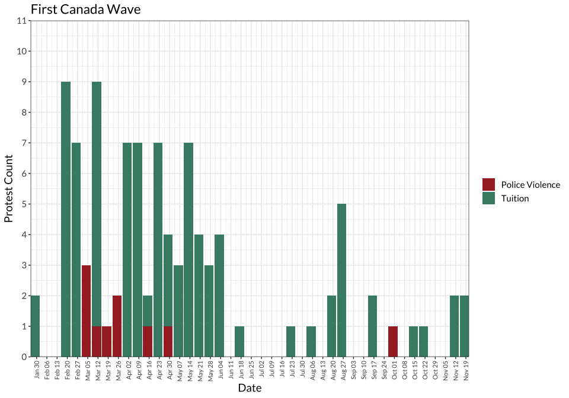
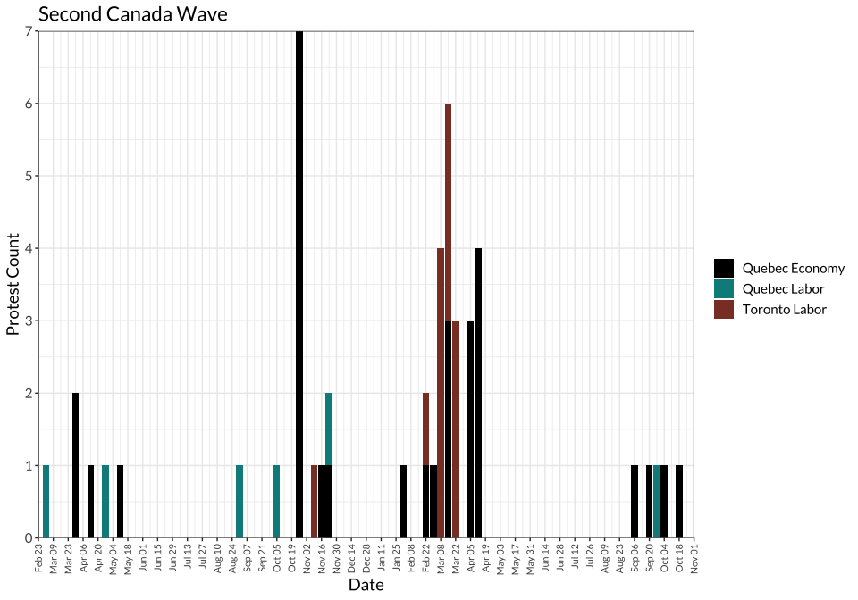

Tables and Figures for *Trends in Higher Ed Protest*
================

- [Figure 1: Frequency of U.S. and Canadian higher ed protest events,
  Jan. 2012 - July
  2018](#figure-1-frequency-of-us-and-canadian-higher-ed-protest-events-jan-2012---july-2018)
- [Figure 2: Frequency of U.S. higher ed protest events and major waves,
  Jan. 2012 - July
  2018](#figure-2-frequency-of-us-higher-ed-protest-events-and-major-waves-jan-2012---july-2018)
- [Figure 3. Frequency of Canadian higher ed protest events and major
  waves, Jan. 2012 -
  Dec. 2018](#figure-3-frequency-of-canadian-higher-ed-protest-events-and-major-waves-jan-2012---dec-2018)
- [Table 1: Top 10 U.S. and Canadian universities and locations for
  higher ed
  protests](#table-1-top-10-us-and-canadian-universities-and-locations-for-higher-ed-protests)
- [Table 2: Top 15 U.S. Higher Ed Protest
  Issues](#table-2-top-15-us-higher-ed-protest-issues)
- [Table 3: Top 15 U.S. Higher Ed Protest Issues with University as the
  Target](#table-3-top-15-us-higher-ed-protest-issues-with-university-as-the-target)
- [Table x: Top 15 Canadian Higher Ed Protest
  Issues](#table-x-top-15-canadian-higher-ed-protest-issues)
- [Table x. Top 10 Canadian Higher Ed Protest Issues with University as
  the
  Target](#table-x-top-10-canadian-higher-ed-protest-issues-with-university-as-the-target)
- [NEW TABLES BELOW THIS POINT](#new-tables-below-this-point)
- [Table x. Top 10 U.S. Higher Ed Protest Issues percentages by
  year](#table-x-top-10-us-higher-ed-protest-issues-percentages-by-year)
- [Table x. Top 10 Canada Higher Ed Protest Issues percentages by
  year](#table-x-top-10-canada-higher-ed-protest-issues-percentages-by-year)
- [U.S. Waves Count](#us-waves-count)
  - [First Wave - BLM 2014](#first-wave---blm-2014)
  - [Second Wave - Mizzou](#second-wave---mizzou)
  - [Third Wave - Trump](#third-wave---trump)
  - [Third Wave - Trump / Sanctuary](#third-wave---trump--sanctuary)
  - [US Waves Summary](#us-waves-summary)
- [Canada Waves Count](#canada-waves-count)
  - [First Wave - Quebec 2012](#first-wave---quebec-2012)
  - [Second Wave - Toronto Labor](#second-wave---toronto-labor)
- [Statistics for in-text citations](#statistics-for-in-text-citations)
  - [Country-level counts](#country-level-counts)
  - [Wave-specific counts](#wave-specific-counts)

# Figure 1: Frequency of U.S. and Canadian higher ed protest events, Jan. 2012 - July 2018

<!-- -->

# Figure 2: Frequency of U.S. higher ed protest events and major waves, Jan. 2012 - July 2018

<!-- -->

# Figure 3. Frequency of Canadian higher ed protest events and major waves, Jan. 2012 - Dec. 2018

<!-- -->

# Table 1: Top 10 U.S. and Canadian universities and locations for higher ed protests

| uni_name                                    | university_n | location               | location_n |
|:--------------------------------------------|-------------:|:-----------------------|-----------:|
| University of California-Berkeley           |          250 | Montreal, QC, Canada   |        376 |
| Mcgill University                           |          226 | Berkeley, CA, USA      |        221 |
| Concordia University                        |          196 | Toronto, ON, Canada    |        219 |
| Harvard University                          |          152 | New York City, NY, USA |        164 |
| University of California-Los Angeles        |          121 | Los Angeles, CA, USA   |        135 |
| University of Michigan-Ann Arbor            |          117 | Cambridge, MA, USA     |        129 |
| University Of Toronto                       |          105 | Chicago, IL, USA       |        116 |
| Ryerson University                          |           91 | Ann Arbor, MI, USA     |        109 |
| York University                             |           86 | San Diego, CA, USA     |         92 |
| Columbia University in the City of New York |           73 | San Francisco, CA, USA |         84 |
| University of Chicago                       |           72 | Washington, D.C., USA  |         73 |
| Tufts University                            |           70 | Columbia, MO, USA      |         66 |
| University Of Quebec At Montreal            |           60 | Boston, MA, USA        |         56 |
| University of California-Davis              |           60 | Austin, TX, USA        |         54 |
| Georgetown University                       |           58 | Vancouver, BC, Canada  |         53 |

# Table 2: Top 15 U.S. Higher Ed Protest Issues

| issue_name                                                   | total          | non-racial     | racial       |
|:-------------------------------------------------------------|:---------------|:---------------|:-------------|
| University governance, admin, policies, programs, curriculum | 39.84% (1,799) | 30.07% (1,358) | 11.89% (537) |
| All anti-racist racial issues                                | 37.8% (1,707)  |                |              |
| Labor and work                                               | 16.28% (735)   | 16.28% (735)   |              |
| Police violence                                              | 12.36% (558)   |                | 12.36% (558) |
| Trump and/or his administration (Against)                    | 12.29% (555)   | 12.29% (555)   |              |
| \_Other Issue                                                | 10.14% (458)   | 7.93% (358)    | 2.44% (110)  |
| Immigration (For)                                            | 10.05% (454)   |                | 10.05% (454) |
| Campus climate                                               | 9.46% (427)    |                | 9.46% (427)  |
| Environmental                                                | 7.64% (345)    | 7.64% (345)    |              |
| Tuition, fees, financial aid                                 | 6.6% (298)     | 6.6% (298)     |              |
| Sexual assault/violence                                      | 5.89% (266)    | 5.89% (266)    |              |
| Economy/inequality                                           | 4.98% (225)    | 4.98% (225)    |              |
| Feminism/women’s issues                                      | 4.92% (222)    | 4.92% (222)    |              |
| Faith-based discrimination                                   | 4.5% (203)     | 4.5% (203)     |              |
| All racist issues                                            | 1.17% (53)     |                |              |

# Table 3: Top 15 U.S. Higher Ed Protest Issues with University as the Target

| issue_name                                                   | total          | non-racial     | racial       |
|:-------------------------------------------------------------|:---------------|:---------------|:-------------|
| University governance, admin, policies, programs, curriculum | 82.05% (1,677) | 62.77% (1,283) | 23.83% (487) |
| All anti-racist racial issues                                | 32.68% (668)   |                |              |
| Labor and work                                               | 29.55% (604)   | 29.55% (604)   |              |
| Campus climate                                               | 14.63% (299)   |                | 14.63% (299) |
| Tuition, fees, financial aid                                 | 11.06% (226)   | 11.06% (226)   |              |
| Environmental                                                | 9.93% (203)    | 9.93% (203)    |              |
| Immigration (For)                                            | 8.9% (182)     |                | 8.9% (182)   |
| Economy/inequality                                           | 7.58% (155)    | 7.58% (155)    |              |
| Sexual assault/violence                                      | 6.7% (137)     | 6.7% (137)     |              |
| Trump and/or his administration (Against)                    | 5.92% (121)    | 5.92% (121)    |              |
| \_Other Issue                                                | 5.87% (120)    | 4.5% (92)      | 1.57% (32)   |
| Police violence                                              | 5.19% (106)    |                | 5.19% (106)  |
| Racist/racialized symbols                                    | 3.42% (70)     |                | 3.42% (70)   |
| Feminism/women’s issues                                      | 3.28% (67)     | 3.28% (67)     |              |
| All racist issues                                            | 0.68% (14)     |                |              |

# Table x: Top 15 Canadian Higher Ed Protest Issues

| issue_name                                                   | total        | non-racial   | racial     |
|:-------------------------------------------------------------|:-------------|:-------------|:-----------|
| University governance, admin, policies, programs, curriculum | 34.51% (341) | 33% (326)    | 2.13% (21) |
| Tuition, fees, financial aid                                 | 30.36% (300) | 30.36% (300) |            |
| Labor and work                                               | 19.33% (191) | 19.33% (191) |            |
| \_Other Issue                                                | 15.38% (152) | 14.57% (144) | 1.32% (13) |
| All anti-racist racial issues                                | 11.84% (117) |              |            |
| Public funding for higher education                          | 9.21% (91)   | 9.21% (91)   |            |
| Economy/inequality                                           | 9.11% (90)   | 9.11% (90)   |            |
| Environmental                                                | 6.68% (66)   | 6.68% (66)   |            |
| Feminism/women’s issues                                      | 5.77% (57)   | 5.77% (57)   |            |
| Indigenous issues                                            | 5.26% (52)   |              | 5.26% (52) |
| Sexual assault/violence                                      | 5.26% (52)   | 5.26% (52)   |            |
| Faith-based discrimination                                   | 4.25% (42)   | 4.25% (42)   |            |
| Social services and welfare                                  | 4.05% (40)   | 4.05% (40)   |            |
| Pro-Palestine/BDS                                            | 2.94% (29)   | 2.94% (29)   |            |
| All racist issues                                            | 0.3% (3)     |              |            |

# Table x. Top 10 Canadian Higher Ed Protest Issues with University as the Target

| issue                                                        | n            |
|:-------------------------------------------------------------|:-------------|
| University governance, admin, policies, programs, curriculum | 78.48% (299) |
| Labor and work                                               | 36.75% (140) |
| Tuition, fees, financial aid                                 | 21.26% (81)  |
| Any racial issue                                             | 10.76% (41)  |
| Environmental                                                | 9.71% (37)   |
| Sexual assault/violence                                      | 7.35% (28)   |
| \_Other Issue                                                | 5.77% (22)   |
| Economy/inequality                                           | 4.2% (16)    |
| Feminism/women’s issues                                      | 4.2% (16)    |
| Free speech                                                  | 2.62% (10)   |

# NEW TABLES BELOW THIS POINT

# Table x. Top 10 U.S. Higher Ed Protest Issues percentages by year

| issue                                                        | type         | issue_n_all_years | 2012a       | 2012b        | 2013a       | 2013b       | 2014a         | 2014b        | 2015a        | 2015b        | 2016a        | 2016b        | 2017a        | 2017b        | 2018a        | 2018b        |
|:-------------------------------------------------------------|:-------------|------------------:|:------------|:-------------|:------------|:------------|:--------------|:-------------|:-------------|:-------------|:-------------|:-------------|:-------------|:-------------|:-------------|:-------------|
| Environmental                                                | issue        |               345 | 5.48% (4)   | 10.81% (4)   | 45% (27)    | 13.57% (27) | 25.82% (55)   | 10.6% (55)   | 20.95% (79)  | 16.81% (79)  | 24.15% (100) | 14.47% (100) | 11.71% (74)  | 18.45% (74)  | 1.16% (5)    | 500% (5)     |
| Trump and/or his administration (Against)                    | issue        |               555 | NA          | NA           | NA          | NA          | NA            | NA           | 1.06% (4)    | 0.85% (4)    | 57.25% (237) | 34.3% (237)  | 47.15% (298) | 74.31% (298) | 3.49% (15)   | 1500% (15)   |
| Campus climate                                               | racial_issue |               427 | 4.11% (3)   | 8.11% (3)    | 16.67% (10) | 5.03% (10)  | 22.07% (47)   | 9.06% (47)   | 48.01% (181) | 38.51% (181) | 21.5% (89)   | 12.88% (89)  | 10.13% (64)  | 15.96% (64)  | 7.67% (33)   | 3300% (33)   |
| Labor and work                                               | issue        |               735 | 30.14% (22) | 59.46% (22)  | 96.67% (58) | 29.15% (58) | 34.74% (74)   | 14.26% (74)  | 46.42% (175) | 37.23% (175) | 45.89% (190) | 27.5% (190)  | 19.78% (125) | 31.17% (125) | 21.16% (91)  | 9100% (91)   |
| Police violence                                              | racial_issue |               558 | 9.59% (7)   | 18.92% (7)   | 13.33% (8)  | 4.02% (8)   | 135.68% (289) | 55.68% (289) | 26.26% (99)  | 21.06% (99)  | 25.6% (106)  | 15.34% (106) | 4.43% (28)   | 6.98% (28)   | 4.88% (21)   | 2100% (21)   |
| Tuition, fees, financial aid                                 | issue        |               298 | 30.14% (22) | 59.46% (22)  | 23.33% (14) | 7.04% (14)  | 27.7% (59)    | 11.37% (59)  | 17.24% (65)  | 13.83% (65)  | 13.29% (55)  | 7.96% (55)   | 7.44% (47)   | 11.72% (47)  | 8.37% (36)   | 3600% (36)   |
| University governance, admin, policies, programs, curriculum | issue        |              1358 | 57.53% (42) | 113.51% (42) | 165% (99)   | 49.75% (99) | 94.84% (202)  | 38.92% (202) | 78.25% (295) | 62.77% (295) | 71.74% (297) | 42.98% (297) | 41.14% (260) | 64.84% (260) | 37.91% (163) | 16300% (163) |
| University governance, admin, policies, programs, curriculum | racial_issue |               537 | 4.11% (3)   | 8.11% (3)    | 23.33% (14) | 7.04% (14)  | 20.19% (43)   | 8.29% (43)   | 44.83% (169) | 35.96% (169) | 35.51% (147) | 21.27% (147) | 18.51% (117) | 29.18% (117) | 10.23% (44)  | 4400% (44)   |
| \_Other Issue                                                | issue        |               358 | 10.96% (8)  | 21.62% (8)   | 38.33% (23) | 11.56% (23) | 17.84% (38)   | 7.32% (38)   | 16.18% (61)  | 12.98% (61)  | 16.43% (68)  | 9.84% (68)   | 17.88% (113) | 28.18% (113) | 10.93% (47)  | 4700% (47)   |
| Immigration (For)                                            | racial_issue |               454 | NA          | NA           | 48.33% (29) | 14.57% (29) | 13.62% (29)   | 5.59% (29)   | 5.31% (20)   | 4.26% (20)   | 22.71% (94)  | 13.6% (94)   | 39.87% (252) | 62.84% (252) | 6.98% (30)   | 3000% (30)   |

<!-- # Table x. Top 10 U.S. Higher Ed Protest Issues by month -->

# Table x. Top 10 Canada Higher Ed Protest Issues percentages by year

| issue                                                        | type         | issue_n_all_years | 2012a        | 2012b         | 2013a       | 2013b       | 2014a       | 2014b       | 2015a       | 2015b       | 2016a       | 2016b       | 2017a       | 2017b       | 2018a       | 2018b       |
|:-------------------------------------------------------------|:-------------|------------------:|:-------------|:--------------|:------------|:------------|:------------|:------------|:------------|:------------|:------------|:------------|:------------|:------------|:------------|:------------|
| University governance, admin, policies, programs, curriculum | issue        |               326 | 24.87% (49)  | 76.56% (49)   | 60.53% (23) | 47.92% (23) | 92.31% (36) | 52.17% (36) | 66.07% (74) | 145.1% (74) | 98.51% (66) | 71.74% (66) | 50.91% (28) | 65.12% (28) | 81.67% (49) | 94.23% (49) |
| Economy/inequality                                           | issue        |                90 | 5.58% (11)   | 17.19% (11)   | 5.26% (2)   | 4.17% (2)   | 38.46% (15) | 21.74% (15) | 33.93% (38) | 74.51% (38) | 16.42% (11) | 11.96% (11) | 10.91% (6)  | 13.95% (6)  | 11.67% (7)  | 13.46% (7)  |
| Environmental                                                | issue        |                66 | 1.52% (3)    | 4.69% (3)     | 42.11% (16) | 33.33% (16) | 23.08% (9)  | 13.04% (9)  | 8.93% (10)  | 19.61% (10) | 25.37% (17) | 18.48% (17) | 10.91% (6)  | 13.95% (6)  | 8.33% (5)   | 9.62% (5)   |
| Feminism/women’s issues                                      | issue        |                57 | 2.54% (5)    | 7.81% (5)     | 18.42% (7)  | 14.58% (7)  | 7.69% (3)   | 4.35% (3)   | 7.14% (8)   | 15.69% (8)  | 20.9% (14)  | 15.22% (14) | 20% (11)    | 25.58% (11) | 15% (9)     | 17.31% (9)  |
| Indigenous issues                                            | racial_issue |                52 | 0.51% (1)    | 1.56% (1)     | 23.68% (9)  | 18.75% (9)  | 7.69% (3)   | 4.35% (3)   | 5.36% (6)   | 11.76% (6)  | 20.9% (14)  | 15.22% (14) | 16.36% (9)  | 20.93% (9)  | 16.67% (10) | 19.23% (10) |
| Labor and work                                               | issue        |               191 | 19.8% (39)   | 60.94% (39)   | 28.95% (11) | 22.92% (11) | 38.46% (15) | 21.74% (15) | 36.61% (41) | 80.39% (41) | 47.76% (32) | 34.78% (32) | 54.55% (30) | 69.77% (30) | 38.33% (23) | 44.23% (23) |
| Public funding for higher education                          | issue        |                91 | 7.61% (15)   | 23.44% (15)   | 34.21% (13) | 27.08% (13) | 33.33% (13) | 18.84% (13) | 30.36% (34) | 66.67% (34) | 20.9% (14)  | 15.22% (14) | 1.82% (1)   | 2.33% (1)   | 1.67% (1)   | 1.92% (1)   |
| Sexual assault/violence                                      | issue        |                52 | 1.52% (3)    | 4.69% (3)     | 7.89% (3)   | 6.25% (3)   | 20.51% (8)  | 11.59% (8)  | 7.14% (8)   | 15.69% (8)  | 28.36% (19) | 20.65% (19) | 10.91% (6)  | 13.95% (6)  | 8.33% (5)   | 9.62% (5)   |
| Tuition, fees, financial aid                                 | issue        |               300 | 94.92% (187) | 292.19% (187) | 47.37% (18) | 37.5% (18)  | 43.59% (17) | 24.64% (17) | 30.36% (34) | 66.67% (34) | 34.33% (23) | 25% (23)    | 18.18% (10) | 23.26% (10) | 18.33% (11) | 21.15% (11) |
| \_Other Issue                                                | issue        |               144 | 18.27% (36)  | 56.25% (36)   | 47.37% (18) | 37.5% (18)  | 28.21% (11) | 15.94% (11) | 16.96% (19) | 37.25% (19) | 34.33% (23) | 25% (23)    | 18.18% (10) | 23.26% (10) | 45% (27)    | 51.92% (27) |

<!-- # Table x. Top 10 Canada Higher Ed Protest Issues by month -->

# U.S. Waves Count

### First Wave - BLM 2014

<!-- -->

#### First Wave Summary

| wave                     | criteria                                                                  | n_protests |
|:-------------------------|:--------------------------------------------------------------------------|-----------:|
| First US Wave (BLM 2014) | dates = late November/early December and racial_issue = “Police violence” |        213 |

## Second Wave - Mizzou

<!-- -->

<!-- -->

<!-- -->

#### Second Wave Summary

| wave                    | criteria                                                           | n_protests |
|:------------------------|:-------------------------------------------------------------------|-----------:|
| Second US Wave (Mizzou) | Mizzou umbrella                                                    |        125 |
| Second US Wave (Mizzou) | racial_issue == Univ governance… OR racial_issue == Campus climate |        354 |

## Third Wave - Trump

<!-- -->

## Third Wave - Trump / Sanctuary

<!-- -->

<!-- -->

## US Waves Summary

| wave                                     | n_protests |
|:-----------------------------------------|-----------:|
| First Wave                               |        213 |
| Second Wave (Mizzou umbrella)            |        125 |
| Third Wave (trump AND immigration count) |        178 |

# Canada Waves Count

## First Wave - Quebec 2012

| wave                            | criteria                                            | n_protests |
|:--------------------------------|:----------------------------------------------------|-----------:|
| First Canada Wave (Quebec 2012) | year = 2012 AND location = QC AND issue = “Tuition” |        164 |
| First Canada Wave (Quebec 2012) | Quebec Police Violence Protests in 2012             |         10 |

<!-- -->

## Second Wave - Toronto Labor

| wave                       | criteria                                     | n_protests |
|:---------------------------|:---------------------------------------------|-----------:|
| Second Canada Wave (Labor) | Toronto Labor Protests 2014/2015             |         29 |
| Second Canada Wave (Labor) | Quebec Labor Protests 2014/2015              |         12 |
| Second Canada Wave (Labor) | Quebec Economy/inequality Protests 2014/2015 |         47 |

<!-- --> \## Canada
Waves Summary

| wave        | criteria                                            | n_protests |
|:------------|:----------------------------------------------------|-----------:|
| First Wave  | year = 2012 AND location = QC AND issue = “Tuition” |        164 |
| First Wave  | Quebec Police Violence Protests in 2012             |         10 |
| Second Wave | Toronto Labor Protests 2014/2015                    |         29 |
| Second Wave | Quebec Labor Protests 2014/2015                     |         12 |
| Second Wave | Quebec Economy/inequality Protests 2014/2015        |         47 |

# Statistics for in-text citations

## Country-level counts

| statistic                           | Both |   US | Canada |
|:------------------------------------|-----:|-----:|-------:|
| Protests                            | 5518 | 4516 |    988 |
| Locations                           |  530 |  465 |     70 |
| Universities                        |  589 |  517 |     74 |
| Off-campus protests                 |  440 |  263 |    177 |
| Counterprotest (via checkbox)       |  286 |  243 |     42 |
| Protests in multiple cities         |  146 |  125 |     21 |
| Campaigns                           |  417 |  317 |    102 |
| Events with one form                | 3166 | 2562 |    593 |
| Events with multiple forms          | 2123 | 1747 |    375 |
| \# for Target = University          | 2435 | 2044 |    381 |
| Target = Domestic government        | 1393 | 1009 |    384 |
| Target = Domestic gov. + University |  223 |  179 |     44 |

## Wave-specific counts
