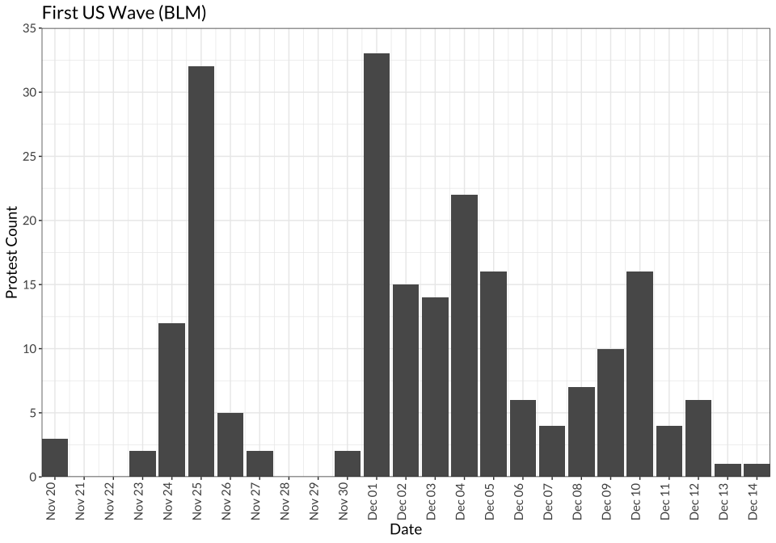
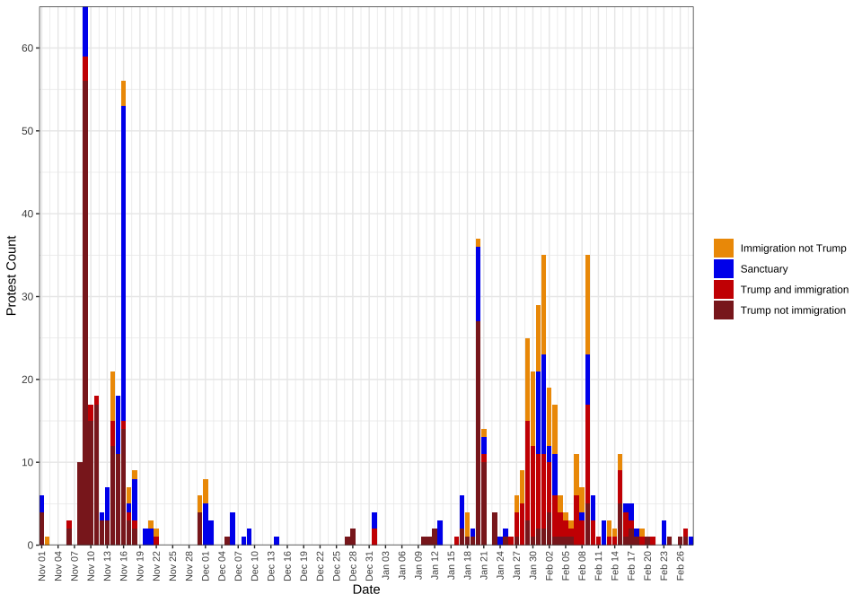

Tables and Figures for *Trends in Higher Ed Protest*
================

- [Figure 1: Frequency of U.S. and Canadian higher ed protest events,
  Jan. 2012 - July
  2018](#figure-1-frequency-of-us-and-canadian-higher-ed-protest-events-jan-2012---july-2018)
- [Figure 2: Frequency of U.S. higher ed protest events and major waves,
  Jan. 2012 - July
  2018](#figure-2-frequency-of-us-higher-ed-protest-events-and-major-waves-jan-2012---july-2018)
- [Figure 3. Frequency of Canadian higher ed protest events and major
  waves, Jan. 2012 -
  Dec. 2018](#figure-3-frequency-of-canadian-higher-ed-protest-events-and-major-waves-jan-2012---dec-2018)
- [Table 1: Top 10 U.S. and Canadian universities and locations for
  higher ed
  protests](#table-1-top-10-us-and-canadian-universities-and-locations-for-higher-ed-protests)
- [Table 2: Top 15 U.S. Higher Ed Protest
  Issues](#table-2-top-15-us-higher-ed-protest-issues)
- [Table 3: Top 15 U.S. Higher Ed Protest Issues with University as the
  Target](#table-3-top-15-us-higher-ed-protest-issues-with-university-as-the-target)
- [Table x: Top 15 Canadian Higher Ed Protest
  Issues](#table-x-top-15-canadian-higher-ed-protest-issues)
- [Table x. Top 10 Canadian Higher Ed Protest Issues with University as
  the
  Target](#table-x-top-10-canadian-higher-ed-protest-issues-with-university-as-the-target)
- [NEW TABLES BELOW THIS POINT](#new-tables-below-this-point)
- [Table x. Top 10 U.S. Higher Ed Protest Issues percentages by
  year](#table-x-top-10-us-higher-ed-protest-issues-percentages-by-year)
- [Table x. Top 10 Canada Higher Ed Protest Issues percentages by
  year](#table-x-top-10-canada-higher-ed-protest-issues-percentages-by-year)
- [U.S. Waves Count](#us-waves-count)
  - [First Wave - BLM 2014](#first-wave---blm-2014)
  - [Second Wave - Mizzou](#second-wave---mizzou)
  - [Third Wave - Trump](#third-wave---trump)
  - [Third Wave - Trump / Sanctuary](#third-wave---trump--sanctuary)
  - [US Waves Summary](#us-waves-summary)
- [Canada Waves Count](#canada-waves-count)
  - [First Wave - Quebec 2012](#first-wave---quebec-2012)
  - [Second Wave - Toronto Labor](#second-wave---toronto-labor)
  - [Canada Waves Summary](#canada-waves-summary)
- [Statistics for in-text citations](#statistics-for-in-text-citations)
  - [Country-level counts](#country-level-counts)
  - [Wave-specific counts](#wave-specific-counts)

# Figure 1: Frequency of U.S. and Canadian higher ed protest events, Jan. 2012 - July 2018

<!-- -->

# Figure 2: Frequency of U.S. higher ed protest events and major waves, Jan. 2012 - July 2018

<!-- -->

# Figure 3. Frequency of Canadian higher ed protest events and major waves, Jan. 2012 - Dec. 2018

<!-- -->

# Table 1: Top 10 U.S. and Canadian universities and locations for higher ed protests

| uni_name                                    | university_n | location               | location_n |
|:--------------------------------------------|-------------:|:-----------------------|-----------:|
| University of California-Berkeley           |          250 | Montreal, QC, Canada   |        376 |
| Mcgill University                           |          226 | Berkeley, CA, USA      |        221 |
| Concordia University                        |          196 | Toronto, ON, Canada    |        219 |
| Harvard University                          |          152 | New York City, NY, USA |        164 |
| University of California-Los Angeles        |          121 | Los Angeles, CA, USA   |        135 |
| University of Michigan-Ann Arbor            |          117 | Cambridge, MA, USA     |        129 |
| University Of Toronto                       |          105 | Chicago, IL, USA       |        116 |
| Ryerson University                          |           91 | Ann Arbor, MI, USA     |        109 |
| York University                             |           86 | San Diego, CA, USA     |         92 |
| Columbia University in the City of New York |           73 | San Francisco, CA, USA |         84 |
| University of Chicago                       |           72 | Washington, D.C., USA  |         73 |
| Tufts University                            |           70 | Columbia, MO, USA      |         66 |
| University Of Quebec At Montreal            |           60 | Boston, MA, USA        |         56 |
| University of California-Davis              |           60 | Austin, TX, USA        |         54 |
| Georgetown University                       |           58 | Vancouver, BC, Canada  |         53 |

# Table 2: Top 15 U.S. Higher Ed Protest Issues

| issue_name                                                   | total          | non-racial     | racial       |
|:-------------------------------------------------------------|:---------------|:---------------|:-------------|
| University governance, admin, policies, programs, curriculum | 39.84% (1,799) | 30.07% (1,358) | 11.89% (537) |
| All anti-racist racial issues                                | 37.8% (1,707)  |                |              |
| Labor and work                                               | 16.28% (735)   | 16.28% (735)   |              |
| Police violence                                              | 12.36% (558)   |                | 12.36% (558) |
| Trump and/or his administration (Against)                    | 12.29% (555)   | 12.29% (555)   |              |
| \_Other Issue                                                | 10.14% (458)   | 7.93% (358)    | 2.44% (110)  |
| Immigration (For)                                            | 10.05% (454)   |                | 10.05% (454) |
| Campus climate                                               | 9.46% (427)    |                | 9.46% (427)  |
| Environmental                                                | 7.64% (345)    | 7.64% (345)    |              |
| Tuition, fees, financial aid                                 | 6.6% (298)     | 6.6% (298)     |              |
| Sexual assault/violence                                      | 5.89% (266)    | 5.89% (266)    |              |
| Economy/inequality                                           | 4.98% (225)    | 4.98% (225)    |              |
| Feminism/women’s issues                                      | 4.92% (222)    | 4.92% (222)    |              |
| Faith-based discrimination                                   | 4.5% (203)     | 4.5% (203)     |              |
| All racist issues                                            | 1.17% (53)     |                |              |

# Table 3: Top 15 U.S. Higher Ed Protest Issues with University as the Target

| issue_name                                                   | total          | non-racial     | racial       |
|:-------------------------------------------------------------|:---------------|:---------------|:-------------|
| University governance, admin, policies, programs, curriculum | 82.05% (1,677) | 62.77% (1,283) | 23.83% (487) |
| All anti-racist racial issues                                | 32.68% (668)   |                |              |
| Labor and work                                               | 29.55% (604)   | 29.55% (604)   |              |
| Campus climate                                               | 14.63% (299)   |                | 14.63% (299) |
| Tuition, fees, financial aid                                 | 11.06% (226)   | 11.06% (226)   |              |
| Environmental                                                | 9.93% (203)    | 9.93% (203)    |              |
| Immigration (For)                                            | 8.9% (182)     |                | 8.9% (182)   |
| Economy/inequality                                           | 7.58% (155)    | 7.58% (155)    |              |
| Sexual assault/violence                                      | 6.7% (137)     | 6.7% (137)     |              |
| Trump and/or his administration (Against)                    | 5.92% (121)    | 5.92% (121)    |              |
| \_Other Issue                                                | 5.87% (120)    | 4.5% (92)      | 1.57% (32)   |
| Police violence                                              | 5.19% (106)    |                | 5.19% (106)  |
| Racist/racialized symbols                                    | 3.42% (70)     |                | 3.42% (70)   |
| Feminism/women’s issues                                      | 3.28% (67)     | 3.28% (67)     |              |
| All racist issues                                            | 0.68% (14)     |                |              |

# Table x: Top 15 Canadian Higher Ed Protest Issues

| issue_name                                                   | total        | non-racial   | racial     |
|:-------------------------------------------------------------|:-------------|:-------------|:-----------|
| University governance, admin, policies, programs, curriculum | 34.51% (341) | 33% (326)    | 2.13% (21) |
| Tuition, fees, financial aid                                 | 30.36% (300) | 30.36% (300) |            |
| Labor and work                                               | 19.33% (191) | 19.33% (191) |            |
| \_Other Issue                                                | 15.38% (152) | 14.57% (144) | 1.32% (13) |
| All anti-racist racial issues                                | 11.84% (117) |              |            |
| Public funding for higher education                          | 9.21% (91)   | 9.21% (91)   |            |
| Economy/inequality                                           | 9.11% (90)   | 9.11% (90)   |            |
| Environmental                                                | 6.68% (66)   | 6.68% (66)   |            |
| Feminism/women’s issues                                      | 5.77% (57)   | 5.77% (57)   |            |
| Indigenous issues                                            | 5.26% (52)   |              | 5.26% (52) |
| Sexual assault/violence                                      | 5.26% (52)   | 5.26% (52)   |            |
| Faith-based discrimination                                   | 4.25% (42)   | 4.25% (42)   |            |
| Social services and welfare                                  | 4.05% (40)   | 4.05% (40)   |            |
| Pro-Palestine/BDS                                            | 2.94% (29)   | 2.94% (29)   |            |
| All racist issues                                            | 0.3% (3)     |              |            |

# Table x. Top 10 Canadian Higher Ed Protest Issues with University as the Target

| issue                                                        | n            |
|:-------------------------------------------------------------|:-------------|
| University governance, admin, policies, programs, curriculum | 78.48% (299) |
| Labor and work                                               | 36.75% (140) |
| Tuition, fees, financial aid                                 | 21.26% (81)  |
| Any racial issue                                             | 10.76% (41)  |
| Environmental                                                | 9.71% (37)   |
| Sexual assault/violence                                      | 7.35% (28)   |
| \_Other Issue                                                | 5.77% (22)   |
| Economy/inequality                                           | 4.2% (16)    |
| Feminism/women’s issues                                      | 4.2% (16)    |
| Free speech                                                  | 2.62% (10)   |

# NEW TABLES BELOW THIS POINT

# Table x. Top 10 U.S. Higher Ed Protest Issues percentages by year

| issue                                                        | type                  | issue_n_all_years | 2012a       | 2012b       | 2013a       | 2013b       | 2014a       | 2014b        | 2015a        | 2015b        | 2016a        | 2016b        | 2017a        | 2017b        | 2018a        |
|:-------------------------------------------------------------|:----------------------|------------------:|:------------|:------------|:------------|:------------|:------------|:-------------|:-------------|:-------------|:-------------|:-------------|:-------------|:-------------|:-------------|
| Environmental                                                | issue                 |               345 | NA          | 10.81% (4)  | 15% (9)     | 9.05% (18)  | 14.08% (30) | 4.82% (25)   | 10.08% (38)  | 8.72% (41)   | 7.25% (30)   | 10.13% (70)  | 11.39% (72)  | 0.5% (2)     | 1.16% (5)    |
| Trump and/or his administration (Against)                    | issue                 |               555 | NA          | NA          | NA          | NA          | NA          | NA           | NA           | 0.85% (4)    | 6.52% (27)   | 30.39% (210) | 40.82% (258) | 9.98% (40)   | 3.49% (15)   |
| Campus climate                                               | racial_issue          |               427 | 1.37% (1)   | 5.41% (2)   | NA          | 5.03% (10)  | 5.63% (12)  | 6.74% (35)   | 7.96% (30)   | 32.13% (151) | 11.11% (46)  | 6.22% (43)   | 4.11% (26)   | 9.48% (38)   | 7.67% (33)   |
| Labor and work                                               | issue                 |               735 | 21.92% (16) | 16.22% (6)  | 30% (18)    | 20.1% (40)  | 18.31% (39) | 6.74% (35)   | 23.08% (87)  | 18.72% (88)  | 25.6% (106)  | 12.16% (84)  | 9.65% (61)   | 15.96% (64)  | 21.16% (91)  |
| Police violence                                              | racial_issue          |               558 | 9.59% (7)   | NA          | NA          | 4.02% (8)   | 1.41% (3)   | 55.11% (286) | 18.3% (69)   | 6.38% (30)   | 4.59% (19)   | 12.59% (87)  | 0.95% (6)    | 5.49% (22)   | 4.88% (21)   |
| Sexual assault/violence                                      | issue                 |               266 | 1.37% (1)   | 5.41% (2)   | 10% (6)     | 5.53% (11)  | 10.33% (22) | 6.74% (35)   | 7.43% (28)   | 4.89% (23)   | 9.18% (38)   | 3.76% (26)   | 4.59% (29)   | 3.49% (14)   | 7.21% (31)   |
| Tuition, fees, financial aid                                 | issue                 |               298 | 19.18% (14) | 21.62% (8)  | 8.33% (5)   | 4.52% (9)   | 10.8% (23)  | 6.94% (36)   | 7.43% (28)   | 7.87% (37)   | 10.39% (43)  | 1.74% (12)   | 3.16% (20)   | 6.73% (27)   | 8.37% (36)   |
| University governance, admin, policies, programs, curriculum | issue OR racial_issue |              1703 | 34.25% (25) | 48.65% (18) | 48.33% (29) | 37.19% (74) | 46.48% (99) | 22.74% (118) | 41.11% (155) | 54.26% (255) | 43.96% (182) | 29.52% (204) | 32.91% (208) | 36.16% (145) | 44.42% (191) |
| \_Other Issue                                                | issue                 |               358 | 9.59% (7)   | 2.7% (1)    | 10% (6)     | 8.54% (17)  | 7.04% (15)  | 4.43% (23)   | 8.22% (31)   | 6.38% (30)   | 6.76% (28)   | 5.79% (40)   | 9.34% (59)   | 13.47% (54)  | 10.93% (47)  |
| Immigration (For)                                            | racial_issue          |               454 | NA          | NA          | 5% (3)      | 13.07% (26) | 8.92% (19)  | 1.93% (10)   | 2.39% (9)    | 2.34% (11)   | 4.11% (17)   | 11.14% (77)  | 31.17% (197) | 13.72% (55)  | 6.98% (30)   |

<!-- # Table x. Top 10 U.S. Higher Ed Protest Issues by month -->

# Table x. Top 10 Canada Higher Ed Protest Issues percentages by year

| issue                                                        | type                  | issue_n_all_years | 2012a        | 2012b       | 2013a       | 2013b       | 2014a       | 2014b       | 2015a       | 2015b       | 2016a       | 2016b       | 2017a       | 2017b       | 2018a       | 2018b       |
|:-------------------------------------------------------------|:----------------------|------------------:|:-------------|:------------|:------------|:------------|:------------|:------------|:------------|:------------|:------------|:------------|:------------|:------------|:------------|:------------|
| University governance, admin, policies, programs, curriculum | issue OR racial_issue |               335 | 13.2% (26)   | 35.94% (23) | 28.95% (11) | 22.92% (11) | 48.72% (19) | 26.09% (18) | 51.79% (58) | 35.29% (18) | 59.7% (40)  | 32.61% (30) | 30.91% (17) | 30.23% (13) | 46.67% (28) | 42.31% (22) |
| Economy/inequality                                           | issue                 |                90 | 2.54% (5)    | 9.38% (6)   | 2.63% (1)   | 2.08% (1)   | 10.26% (4)  | 15.94% (11) | 25% (28)    | 19.61% (10) | 10.45% (7)  | 4.35% (4)   | 7.27% (4)   | 4.65% (2)   | 5% (3)      | 7.69% (4)   |
| Environmental                                                | issue                 |                66 | 1.52% (3)    | NA          | 26.32% (10) | 12.5% (6)   | 15.38% (6)  | 4.35% (3)   | 2.68% (3)   | 13.73% (7)  | 17.91% (12) | 5.43% (5)   | 5.45% (3)   | 6.98% (3)   | 5% (3)      | 3.85% (2)   |
| Feminism/women’s issues                                      | issue                 |                57 | 1.52% (3)    | 3.12% (2)   | 5.26% (2)   | 10.42% (5)  | 5.13% (2)   | 1.45% (1)   | 4.46% (5)   | 5.88% (3)   | 8.96% (6)   | 8.7% (8)    | 10.91% (6)  | 11.63% (5)  | 5% (3)      | 11.54% (6)  |
| Labor and work                                               | issue                 |               191 | 5.58% (11)   | 43.75% (28) | 10.53% (4)  | 14.58% (7)  | 25.64% (10) | 7.25% (5)   | 32.14% (36) | 9.8% (5)    | 17.91% (12) | 21.74% (20) | 29.09% (16) | 32.56% (14) | 21.67% (13) | 19.23% (10) |
| Public funding for higher education                          | issue                 |                91 | 4.57% (9)    | 9.38% (6)   | 26.32% (10) | 6.25% (3)   | 12.82% (5)  | 11.59% (8)  | 20.54% (23) | 21.57% (11) | 5.97% (4)   | 10.87% (10) | NA          | 2.33% (1)   | 1.67% (1)   | NA          |
| Sexual assault/violence                                      | issue                 |                52 | 0.51% (1)    | 3.12% (2)   | NA          | 6.25% (3)   | 2.56% (1)   | 10.14% (7)  | 4.46% (5)   | 5.88% (3)   | 10.45% (7)  | 13.04% (12) | 10.91% (6)  | NA          | 8.33% (5)   | NA          |
| Tuition, fees, financial aid                                 | issue                 |               300 | 84.26% (166) | 32.81% (21) | 42.11% (16) | 4.17% (2)   | 12.82% (5)  | 17.39% (12) | 24.11% (27) | 13.73% (7)  | 14.93% (10) | 14.13% (13) | 7.27% (4)   | 13.95% (6)  | 15% (9)     | 3.85% (2)   |
| \_Other Issue                                                | issue                 |               144 | 12.69% (25)  | 17.19% (11) | 7.89% (3)   | 31.25% (15) | 7.69% (3)   | 11.59% (8)  | 8.93% (10)  | 17.65% (9)  | 10.45% (7)  | 17.39% (16) | 9.09% (5)   | 11.63% (5)  | 21.67% (13) | 26.92% (14) |
| Indigenous issues                                            | racial_issue          |                52 | NA           | 1.56% (1)   | 18.42% (7)  | 4.17% (2)   | 2.56% (1)   | 2.9% (2)    | 1.79% (2)   | 7.84% (4)   | 7.46% (5)   | 9.78% (9)   | 12.73% (7)  | 4.65% (2)   | 10% (6)     | 7.69% (4)   |

<!-- # Table x. Top 10 Canada Higher Ed Protest Issues by month -->

# U.S. Waves Count

### First Wave - BLM 2014

<!-- -->

#### First Wave Summary

| wave                     | criteria                                                                  | n_protests |
|:-------------------------|:--------------------------------------------------------------------------|-----------:|
| First US Wave (BLM 2014) | dates = late November/early December and racial_issue = “Police violence” |        213 |

## Second Wave - Mizzou

<!-- -->

<!-- -->

<!-- -->

## Third Wave - Trump

<!-- -->

<!-- -->

## Third Wave - Trump / Sanctuary

<!-- -->

## US Waves Summary

| wave                                     | n_protests |
|:-----------------------------------------|-----------:|
| First Wave                               |        213 |
| Second Wave (Mizzou umbrella)            |        125 |
| Third Wave (trump AND immigration count) |        178 |

# Canada Waves Count

## First Wave - Quebec 2012

| wave                            | criteria                                            | n_protests |
|:--------------------------------|:----------------------------------------------------|-----------:|
| First Canada Wave (Quebec 2012) | year = 2012 AND location = QC AND issue = “Tuition” |        164 |
| First Canada Wave (Quebec 2012) | Quebec Police Violence Protests in 2012             |         10 |

<!-- -->

## Second Wave - Toronto Labor

| wave                       | criteria                                     | n_protests |
|:---------------------------|:---------------------------------------------|-----------:|
| Second Canada Wave (Labor) | Toronto Labor Protests 2014/2015             |         29 |
| Second Canada Wave (Labor) | Quebec Labor Protests 2014/2015              |         12 |
| Second Canada Wave (Labor) | Quebec Economy/inequality Protests 2014/2015 |         47 |

<!-- -->

## Canada Waves Summary

| wave        | criteria                                            | n_protests |
|:------------|:----------------------------------------------------|-----------:|
| First Wave  | year = 2012 AND location = QC AND issue = “Tuition” |        164 |
| First Wave  | Quebec Police Violence Protests in 2012             |         10 |
| Second Wave | Toronto Labor Protests 2014/2015                    |         29 |
| Second Wave | Quebec Labor Protests 2014/2015                     |         12 |
| Second Wave | Quebec Economy/inequality Protests 2014/2015        |         47 |

# Statistics for in-text citations

## Country-level counts

| statistic                           | Both |   US | Canada |
|:------------------------------------|-----:|-----:|-------:|
| Protests                            | 5518 | 4516 |    988 |
| Locations                           |  530 |  465 |     70 |
| Universities                        |  589 |  517 |     74 |
| Off-campus protests                 |  440 |  263 |    177 |
| Counterprotest (via checkbox)       |  286 |  243 |     42 |
| Protests in multiple cities         |  146 |  125 |     21 |
| Campaigns                           |  417 |  317 |    102 |
| Events with one form                | 3166 | 2562 |    593 |
| Events with multiple forms          | 2123 | 1747 |    375 |
| \# for Target = University          | 2435 | 2044 |    381 |
| Target = Domestic government        | 1393 | 1009 |    384 |
| Target = Domestic gov. + University |  223 |  179 |     44 |

## Wave-specific counts
