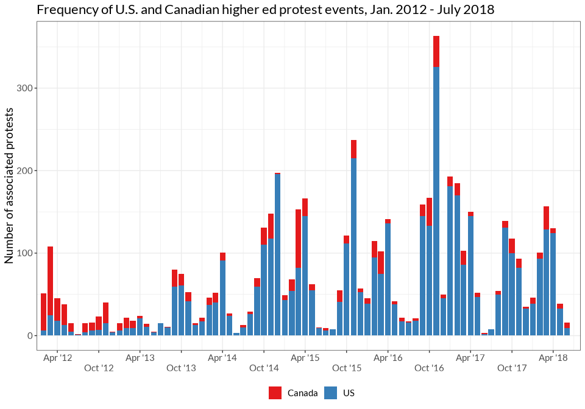
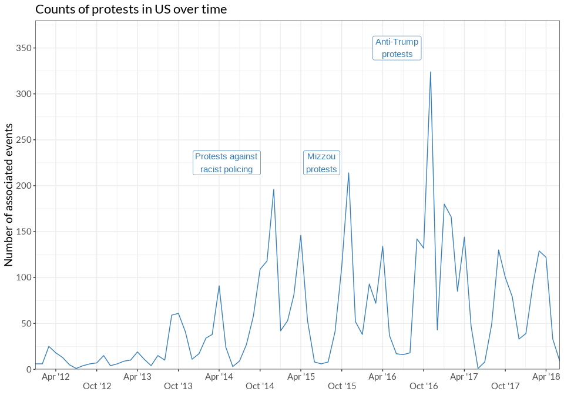
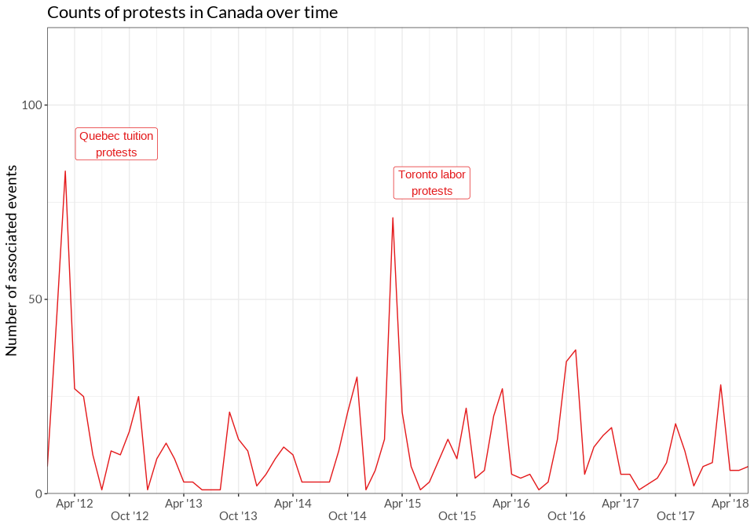

Tables and Figures for *Trends in Higher Ed Protest*
================

- [Figure 1: Frequency of U.S. and Canadian higher ed protest events,
  Jan. 2012 - July
  2018](#figure-1-frequency-of-us-and-canadian-higher-ed-protest-events-jan-2012---july-2018)
- [Figure 2: Frequency of U.S. higher ed protest events and major waves,
  Jan. 2012 - July
  2018](#figure-2-frequency-of-us-higher-ed-protest-events-and-major-waves-jan-2012---july-2018)
- [Figure 3. Frequency of Canadian higher ed protest events and major
  waves, Jan. 2012 -
  Dec. 2018](#figure-3-frequency-of-canadian-higher-ed-protest-events-and-major-waves-jan-2012---dec-2018)
- [Table 1: Top 10 U.S. and Canadian universities and locations for
  higher ed
  protests](#table-1-top-10-us-and-canadian-universities-and-locations-for-higher-ed-protests)
- [Table 2: Top 15 U.S. Higher Ed Protest
  Issues](#table-2-top-15-us-higher-ed-protest-issues)
- [Table 3: Top 15 U.S. Higher Ed Protest Issues with University as the
  Target](#table-3-top-15-us-higher-ed-protest-issues-with-university-as-the-target)
- [Table x: Top 15 Canadian Higher Ed Protest
  Issues](#table-x-top-15-canadian-higher-ed-protest-issues)
- [Table x. Top 10 Canadian Higher Ed Protest Issues with University as
  the
  Target](#table-x-top-10-canadian-higher-ed-protest-issues-with-university-as-the-target)
- [Statistics for in-text citations](#statistics-for-in-text-citations)
  - [Country-level counts](#country-level-counts)
  - [Wave-specific counts](#wave-specific-counts)

# Figure 1: Frequency of U.S. and Canadian higher ed protest events, Jan. 2012 - July 2018

<!-- -->

# Figure 2: Frequency of U.S. higher ed protest events and major waves, Jan. 2012 - July 2018

<!-- -->

# Figure 3. Frequency of Canadian higher ed protest events and major waves, Jan. 2012 - Dec. 2018

<!-- -->

# Table 1: Top 10 U.S. and Canadian universities and locations for higher ed protests

| university_name                      | university_n | location               | location_n |
|:-------------------------------------|-------------:|:-----------------------|-----------:|
| University of California Berkeley    |          282 | Montreal, QC, Canada   |        375 |
| McGill University                    |          258 | Toronto, ON, Canada    |        224 |
| Concordia University                 |          214 | Berkeley, CA, USA      |        222 |
| Harvard University                   |          148 | New York City, NY, USA |        166 |
| University of Toronto                |          132 | Los Angeles, CA, USA   |        135 |
| University of Michigan Ann Arbor     |          123 | Cambridge, MA, USA     |        129 |
| University of California Los Angeles |          116 | Chicago, IL, USA       |        116 |
| Ryerson University                   |           93 | Ann Arbor, MI, USA     |        110 |
| York University                      |           84 | San Diego, CA, USA     |         92 |
| Columbia University                  |           82 | San Francisco, CA, USA |         84 |
| Tufts University                     |           77 | Washington, D.C., USA  |         72 |
| University of Chicago                |           73 | Medford, MA, USA       |         58 |
| University of Texas Austin           |           58 | Boston, MA, USA        |         56 |
| University of Wisconsin Madison      |           58 | Austin, TX, USA        |         53 |
| Georgetown University                |           55 | Vancouver, BC, Canada  |         53 |

# Table 2: Top 15 U.S. Higher Ed Protest Issues

| issue_name                                                   | total          | non-racial     | racial       |
|:-------------------------------------------------------------|:---------------|:---------------|:-------------|
| University governance, admin, policies, programs, curriculum | 39.62% (1,770) | 30.42% (1,359) | 11.21% (501) |
| All anti-racist racial issues                                | 37.47% (1,674) |                |              |
| Labor and work                                               | 16.61% (742)   | 16.61% (742)   |              |
| Police violence                                              | 12.44% (556)   |                | 12.44% (556) |
| Trump and/or his administration (Against)                    | 12.4% (554)    | 12.4% (554)    |              |
| \_Other Issue                                                | 10.27% (459)   | 8.03% (359)    | 2.48% (111)  |
| Immigration (For)                                            | 10.14% (453)   |                | 10.14% (453) |
| Campus climate                                               | 8.95% (400)    |                | 8.95% (400)  |
| Environmental                                                | 7.74% (346)    | 7.74% (346)    |              |
| Tuition, fees, financial aid                                 | 6.62% (296)    | 6.62% (296)    |              |
| Sexual assault/violence                                      | 5.91% (264)    | 5.91% (264)    |              |
| Economy/inequality                                           | 4.99% (223)    | 4.99% (223)    |              |
| Feminism/women’s issues                                      | 4.88% (218)    | 4.88% (218)    |              |
| Faith-based discrimination                                   | 4.5% (201)     | 4.5% (201)     |              |
| All racist issues                                            | 1.12% (50)     |                |              |

# Table 3: Top 15 U.S. Higher Ed Protest Issues with University as the Target

| issue_name                                                   | total          | non-racial    | racial       |
|:-------------------------------------------------------------|:---------------|:--------------|:-------------|
| University governance, admin, policies, programs, curriculum | 82.17% (1,655) | 63.8% (1,285) | 22.79% (459) |
| All anti-racist racial issues                                | 31.93% (643)   |               |              |
| Labor and work                                               | 30.34% (611)   | 30.34% (611)  |              |
| Campus climate                                               | 14.05% (283)   |               | 14.05% (283) |
| Tuition, fees, financial aid                                 | 11.12% (224)   | 11.12% (224)  |              |
| Environmental                                                | 10.18% (205)   | 10.18% (205)  |              |
| Immigration (For)                                            | 9.04% (182)    |               | 9.04% (182)  |
| Economy/inequality                                           | 7.6% (153)     | 7.6% (153)    |              |
| Sexual assault/violence                                      | 6.75% (136)    | 6.75% (136)   |              |
| \_Other Issue                                                | 6.06% (122)    | 4.62% (93)    | 1.69% (34)   |
| Trump and/or his administration (Against)                    | 6.01% (121)    | 6.01% (121)   |              |
| Police violence                                              | 5.16% (104)    |               | 5.16% (104)  |
| Feminism/women’s issues                                      | 3.13% (63)     | 3.13% (63)    |              |
| White supremacy (Against)                                    | 3.03% (61)     |               | 3.03% (61)   |
| All racist issues                                            | 0.55% (11)     |               |              |

# Table x: Top 15 Canadian Higher Ed Protest Issues

| issue_name                                                   | total        | non-racial   | racial     |
|:-------------------------------------------------------------|:-------------|:-------------|:-----------|
| University governance, admin, policies, programs, curriculum | 34.33% (344) | 32.83% (329) | 2.1% (21)  |
| Tuition, fees, financial aid                                 | 30.04% (301) | 30.04% (301) |            |
| Labor and work                                               | 19.86% (199) | 19.86% (199) |            |
| \_Other Issue                                                | 15.57% (156) | 14.77% (148) | 1.3% (13)  |
| All anti-racist racial issues                                | 11.68% (117) |              |            |
| Public funding for higher education                          | 9.18% (92)   | 9.18% (92)   |            |
| Economy/inequality                                           | 8.98% (90)   | 8.98% (90)   |            |
| Environmental                                                | 6.59% (66)   | 6.59% (66)   |            |
| Feminism/women’s issues                                      | 5.69% (57)   | 5.69% (57)   |            |
| Indigenous issues                                            | 5.19% (52)   |              | 5.19% (52) |
| Sexual assault/violence                                      | 5.19% (52)   | 5.19% (52)   |            |
| Faith-based discrimination                                   | 4.19% (42)   | 4.19% (42)   |            |
| Social services and welfare                                  | 3.99% (40)   | 3.99% (40)   |            |
| Pro-Palestine/BDS                                            | 2.89% (29)   | 2.89% (29)   |            |
| All racist issues                                            | 0.3% (3)     |              |            |

# Table x. Top 10 Canadian Higher Ed Protest Issues with University as the Target

| issue                                                        | n            |
|:-------------------------------------------------------------|:-------------|
| University governance, admin, policies, programs, curriculum | 77.38% (301) |
| Labor and work                                               | 37.53% (146) |
| Tuition, fees, financial aid                                 | 21.08% (82)  |
| Any racial issue                                             | 10.54% (41)  |
| Environmental                                                | 9.51% (37)   |
| Sexual assault/violence                                      | 7.2% (28)    |
| \_Other Issue                                                | 6.17% (24)   |
| Economy/inequality                                           | 4.11% (16)   |
| Feminism/women’s issues                                      | 4.11% (16)   |
| Public funding for higher education                          | 2.83% (11)   |

# Statistics for in-text citations

## Country-level counts

| statistic                           | Both |   US | Canada |
|:------------------------------------|-----:|-----:|-------:|
| Protests                            | 5488 | 4468 |   1002 |
| Locations                           |  534 |  467 |     72 |
| Universities                        |  585 |  513 |     74 |
| Off-campus protests                 |  441 |  264 |    177 |
| Counterprotest (via checkbox)       |  267 |  227 |     39 |
| Protests in multiple cities         |  148 |  125 |     23 |
| Campaigns                           |  406 |  310 |     98 |
| Events with one form                | 3153 | 2534 |    605 |
| Events with multiple forms          | 2110 | 1732 |    376 |
| \# for Target = University          | 2415 | 2014 |    389 |
| Target = Domestic government        | 1392 | 1007 |    384 |
| Target = Domestic gov. + University |  223 |  179 |     44 |

## Wave-specific counts
