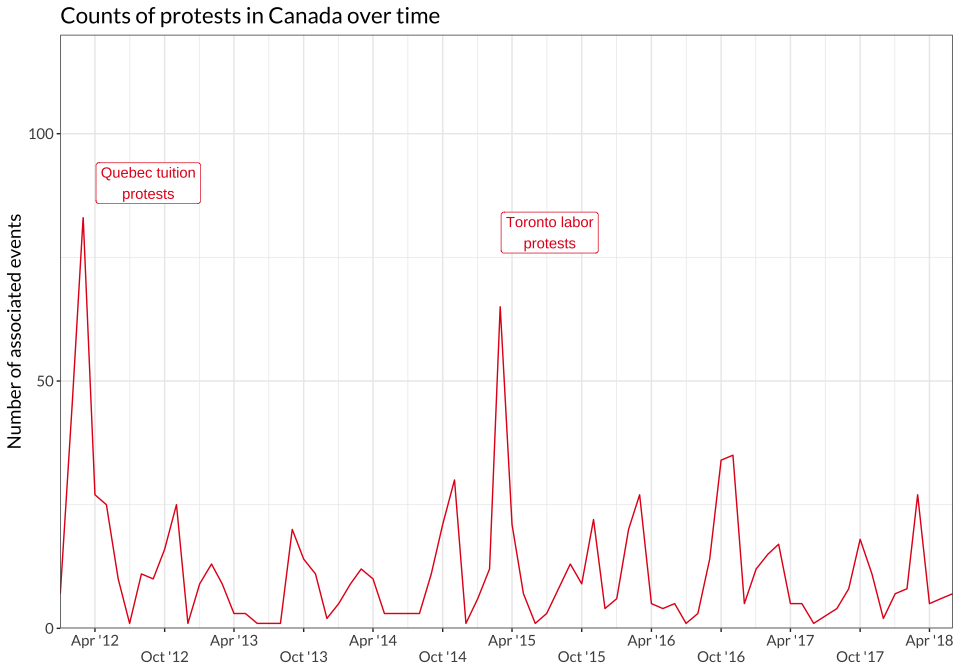

Tables and Figures for *Trends in Higher Ed Protest*
================

- [Figure 1: Frequency of U.S. and Canadian higher ed protest events,
  Jan. 2012 - July
  2018](#figure-1-frequency-of-us-and-canadian-higher-ed-protest-events-jan-2012---july-2018)
- [Figure 2: Frequency of U.S. higher ed protest events and major waves,
  Jan. 2012 - July
  2018](#figure-2-frequency-of-us-higher-ed-protest-events-and-major-waves-jan-2012---july-2018)
- [Figure 3. Frequency of Canadian higher ed protest events and major
  waves, Jan. 2012 -
  Dec. 2018](#figure-3-frequency-of-canadian-higher-ed-protest-events-and-major-waves-jan-2012---dec-2018)
- [Table 1: Top 10 U.S. and Canadian universities and locations for
  higher ed
  protests](#table-1-top-10-us-and-canadian-universities-and-locations-for-higher-ed-protests)
- [Table 2: Top 15 U.S. Higher Ed Protest
  Issues](#table-2-top-15-us-higher-ed-protest-issues)
- [Table 3: Top 15 U.S. Higher Ed Protest Issues with University as the
  Target](#table-3-top-15-us-higher-ed-protest-issues-with-university-as-the-target)
- [Table x: Top 15 Canadian Higher Ed Protest
  Issues](#table-x-top-15-canadian-higher-ed-protest-issues)
- [Table x. Top 10 Canadian Higher Ed Protest Issues with University as
  the
  Target](#table-x-top-10-canadian-higher-ed-protest-issues-with-university-as-the-target)
- [NEW TABLES BELOW THIS POINT](#new-tables-below-this-point)
- [Table x. Top 10 U.S. Higher Ed Protest Issues by
  year](#table-x-top-10-us-higher-ed-protest-issues-by-year)
- [Table x. Top 10 U.S. Higher Ed Protest Issues by
  month](#table-x-top-10-us-higher-ed-protest-issues-by-month)
- [Table x. Top 10 Canada Higher Ed Protest Issues by
  year](#table-x-top-10-canada-higher-ed-protest-issues-by-year)
- [Table x. Top 10 Canada Higher Ed Protest Issues by
  month](#table-x-top-10-canada-higher-ed-protest-issues-by-month)
- [U.S. Waves Count](#us-waves-count)
  - [First Wave](#first-wave)
  - [Second Wave](#second-wave)
- [Statistics for in-text citations](#statistics-for-in-text-citations)
  - [Country-level counts](#country-level-counts)
  - [Wave-specific counts](#wave-specific-counts)

# Figure 1: Frequency of U.S. and Canadian higher ed protest events, Jan. 2012 - July 2018

<!-- -->

# Figure 2: Frequency of U.S. higher ed protest events and major waves, Jan. 2012 - July 2018

<!-- -->

# Figure 3. Frequency of Canadian higher ed protest events and major waves, Jan. 2012 - Dec. 2018

<!-- -->

# Table 1: Top 10 U.S. and Canadian universities and locations for higher ed protests

| uni_name                                    | university_n | location               | location_n |
|:--------------------------------------------|-------------:|:-----------------------|-----------:|
| University of California-Berkeley           |          246 | Montreal, QC, Canada   |        376 |
| Harvard University                          |          144 | Berkeley, CA, USA      |        221 |
| University of California-Los Angeles        |          116 | Toronto, ON, Canada    |        219 |
| University of Michigan-Ann Arbor            |          112 | New York City, NY, USA |        164 |
| University of Chicago                       |           72 | Los Angeles, CA, USA   |        135 |
| Columbia University in the City of New York |           69 | Cambridge, MA, USA     |        129 |
| Tufts University                            |           68 | Chicago, IL, USA       |        116 |
| University of California-Davis              |           58 | Ann Arbor, MI, USA     |        109 |
| The University of Texas at Austin           |           56 | San Diego, CA, USA     |         92 |
| Georgetown University                       |           53 | San Francisco, CA, USA |         84 |
| University of Wisconsin-Madison             |           49 | Washington, D.C., USA  |         73 |
| New York University                         |           48 | Columbia, MO, USA      |         66 |
| San Diego State University                  |           48 | Boston, MA, USA        |         56 |
| University of California-San Diego          |           46 | Austin, TX, USA        |         54 |
| Ohio University-Main Campus                 |           45 | Vancouver, BC, Canada  |         53 |

# Table 2: Top 15 U.S. Higher Ed Protest Issues

| issue_name                                                   | total          | non-racial     | racial       |
|:-------------------------------------------------------------|:---------------|:---------------|:-------------|
| University governance, admin, policies, programs, curriculum | 39.79% (1,793) | 30.03% (1,353) | 11.83% (533) |
| All anti-racist racial issues                                | 37.79% (1,703) |                |              |
| Labor and work                                               | 16.27% (733)   | 16.27% (733)   |              |
| Police violence                                              | 12.36% (557)   |                | 12.36% (557) |
| Trump and/or his administration (Against)                    | 12.32% (555)   | 12.32% (555)   |              |
| \_Other Issue                                                | 10.14% (457)   | 7.92% (357)    | 2.44% (110)  |
| Immigration (For)                                            | 10.08% (454)   |                | 10.08% (454) |
| Campus climate                                               | 9.41% (424)    |                | 9.41% (424)  |
| Environmental                                                | 7.66% (345)    | 7.66% (345)    |              |
| Tuition, fees, financial aid                                 | 6.61% (298)    | 6.61% (298)    |              |
| Sexual assault/violence                                      | 5.9% (266)     | 5.9% (266)     |              |
| Economy/inequality                                           | 4.99% (225)    | 4.99% (225)    |              |
| Feminism/women’s issues                                      | 4.9% (221)     | 4.9% (221)     |              |
| Faith-based discrimination                                   | 4.46% (201)    | 4.46% (201)    |              |
| All racist issues                                            | 1.18% (53)     |                |              |

# Table 3: Top 15 U.S. Higher Ed Protest Issues with University as the Target

| issue_name                                                   | total          | non-racial    | racial       |
|:-------------------------------------------------------------|:---------------|:--------------|:-------------|
| University governance, admin, policies, programs, curriculum | 82.11% (1,671) | 62.8% (1,278) | 23.73% (483) |
| All anti-racist racial issues                                | 32.63% (664)   |               |              |
| Labor and work                                               | 29.58% (602)   | 29.58% (602)  |              |
| Campus climate                                               | 14.55% (296)   |               | 14.55% (296) |
| Tuition, fees, financial aid                                 | 11.11% (226)   | 11.11% (226)  |              |
| Environmental                                                | 9.98% (203)    | 9.98% (203)   |              |
| Immigration (For)                                            | 8.94% (182)    |               | 8.94% (182)  |
| Economy/inequality                                           | 7.62% (155)    | 7.62% (155)   |              |
| Sexual assault/violence                                      | 6.73% (137)    | 6.73% (137)   |              |
| Trump and/or his administration (Against)                    | 5.95% (121)    | 5.95% (121)   |              |
| \_Other Issue                                                | 5.9% (120)     | 4.52% (92)    | 1.57% (32)   |
| Police violence                                              | 5.16% (105)    |               | 5.16% (105)  |
| Racist/racialized symbols                                    | 3.44% (70)     |               | 3.44% (70)   |
| Feminism/women’s issues                                      | 3.24% (66)     | 3.24% (66)    |              |
| All racist issues                                            | 0.69% (14)     |               |              |

# Table x: Top 15 Canadian Higher Ed Protest Issues

| issue_name                                                   | total        | non-racial   | racial     |
|:-------------------------------------------------------------|:-------------|:-------------|:-----------|
| University governance, admin, policies, programs, curriculum | 34.51% (341) | 33% (326)    | 2.13% (21) |
| Tuition, fees, financial aid                                 | 30.36% (300) | 30.36% (300) |            |
| Labor and work                                               | 19.33% (191) | 19.33% (191) |            |
| \_Other Issue                                                | 15.38% (152) | 14.57% (144) | 1.32% (13) |
| All anti-racist racial issues                                | 11.84% (117) |              |            |
| Public funding for higher education                          | 9.21% (91)   | 9.21% (91)   |            |
| Economy/inequality                                           | 9.11% (90)   | 9.11% (90)   |            |
| Environmental                                                | 6.68% (66)   | 6.68% (66)   |            |
| Feminism/women’s issues                                      | 5.77% (57)   | 5.77% (57)   |            |
| Indigenous issues                                            | 5.26% (52)   |              | 5.26% (52) |
| Sexual assault/violence                                      | 5.26% (52)   | 5.26% (52)   |            |
| Faith-based discrimination                                   | 4.25% (42)   | 4.25% (42)   |            |
| Social services and welfare                                  | 4.05% (40)   | 4.05% (40)   |            |
| Pro-Palestine/BDS                                            | 2.94% (29)   | 2.94% (29)   |            |
| All racist issues                                            | 0.3% (3)     |              |            |

# Table x. Top 10 Canadian Higher Ed Protest Issues with University as the Target

| issue                                                        | n            |
|:-------------------------------------------------------------|:-------------|
| University governance, admin, policies, programs, curriculum | 78.48% (299) |
| Labor and work                                               | 36.75% (140) |
| Tuition, fees, financial aid                                 | 21.26% (81)  |
| Any racial issue                                             | 10.76% (41)  |
| Environmental                                                | 9.71% (37)   |
| Sexual assault/violence                                      | 7.35% (28)   |
| \_Other Issue                                                | 5.77% (22)   |
| Economy/inequality                                           | 4.2% (16)    |
| Feminism/women’s issues                                      | 4.2% (16)    |
| Free speech                                                  | 2.62% (10)   |

# NEW TABLES BELOW THIS POINT

# Table x. Top 10 U.S. Higher Ed Protest Issues by year

    ## `summarise()` has grouped output by 'year', 'issue', 'type'. You can override
    ## using the `.groups` argument.

| issue                                                        | type         | total_n | 2012 | 2013 | 2014 | 2015 | 2016 | 2017 | 2018 |
|:-------------------------------------------------------------|:-------------|--------:|-----:|-----:|-----:|-----:|-----:|-----:|-----:|
| University governance, admin, policies, programs, curriculum | issue        |    1353 |   42 |   99 |  202 |  294 |  294 |  260 |  162 |
| Labor and work                                               | issue        |     733 |   22 |   58 |   74 |  174 |  189 |  125 |   91 |
| Police violence                                              | racial_issue |     557 |    7 |    8 |  289 |   99 |  105 |   28 |   21 |
| Trump and/or his administration (Against)                    | issue        |     555 |   NA |   NA |   NA |    4 |  237 |  298 |   15 |
| University governance, admin, policies, programs, curriculum | racial_issue |     533 |    3 |   14 |   43 |  168 |  144 |  117 |   44 |
| Immigration (For)                                            | racial_issue |     454 |   NA |   29 |   29 |   20 |   94 |  252 |   30 |
| Campus climate                                               | racial_issue |     424 |    3 |   10 |   47 |  181 |   86 |   64 |   33 |
| \_Other Issue                                                | issue        |     357 |    8 |   23 |   38 |   61 |   68 |  112 |   47 |
| Environmental                                                | issue        |     345 |    4 |   27 |   55 |   79 |  100 |   74 |    5 |
| Tuition, fees, financial aid                                 | issue        |     298 |   22 |   14 |   59 |   65 |   55 |   47 |   36 |

# Table x. Top 10 U.S. Higher Ed Protest Issues by month

    ## `summarise()` has grouped output by 'month_year', 'issue', 'type'. You can
    ## override using the `.groups` argument.

| issue                                                        | type         | total_n | 2012-01 | 2012-02 | 2012-03 | 2012-04 | 2012-05 | 2012-06 | 2012-07 | 2012-08 | 2012-09 | 2012-10 | 2012-11 | 2012-12 | 2013-01 | 2013-02 | 2013-03 | 2013-04 | 2013-05 | 2013-06 | 2013-07 | 2013-08 | 2013-09 | 2013-10 | 2013-11 | 2013-12 | 2014-01 | 2014-02 | 2014-03 | 2014-04 | 2014-05 | 2014-06 | 2014-07 | 2014-08 | 2014-09 | 2014-10 | 2014-11 | 2014-12 | 2015-01 | 2015-02 | 2015-03 | 2015-04 | 2015-05 | 2015-06 | 2015-07 | 2015-08 | 2015-09 | 2015-10 | 2015-11 | 2015-12 | 2016-01 | 2016-02 | 2016-03 | 2016-04 | 2016-05 | 2016-06 | 2016-07 | 2016-08 | 2016-09 | 2016-10 | 2016-11 | 2016-12 | 2017-01 | 2017-02 | 2017-03 | 2017-04 | 2017-05 | 2017-06 | 2017-07 | 2017-08 | 2017-09 | 2017-10 | 2017-11 | 2017-12 | 2018-01 | 2018-02 | 2018-03 | 2018-04 | 2018-05 | 2018-06 | 2018-08 | 2018-09 | 2018-10 | 2018-11 | 2018-12 |
|:-------------------------------------------------------------|:-------------|--------:|--------:|--------:|--------:|--------:|--------:|--------:|--------:|--------:|--------:|--------:|--------:|--------:|--------:|--------:|--------:|--------:|--------:|--------:|--------:|--------:|--------:|--------:|--------:|--------:|--------:|--------:|--------:|--------:|--------:|--------:|--------:|--------:|--------:|--------:|--------:|--------:|--------:|--------:|--------:|--------:|--------:|--------:|--------:|--------:|--------:|--------:|--------:|--------:|--------:|--------:|--------:|--------:|--------:|--------:|--------:|--------:|--------:|--------:|--------:|--------:|--------:|--------:|--------:|--------:|--------:|--------:|--------:|--------:|--------:|--------:|--------:|--------:|--------:|--------:|--------:|--------:|--------:|--------:|--------:|--------:|--------:|--------:|--------:|
| University governance, admin, policies, programs, curriculum | issue        |    1688 |       2 |      15 |      10 |      13 |       6 |       5 |      NA |       5 |       9 |       5 |      18 |       3 |       8 |      10 |       4 |       9 |       8 |       1 |       7 |      NA |      17 |      29 |      21 |       8 |       7 |      27 |      21 |      42 |      14 |       2 |       9 |       4 |      23 |      42 |      31 |      17 |      15 |      30 |      65 |      64 |      20 |       6 |       6 |       3 |      22 |      45 |      69 |      27 |      19 |      44 |      49 |      54 |      23 |      11 |       1 |       8 |      37 |      53 |      43 |      21 |      34 |      46 |      28 |      40 |      19 |       2 |       2 |       8 |      30 |      32 |      29 |      18 |      24 |      38 |      48 |      51 |      23 |       7 |      NA |       1 |       3 |      16 |       1 |
| Labor and work                                               | issue        |     926 |      NA |       7 |       6 |       1 |       7 |       6 |      NA |       1 |       4 |      13 |      14 |       2 |       5 |       4 |       1 |       3 |       8 |       1 |       6 |       3 |      13 |      10 |      13 |       2 |       7 |      10 |       6 |      17 |       8 |       1 |       1 |      NA |       4 |      19 |       9 |       7 |       7 |      22 |      35 |      41 |      12 |       6 |       1 |       2 |      12 |      27 |      35 |      16 |      11 |      23 |      25 |      36 |      14 |       9 |       1 |       9 |      25 |      45 |      18 |       6 |       9 |      18 |      14 |      18 |      18 |      NA |       1 |       4 |      17 |      21 |      21 |      14 |       8 |      25 |      25 |      27 |      16 |       3 |      NA |       1 |       1 |       8 |      NA |
| Tuition, fees, financial aid                                 | issue        |     598 |       4 |      32 |      79 |      28 |      29 |       8 |       2 |      10 |       3 |       3 |      11 |      NA |       1 |       8 |       8 |       2 |       2 |      NA |      NA |      NA |       3 |       4 |       3 |       1 |       2 |       6 |      10 |       6 |       4 |      NA |       1 |      NA |       3 |      13 |      29 |       2 |       4 |       7 |      32 |       6 |       6 |      NA |      NA |       1 |       2 |       8 |      30 |       3 |       4 |      15 |      12 |      14 |       5 |       3 |      NA |      NA |       5 |       4 |      15 |       1 |       6 |       1 |      10 |       4 |       3 |      NA |       1 |       1 |       4 |       5 |      17 |       5 |       7 |      10 |      12 |      10 |       6 |      NA |      NA |       1 |      NA |       1 |      NA |
| Police violence                                              | racial_issue |     571 |      NA |      NA |       6 |       2 |      NA |      NA |      NA |      NA |      NA |      NA |      NA |      NA |      NA |      NA |      NA |      NA |      NA |      NA |       1 |      NA |       1 |       5 |      NA |       1 |      NA |      NA |      NA |       3 |      NA |      NA |      NA |      20 |      19 |      20 |      66 |     167 |      11 |       5 |      13 |      23 |      17 |      NA |       2 |       4 |       3 |       5 |      17 |       1 |       5 |       8 |       2 |       4 |       2 |      NA |      15 |      NA |      48 |      20 |       5 |      NA |      NA |      NA |       1 |       5 |      NA |      NA |      NA |       1 |      13 |       7 |       1 |      NA |       3 |       1 |       5 |      13 |      NA |      NA |      NA |      NA |      NA |      NA |      NA |
| Trump and/or his administration (Against)                    | issue        |     564 |      NA |      NA |      NA |      NA |      NA |      NA |      NA |      NA |      NA |      NA |      NA |      NA |      NA |      NA |      NA |      NA |      NA |      NA |      NA |      NA |      NA |      NA |      NA |      NA |      NA |      NA |      NA |      NA |      NA |      NA |      NA |      NA |      NA |      NA |      NA |      NA |      NA |      NA |      NA |      NA |      NA |      NA |      NA |      NA |      NA |       2 |      NA |       2 |       3 |       7 |       6 |      10 |       1 |      NA |      NA |       2 |       3 |       5 |     197 |       7 |     115 |      88 |      13 |      30 |      16 |      NA |      NA |       4 |      28 |       2 |       4 |       2 |       8 |       3 |       3 |       1 |      NA |       1 |      NA |      NA |      NA |      NA |      NA |
| University governance, admin, policies, programs, curriculum | racial_issue |     561 |      NA |      NA |      NA |       1 |       1 |      NA |      NA |      NA |      NA |      NA |       1 |      NA |      NA |      NA |      NA |      NA |      NA |      NA |       1 |      NA |       3 |       7 |       3 |       1 |       3 |       3 |       4 |       6 |       1 |      NA |      NA |       1 |       1 |       6 |       5 |      14 |       5 |       3 |       4 |       6 |       7 |      NA |      NA |       1 |       3 |      25 |     111 |      11 |       2 |      16 |       7 |      23 |      10 |      NA |       1 |      NA |      19 |      16 |      51 |      12 |      14 |      22 |      13 |      12 |       6 |       1 |      NA |      10 |      16 |      11 |      10 |       4 |       2 |      15 |      10 |      13 |       4 |      NA |      NA |      NA |       2 |       1 |      NA |
| \_Other Issue                                                | issue        |     503 |       4 |       6 |       6 |       2 |      11 |       3 |      NA |       4 |       4 |       1 |       3 |      NA |      NA |       4 |       2 |       3 |      NA |      NA |       1 |      NA |      14 |       8 |       7 |       2 |      NA |       8 |       3 |       4 |       3 |      NA |      NA |      NA |       9 |      13 |       3 |       6 |       4 |       5 |      10 |      13 |       7 |       2 |      NA |       1 |       7 |      11 |      17 |       3 |       2 |       6 |       5 |      12 |       8 |       2 |       1 |       1 |      13 |      19 |      21 |       1 |      12 |      13 |      10 |      28 |      NA |       1 |       1 |       4 |      20 |      11 |      16 |       8 |       7 |      13 |      21 |      10 |       5 |       4 |       2 |       6 |       2 |       2 |       2 |
| Immigration (For)                                            | racial_issue |     464 |      NA |      NA |      NA |      NA |      NA |      NA |      NA |      NA |       1 |      NA |      NA |      NA |      NA |       1 |      NA |       2 |       1 |      NA |       2 |       1 |       2 |       7 |      12 |       2 |       3 |       3 |       3 |       9 |       1 |      NA |       1 |      NA |       1 |       5 |       1 |       2 |      NA |       2 |       2 |       3 |       2 |      NA |      NA |      NA |       2 |       3 |       3 |       4 |       2 |       5 |       2 |       8 |      NA |      NA |      NA |      NA |       1 |       1 |      63 |      13 |      66 |      85 |      18 |      12 |      20 |      NA |       1 |       4 |      33 |       7 |       9 |       3 |       4 |       7 |      15 |       2 |       1 |       1 |      NA |      NA |      NA |      NA |      NA |
| Campus climate                                               | racial_issue |     445 |      NA |      NA |      NA |      NA |       1 |      NA |      NA |      NA |       1 |      NA |       1 |      NA |      NA |      NA |      NA |      NA |      NA |      NA |      NA |       1 |       1 |       5 |       4 |      NA |       2 |       2 |       1 |       6 |       1 |      NA |       1 |      NA |       3 |       7 |       4 |      21 |       4 |       3 |       3 |      13 |       7 |      NA |       2 |      NA |       4 |      19 |     120 |      12 |       1 |      13 |       6 |      19 |       7 |       1 |      NA |       1 |      14 |       9 |      20 |       6 |       4 |       9 |       4 |       7 |       3 |      NA |      NA |       7 |      17 |       9 |       5 |       1 |       1 |      12 |       6 |      12 |       2 |      NA |      NA |      NA |      NA |      NA |      NA |
| Environmental                                                | issue        |     411 |      NA |      NA |       1 |       2 |      NA |      NA |      NA |      NA |       2 |      NA |       1 |       1 |       3 |       4 |       2 |       6 |       3 |       1 |       2 |      NA |       9 |       5 |       6 |       2 |       1 |       7 |       6 |      15 |       6 |       1 |      NA |       2 |       9 |       7 |       6 |       4 |       4 |       6 |       9 |      21 |       1 |      NA |       1 |       1 |       6 |      18 |      14 |       8 |       3 |       4 |      12 |      16 |       6 |       1 |      NA |       1 |      18 |      15 |      31 |      10 |      11 |      22 |       2 |      34 |       4 |       2 |      NA |      NA |       1 |      NA |       4 |      NA |      NA |       1 |       3 |       2 |       1 |       1 |      NA |       1 |       1 |      NA |      NA |

# Table x. Top 10 Canada Higher Ed Protest Issues by year

    ## `summarise()` has grouped output by 'year', 'issue', 'type'. You can override
    ## using the `.groups` argument.

| issue                                                        | type         | total_n | 2012 | 2013 | 2014 | 2015 | 2016 | 2017 | 2018 |
|:-------------------------------------------------------------|:-------------|--------:|-----:|-----:|-----:|-----:|-----:|-----:|-----:|
| University governance, admin, policies, programs, curriculum | issue        |     326 |   49 |   23 |   36 |   74 |   66 |   28 |   49 |
| Tuition, fees, financial aid                                 | issue        |     300 |  187 |   18 |   17 |   34 |   23 |   10 |   11 |
| Labor and work                                               | issue        |     191 |   39 |   11 |   15 |   41 |   32 |   30 |   23 |
| \_Other Issue                                                | issue        |     144 |   36 |   18 |   11 |   19 |   23 |   10 |   27 |
| Public funding for higher education                          | issue        |      91 |   15 |   13 |   13 |   34 |   14 |    1 |    1 |
| Economy/inequality                                           | issue        |      90 |   11 |    2 |   15 |   38 |   11 |    6 |    7 |
| Environmental                                                | issue        |      66 |    3 |   16 |    9 |   10 |   17 |    6 |    5 |
| Feminism/women’s issues                                      | issue        |      57 |    5 |    7 |    3 |    8 |   14 |   11 |    9 |
| Indigenous issues                                            | racial_issue |      52 |    1 |    9 |    3 |    6 |   14 |    9 |   10 |
| Sexual assault/violence                                      | issue        |      52 |    3 |    3 |    8 |    8 |   19 |    6 |    5 |

# Table x. Top 10 Canada Higher Ed Protest Issues by month

    ## `summarise()` has grouped output by 'month_year', 'issue', 'type'. You can
    ## override using the `.groups` argument.

| issue                                                        | type         | total_n | 2012-01 | 2012-02 | 2012-03 | 2012-04 | 2012-05 | 2012-06 | 2012-07 | 2012-08 | 2012-09 | 2012-10 | 2012-11 | 2012-12 | 2013-01 | 2013-02 | 2013-03 | 2013-04 | 2013-05 | 2013-06 | 2013-07 | 2013-08 | 2013-09 | 2013-10 | 2013-11 | 2013-12 | 2014-01 | 2014-02 | 2014-03 | 2014-04 | 2014-05 | 2014-06 | 2014-07 | 2014-08 | 2014-09 | 2014-10 | 2014-11 | 2014-12 | 2015-01 | 2015-02 | 2015-03 | 2015-04 | 2015-05 | 2015-06 | 2015-07 | 2015-08 | 2015-09 | 2015-10 | 2015-11 | 2015-12 | 2016-01 | 2016-02 | 2016-03 | 2016-04 | 2016-05 | 2016-06 | 2016-07 | 2016-08 | 2016-09 | 2016-10 | 2016-11 | 2016-12 | 2017-01 | 2017-02 | 2017-03 | 2017-04 | 2017-05 | 2017-06 | 2017-07 | 2017-08 | 2017-09 | 2017-10 | 2017-11 | 2017-12 | 2018-01 | 2018-02 | 2018-03 | 2018-04 | 2018-05 | 2018-06 | 2018-08 | 2018-09 | 2018-10 | 2018-11 | 2018-12 |
|:-------------------------------------------------------------|:-------------|--------:|--------:|--------:|--------:|--------:|--------:|--------:|--------:|--------:|--------:|--------:|--------:|--------:|--------:|--------:|--------:|--------:|--------:|--------:|--------:|--------:|--------:|--------:|--------:|--------:|--------:|--------:|--------:|--------:|--------:|--------:|--------:|--------:|--------:|--------:|--------:|--------:|--------:|--------:|--------:|--------:|--------:|--------:|--------:|--------:|--------:|--------:|--------:|--------:|--------:|--------:|--------:|--------:|--------:|--------:|--------:|--------:|--------:|--------:|--------:|--------:|--------:|--------:|--------:|--------:|--------:|--------:|--------:|--------:|--------:|--------:|--------:|--------:|--------:|--------:|--------:|--------:|--------:|--------:|--------:|--------:|--------:|--------:|--------:|
| University governance, admin, policies, programs, curriculum | issue        |    1688 |       2 |      15 |      10 |      13 |       6 |       5 |      NA |       5 |       9 |       5 |      18 |       3 |       8 |      10 |       4 |       9 |       8 |       1 |       7 |      NA |      17 |      29 |      21 |       8 |       7 |      27 |      21 |      42 |      14 |       2 |       9 |       4 |      23 |      42 |      31 |      17 |      15 |      30 |      65 |      64 |      20 |       6 |       6 |       3 |      22 |      45 |      69 |      27 |      19 |      44 |      49 |      54 |      23 |      11 |       1 |       8 |      37 |      53 |      43 |      21 |      34 |      46 |      28 |      40 |      19 |       2 |       2 |       8 |      30 |      32 |      29 |      18 |      24 |      38 |      48 |      51 |      23 |       7 |      NA |       1 |       3 |      16 |       1 |
| Labor and work                                               | issue        |     926 |      NA |       7 |       6 |       1 |       7 |       6 |      NA |       1 |       4 |      13 |      14 |       2 |       5 |       4 |       1 |       3 |       8 |       1 |       6 |       3 |      13 |      10 |      13 |       2 |       7 |      10 |       6 |      17 |       8 |       1 |       1 |      NA |       4 |      19 |       9 |       7 |       7 |      22 |      35 |      41 |      12 |       6 |       1 |       2 |      12 |      27 |      35 |      16 |      11 |      23 |      25 |      36 |      14 |       9 |       1 |       9 |      25 |      45 |      18 |       6 |       9 |      18 |      14 |      18 |      18 |      NA |       1 |       4 |      17 |      21 |      21 |      14 |       8 |      25 |      25 |      27 |      16 |       3 |      NA |       1 |       1 |       8 |      NA |
| Tuition, fees, financial aid                                 | issue        |     598 |       4 |      32 |      79 |      28 |      29 |       8 |       2 |      10 |       3 |       3 |      11 |      NA |       1 |       8 |       8 |       2 |       2 |      NA |      NA |      NA |       3 |       4 |       3 |       1 |       2 |       6 |      10 |       6 |       4 |      NA |       1 |      NA |       3 |      13 |      29 |       2 |       4 |       7 |      32 |       6 |       6 |      NA |      NA |       1 |       2 |       8 |      30 |       3 |       4 |      15 |      12 |      14 |       5 |       3 |      NA |      NA |       5 |       4 |      15 |       1 |       6 |       1 |      10 |       4 |       3 |      NA |       1 |       1 |       4 |       5 |      17 |       5 |       7 |      10 |      12 |      10 |       6 |      NA |      NA |       1 |      NA |       1 |      NA |
| Police violence                                              | racial_issue |     571 |      NA |      NA |       6 |       2 |      NA |      NA |      NA |      NA |      NA |      NA |      NA |      NA |      NA |      NA |      NA |      NA |      NA |      NA |       1 |      NA |       1 |       5 |      NA |       1 |      NA |      NA |      NA |       3 |      NA |      NA |      NA |      20 |      19 |      20 |      66 |     167 |      11 |       5 |      13 |      23 |      17 |      NA |       2 |       4 |       3 |       5 |      17 |       1 |       5 |       8 |       2 |       4 |       2 |      NA |      15 |      NA |      48 |      20 |       5 |      NA |      NA |      NA |       1 |       5 |      NA |      NA |      NA |       1 |      13 |       7 |       1 |      NA |       3 |       1 |       5 |      13 |      NA |      NA |      NA |      NA |      NA |      NA |      NA |
| Trump and/or his administration (Against)                    | issue        |     564 |      NA |      NA |      NA |      NA |      NA |      NA |      NA |      NA |      NA |      NA |      NA |      NA |      NA |      NA |      NA |      NA |      NA |      NA |      NA |      NA |      NA |      NA |      NA |      NA |      NA |      NA |      NA |      NA |      NA |      NA |      NA |      NA |      NA |      NA |      NA |      NA |      NA |      NA |      NA |      NA |      NA |      NA |      NA |      NA |      NA |       2 |      NA |       2 |       3 |       7 |       6 |      10 |       1 |      NA |      NA |       2 |       3 |       5 |     197 |       7 |     115 |      88 |      13 |      30 |      16 |      NA |      NA |       4 |      28 |       2 |       4 |       2 |       8 |       3 |       3 |       1 |      NA |       1 |      NA |      NA |      NA |      NA |      NA |
| University governance, admin, policies, programs, curriculum | racial_issue |     561 |      NA |      NA |      NA |       1 |       1 |      NA |      NA |      NA |      NA |      NA |       1 |      NA |      NA |      NA |      NA |      NA |      NA |      NA |       1 |      NA |       3 |       7 |       3 |       1 |       3 |       3 |       4 |       6 |       1 |      NA |      NA |       1 |       1 |       6 |       5 |      14 |       5 |       3 |       4 |       6 |       7 |      NA |      NA |       1 |       3 |      25 |     111 |      11 |       2 |      16 |       7 |      23 |      10 |      NA |       1 |      NA |      19 |      16 |      51 |      12 |      14 |      22 |      13 |      12 |       6 |       1 |      NA |      10 |      16 |      11 |      10 |       4 |       2 |      15 |      10 |      13 |       4 |      NA |      NA |      NA |       2 |       1 |      NA |
| \_Other Issue                                                | issue        |     503 |       4 |       6 |       6 |       2 |      11 |       3 |      NA |       4 |       4 |       1 |       3 |      NA |      NA |       4 |       2 |       3 |      NA |      NA |       1 |      NA |      14 |       8 |       7 |       2 |      NA |       8 |       3 |       4 |       3 |      NA |      NA |      NA |       9 |      13 |       3 |       6 |       4 |       5 |      10 |      13 |       7 |       2 |      NA |       1 |       7 |      11 |      17 |       3 |       2 |       6 |       5 |      12 |       8 |       2 |       1 |       1 |      13 |      19 |      21 |       1 |      12 |      13 |      10 |      28 |      NA |       1 |       1 |       4 |      20 |      11 |      16 |       8 |       7 |      13 |      21 |      10 |       5 |       4 |       2 |       6 |       2 |       2 |       2 |
| Immigration (For)                                            | racial_issue |     464 |      NA |      NA |      NA |      NA |      NA |      NA |      NA |      NA |       1 |      NA |      NA |      NA |      NA |       1 |      NA |       2 |       1 |      NA |       2 |       1 |       2 |       7 |      12 |       2 |       3 |       3 |       3 |       9 |       1 |      NA |       1 |      NA |       1 |       5 |       1 |       2 |      NA |       2 |       2 |       3 |       2 |      NA |      NA |      NA |       2 |       3 |       3 |       4 |       2 |       5 |       2 |       8 |      NA |      NA |      NA |      NA |       1 |       1 |      63 |      13 |      66 |      85 |      18 |      12 |      20 |      NA |       1 |       4 |      33 |       7 |       9 |       3 |       4 |       7 |      15 |       2 |       1 |       1 |      NA |      NA |      NA |      NA |      NA |
| Campus climate                                               | racial_issue |     445 |      NA |      NA |      NA |      NA |       1 |      NA |      NA |      NA |       1 |      NA |       1 |      NA |      NA |      NA |      NA |      NA |      NA |      NA |      NA |       1 |       1 |       5 |       4 |      NA |       2 |       2 |       1 |       6 |       1 |      NA |       1 |      NA |       3 |       7 |       4 |      21 |       4 |       3 |       3 |      13 |       7 |      NA |       2 |      NA |       4 |      19 |     120 |      12 |       1 |      13 |       6 |      19 |       7 |       1 |      NA |       1 |      14 |       9 |      20 |       6 |       4 |       9 |       4 |       7 |       3 |      NA |      NA |       7 |      17 |       9 |       5 |       1 |       1 |      12 |       6 |      12 |       2 |      NA |      NA |      NA |      NA |      NA |      NA |
| Environmental                                                | issue        |     411 |      NA |      NA |       1 |       2 |      NA |      NA |      NA |      NA |       2 |      NA |       1 |       1 |       3 |       4 |       2 |       6 |       3 |       1 |       2 |      NA |       9 |       5 |       6 |       2 |       1 |       7 |       6 |      15 |       6 |       1 |      NA |       2 |       9 |       7 |       6 |       4 |       4 |       6 |       9 |      21 |       1 |      NA |       1 |       1 |       6 |      18 |      14 |       8 |       3 |       4 |      12 |      16 |       6 |       1 |      NA |       1 |      18 |      15 |      31 |      10 |      11 |      22 |       2 |      34 |       4 |       2 |      NA |      NA |       1 |      NA |       4 |      NA |      NA |       1 |       3 |       2 |       1 |       1 |      NA |       1 |       1 |      NA |      NA |

# U.S. Waves Count

## First Wave

## Second Wave

# Statistics for in-text citations

## Country-level counts

| statistic                           | Both |   US | Canada |
|:------------------------------------|-----:|-----:|-------:|
| Protests                            | 5518 | 4506 |    988 |
| Locations                           |  530 |  465 |     70 |
| Universities                        |  584 |  512 |     74 |
| Off-campus protests                 |  440 |  263 |    177 |
| Counterprotest (via checkbox)       |  286 |  243 |     42 |
| Protests in multiple cities         |  146 |  125 |     21 |
| Campaigns                           |  416 |  316 |    102 |
| Events with one form                | 3166 | 2553 |    593 |
| Events with multiple forms          | 2123 | 1746 |    375 |
| \# for Target = University          | 2435 | 2035 |    381 |
| Target = Domestic government        | 1393 | 1009 |    384 |
| Target = Domestic gov. + University |  223 |  179 |     44 |

## Wave-specific counts
